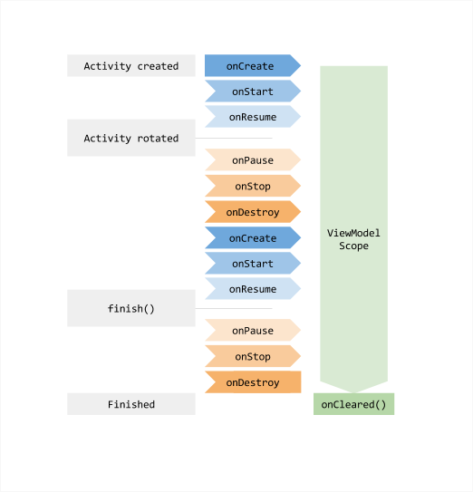

#### Manifest
- The **components of the app**, which include all activities, services, broadcast receivers, and content providers.
- The **permissions** that the app needs in order to access protected parts of the system and other apps.
- The **hardware and software features that the app requires**, which affects the app's installation on a device.

#### Activity Lifecycle
- Defined by a series of **callback methods** that are invoked as the activity enters a new state:
	- `onCreate()` - when the system **creates** the activity:
		- Initial setup, with components to show in screen
		- Called on `startActivity()` call 
	- `onStart()` - called after the `onCreate()` method, when the activity becomes **visible to the user**
	- `onResume()` - called when the activity will **start interacting** with the user;
	- `onPause()` - when called, the activity is **still visible to the user**, but **not in focus** - it technically means your activity is still partially visible, but most often is an indication that the user is leaving the activity, and the activity will soon enter the Stopped or Resumed state
	- `onStop()` - called when the activity is **no longer visible to the user**;
	    - Called when the user **selects other user task**;
	- `onDestroy()` - called before the activity is destroyed;
	    - Called when the **back button is pressed**, **the host process is terminated** or **screen is rotated**
	- `onRestart()` - restores the state of the activity from the point where it was **last stopped**;

>**Screen Created** => onCreate, onStart, onResume
>**Screen Rotated** => onPause, onStop, onDestroy, onCreate, onStart, onResume
>**Back, Process Terminated** => onPause, onStop, onDestroy => Discarts ViewModel
>**Selects Other User Task** => onPause, onStop => can destroy activity if needed
>**Returns To Activity** => onRestart, onResume



#### Threading
There are two rules to Android's single-thread model:
- **Do not block the UI thread;**
- **Do not access the Android UI toolkit from a thread other than the UI thread.**
#### Intents
- You can start an activity by calling `startActivity()` and passing an `Intent`, which describes the activity to start;
- Intent Types:
	- **Explicit** - to share data between activities - specifying either the target app's package name or component class name - `new Intent(this, MyActivity.class)`
	- **Implicit** - do not specify the app component to start, but a action to perform, which allows a component from another app to handle the intent - `new Intent(Intent.ACTION_VIEW, ...)` - requires at least one intent filter in the manifest file
#### Tasks
- A new activity is **pushed** onto the back stack when it is started;
- When the user presses the **back button**, the current activity is **popped** off the stack and destroyed;
- Activities in the back stack are never rearranged
- A **foreground task** is the task that the user is currently interacting with;
- A **background task** is a task that is not currently visible to the user - it is **stopped, but not destroyed**;

#### Background Work
- Runs outside of the main thread
- Types of background work:
	- **Immediate** - needs to be done **immediately**;
	- **Long Running** - needs to be done **over a period of time**;
	- **Deferred** - needs to be done **at some point in the future**.

Background work can be either persistent or impersistent :
- **Persistent** - remains scheduled through app restarts and device reboots;
    - _You should use `WorkManager` for all forms of persistent work._
- **Impersistent** - is canceled when the app is stopped or the device is rebooted.
    - _You should use Kotlin coroutines for immediate impersistent work._ - **asynchronous work**;
    - _You shouldn't use long-running and deferrable impersistent work._

#### ViewModel
- Store and manage UI-related data in lifecycle conscious way
- Survives configuration changes
- Alternative execution host
- Discarted when the activity finishes
- A new instance of a VM is created for each activity, and can be shared between activities: **VM's <= Activities**

#### SavedStateHandler
- Allows to persist data not just through configuration changes, but across process recreation. That is, **it enables you to keep the UI state intact even when the user closes the app and opens it at a later time**.
- Saved state is **tied to your task stack** 

#### Data Store
- Store data asynchronously, consistently, and transactionally, overcoming some of the drawbacks of SharedPreferences
- Data stored in key-value pairs
- Never create more than one instance of `DataStore` for a given file in the same process => will throw `IllegalArgumentException`

#### Flows
-  In coroutines, **a flow is a type that can emit multiple values sequentially**, as opposed to suspend functions that return only a single value. For example, you can use a flow to receive live updates from a database.

- Collecting values:
	- `collect` - collects every value emitted by the flow, useful when every update is important
	- `collectLatest` - will stop the current work to collect the latest value, useful when updates can be overriden with no loss, like database updates

- When terminal operation is applied to a flow, the flow is created on demand and starts emitting values
- Otherwise, the items are emitted lazyly into the flow
- UI should collect items only when needed
```kotlin
lifecycleScope.launch {
	repeatOnLifecycle(Lifecycle.State.STARTED) {
		vm.items.collect { items -> ... }
	}
}
```

##### StateFlow & SharedFlow
- `StateFlow` and `SharedFlow` are two new types of flow that are designed to make it easier to work with state in your app.
- The `StateFlow` class is a **state-holder** flow that emits the **current and new state updates** to its collectors. The current state value can also be read through its value property. To update state and send it to the flow, assign a new value to the value property of the `MutableStateFlow` class.
- The `SharedFlow` class is a **hot** flow that **shares** emitted values among all its collectors; it's a highly-configurable generalization of the `StateFlow`.

The `collectAsState()` extension function is used to **collect** the **latest** value of a flow as a `StateFlow` instance.
- **Cold Flow** - emits data only when there is a collector, doesn't store data, and each collector receives all the values from the beginning. 
- **Hot Flow** - emits data continuously, can store data, and each collector receives data from where they started collecting.
