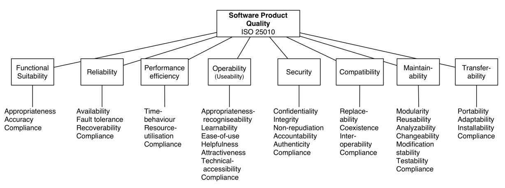

# Software Quality: Concepts, Metrics, Principles & Techniques
### Quality Concepts
- Quality is often associated with an object.
- Quality in construction depends on the quality of the design.
- High standards in the design process are necessary for good quality.
- Quality assessment lacks an absolute scale - typically, a ranking scale is used.

### Quality Dimensions in Software Development
- **Software Quality** (functionality, scalability, security, ...)
- **Design Quality** (simplicity, modularity, ...)
- **Business Quality** (time to market, value for money, ...) 
- **Process Quality** (compliance with standards, meet delivery deadlines, ...)
- **People Quality** (customer satisfaction, employee satisfaction, efficiency, ...)

### Criteria for Analysis
- **Fitness for Purpose**: evaluates how well the software meets its intended objectives and user requirements.
- **Fitness for Future**: considers scalability, adaptability and future-proofing to accommodate evolving needs and technological advancements.
- **Production Cost**: analyzes the expenses associated with software development, deployment and maintenance.
- **Operating Cost**: assesses ongoing costs such as licensing, infrastructure and support, influencing the overall economic viability of the software.

### Analysis Methods
- **Static Program Analysis**: examines source code without executing it, identifying potential defects, security vulnerabilities or adherence to coding standards.
- **Model Checking**: formal verification technique ensuring software models conform to specified requirements or constraints, minimizing errors and enhancing reliability.
- **Multi-Criteria Optimization**:
    - **Pareto Chart**: visualizes trade-offs between conflicting objectives to optimize decision-making.
    - **Star Plot**: graphically represents multi-dimensional data to evaluate software attributes across different criteria.

### Quality Concepts
- **Internal Qualities:** visible to development team members.
- **External Qualities:** visible at runtime to system users.
- **Business and Process Perspectives**: organizational goals, compliance with industry standards and efficiency in development.

### Relevant Software Qualities
- **Reliability**: consistent performance and correct functioning under expected conditions.
- **Performance Efficiency**: optimal use of resources to deliver fast response times and high throughput.
- **Maintainability**: ease of modifying and updating software without introducing errors.
- **Usability**: intuitive interface and user-friendly experience, ensuring accessibility for users.
- **Availability**: high system uptime and accessibility, minimizing downtime.
- **Reusability**: ability to reuse components across multiple projects, saving time and effort.
- **Scalability**: capacity to handle growing workload or user base without degradation in performance.
- **Flexibility**: adaptability to changing requirements or environments with minimal rework.
- **Testability**: ease of testing the software to ensure all parts function as intended.
- **Portability**: ability to operate across different platforms or environments without significant changes.
- **Security**: protection against unauthorized access, ensuring confidentiality, integrity and availability of data.

## Design Principles
- **Simplicity/KISS**: focus on minimizing complexity to improve clarity and maintainability (Keep It Simple Stupid).
- **Modularity**: organize software into independent modules, making the system easier to understand, test and maintain - higher cohesion, lower coupling.
- **Separation of Concerns**: divide the system into distinct sections, each focused on a specific aspect or functionality.
- **Abstraction/DRY**: promote the use of abstraction to avoid repetition, improve code reuse and simplify maintenance (Don't Repeat Yourself).
- **Anticipate Change**: design software with future modifications in mind, reducing the impact of changes.
- **Generality**: build systems that can handle a wide variety of use cases to increase flexibility and reuse.
- **Precision**: ensure clear, detailed specifications and implementations to reduce ambiguity.
- **SOLID Principles**: apply principles for building robust, maintainable object-oriented designs, promoting code cohesion, flexibility and scalability.
	- **S - Single Responsibility Principle (SRP)**: a class should have one responsibility, minimizing changes and simplifying maintenance.
	- **O - Open/Closed Principle (OCP)**: software entities should be open to extension but closed to modification, allowing for new features without altering existing code.
	- **L - Liskov Substitution Principle (LSP)**: subtypes should be interchangeable with their base types without affecting program correctness, ensuring derived classes maintain expected behavior.
	- **I - Interface Segregation Principle (ISP)**: clients should not depend on unused methods; prefer many small interfaces over a single large one.
	- **D - Dependency Inversion Principle (DIP)**: high-level modules shouldn't depend on low-level ones; both should rely on abstractions, promoting loose coupling and easier testing.
### Techniques
- **Decomposition/Modularity**: the process of breaking a system into smaller, manageable and independent components (modules), improving maintainability and scalability.
	- **Information Hiding**: a module's internal details are hidden, exposing only what is necessary to the outside, reducing complexity and interdependencies.
	- **Encapsulation**: the bundling of data and methods that operate on that data within a single unit (e.g., a class), ensuring that the internal workings are protected from outside interference and misuse.
- **Standardization:** algorithms, data structures, coding standards, documentation practices, design patterns, architectural patterns, APIs, ...

 **During the design process**:
- Be rigorous.
- Apply the Separation of Concerns principle: modularize and abstract.
- Anticipate change: build for today, design for tomorrow.
- Generalize: plan ahead for reuse.
- Proceed incrementally.

**The final product should be**:
- Understandable, non-ambiguous, consistent, useful.
- Correct, complete, concise, verifiable, effective.
- Divisible into different parts.
- Flexible, able to evolve easily.
- Be thoroughly documented.

### Complexity Metrics
- **Halstead Volume**: measures the size of the code based on the number of operators and operands, estimating the cognitive effort needed to understand the program.
- **Cyclomatic Complexity**: indicates the number of linearly independent paths through the code, reflecting its logical complexity and potential for errors.
- **Maintainability Index**: a composite metric that assesses how easy it is to maintain code, factoring in cyclomatic complexity, Halstead Volume and lines of code (LoC).
- **Information Flow Complexity**: evaluates the complexity based on the flow of information between modules, considering how data is passed through the system.
- **Metrics for OO Design**:
	- **WMC (Weighted Methods per Class)**: sums the complexity of all methods in a class, reflecting the class's overall complexity.
	- **RFC (Response for a Class)**: counts the number of methods that can be invoked in response to a message received by a class, showing the potential interaction complexity.
	- **NOC (Number of Children)**: tracks how many subclasses inherit from a class, indicating inheritance hierarchy depth.
	- **DIT (Depth of Inheritance Tree)**: measures how far a class is from the root of the inheritance tree, representing its level of reuse or complexity in the hierarchy.