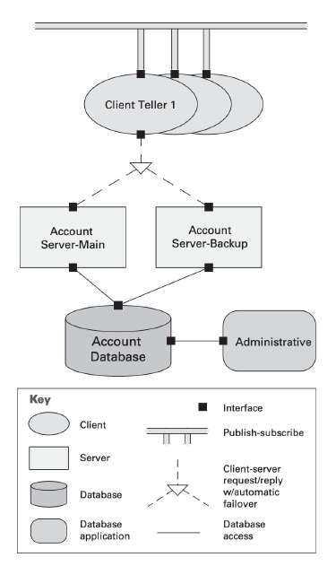
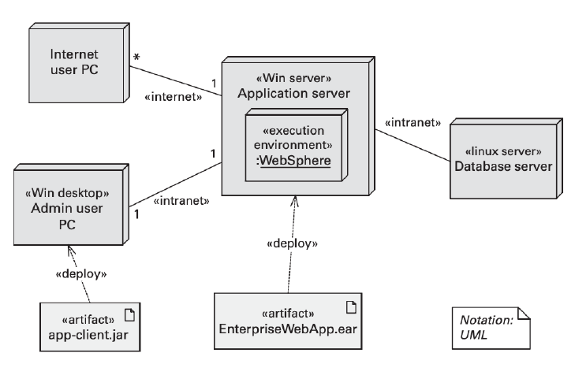
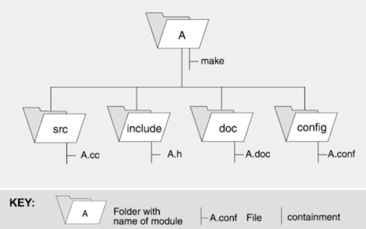
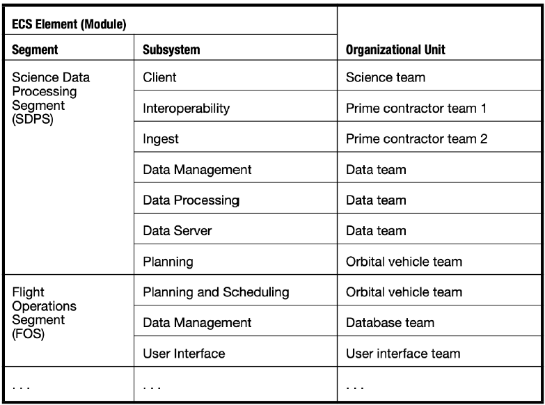

# Architectural Views - C&C and Allocation Views
## Component-and-Connector (C&C) Views
- Focuses on the primary computing units and data repositories that exist at **runtime**:
	- **Services, processes, objects, clients, servers, repositories**
- And on the communication vehicles used:
	- Protocols, information flows, data access
- In order to carry out the system's functionalities.

- The system is perceived as a collection of **runtime entities** called **components**, whose **interaction** is governed by **connectors**. They facilitate the analysis of properties exhibited by the system at runtime.
- **Elements:**
	- **Component types:** main processing units and data stores - a component has a set of ports through which it interacts with other components (via connectors).
	- **Connector types:** interaction mechanisms - connectors have a set of roles that indicate how components may use a connector in interactions.
- **Relations:**
	- **Attachments:** component ports are associates with specific connector roles - a components port *p* attaches to a connector role *r* if the component interacts over the connector using the interface described by *p* and conforming to the expectations described by *r*.
	- **Interface delegation:** in some situations, component ports are associated with one or more ports in an "internal" sub-architecture and similarly for the roles of a connector.
- **Constraints:**
	- Components can only be attached to connectors, not other connectors.
	- Connectors can only be attached to components, not another connectors.
	- Attachments can be made only between compatible ports and roles.
	- Interface delegation can only be defined between two compatible ports or roles.
	- Connectors cannot appear in isolation - a connector must be attached to a component.
- **Purpose:**
	- Showing how the system works.
	- Guiding development by specifying the structure and behavior of runtime elements.
	- Helping architects and others to reason about runtime system quality attributes, such as **performance**, **reliability** and **availability**.

### Components
- Represent the main computational elements and data stores that are present at runtime.
- Each component has a **name** that should indicate the **intended function** of the component.
- Components have interfaces called **ports** - a port is a **point of potential interaction** of a component with its environment, and usually has an explicit type, which defined the kind of behavior that can take place at that point of interaction.
- **A component may have many ports of the same type** - ports ≠ interfaces of modules, that are server replicated. Examples:
	- A filter might have several input ports of the same type to handle multiple input streams.
	- A server might provide several request ports for client interactions.
- A component in a C&C view may represent a complex subsystem, which itself can be described as a C&C sub-architecture.
- **Examples:** service invocation, asynchronous message queues, event multicast, pipes with asynchronous order-preserving data streams, etc.
- **Connectors have roles (its interfaces) defining the ways in which the connector may be used by components to carry out interaction** - a role represents expectations of a participant in the interaction.
- Like components, complex connectors may in turn be decomposed into collections of components and connectors that describe the architectural substructure of those connectors.

##### Example
This system contains a shared repository that is accessed by servers and an administrative component. A set of client tellers can interact with the account servers and communicate among themselves through a publish-subscribe connector.

Features diagram promote about the system: **reliability**, **availability**, **performance** and **concurrency**.

### Properties
- Every element should have a **name** and a **type**.
- If the view is supposed to be used for performance analysis, then latencies, queue capacities and thread priorities may be necessary for example.
- Ports and roles also may have properties associated with them. For example, maximum sustainable request rates may be specified for a server port.
- **Quality attributes** to be analyzed in a C&C view:
	- **Reliability**: Used to help determine overall system reliability.
		- What is the likelihood of failure for a given component or connector?
	- **Performance**: Used with others to determine system properties such as response times, throughput and buffering needs.
		- What kinds of response time will the component provide under what loads? What kinds of latencies and throughputs can be expected for a given connector?
	- **Resource requirements**: Used to determine whether a proposed hardware configuration will be adequate.
		- What are the processing and storage needs of a component or a connector?
	- **Functionality**: Used to reason about the overall computation performed by a system.
		- What functions does an element perform?
	- **Security**: Used to determine system security vulnerabilities.
		- Does a component or a connector enforce or provide security features, such as encryption or authentication?
	- **Concurrency**: Used to help analyze or simulate the performance of concurrent components and identify possible deadlocks.
		- Does this component execute as a separate process or thread?

### Relations with Other Views
- **Module and C&C views** have a strong relationship. Systems that have natural correspondences between these two types of views are often much easier to understand, maintain and extend.
	- Each component has a type that can be associated with an implementation module, such as a class.
	- Each module has a single runtime component associated with it and the connectors are restricted to *calls procedure* connectors.
- **Deployment and C&C views** also have a close correspondence, since runtime elements correspond to physical platforms and communication channels.

### C&C Styles
- **Dataflow**
	- Functional transformation process inputs to produce outputs
	- **Example:** pipe-and-filter, batch sequential
- **Call-Return**
	- Components receive control-and-data from other components and when they're finished executing, return control to the component that invoked them
	- **Example:** client-server, peer-to-peer, SOA
- **Event-Based**
	- Control transfers not through explicit calls or invocations but through the occurrence of events
	- Components can publish and/or subscribe to events
	- **Example:** pub-sub, SOA
- **Repository**
	- Large stores of persistent data
	- Large central or several central databases in which persistent data is stored
	- **Example:** shared-data, blackboard

## Allocation Views
- Allocation structures describe a mapping between software structures and the system environment:
	- **Organizational, development, installation, execution**
### Types of Allocation Views
- **Deployment view:** describes the mapping between the software's components and connectors and the hardware of the computing platform on which the software executes.
- **Install view:** describes the mapping between the software's components and structures in the file system of the production environment.
- **Work assignment view:** describes the mapping between the software's modules and the people, teams or organizational work units tasked with the development of those modules.

### Deployment View
- Describes the mapping of components and connectors in the software architecture to the hardware of the computing platform.
- **Elements:**
	- **Software elements:** elements from a C&C view.
		- Useful properties to document include the significant features required from hardware such as processing, memory, capacity requirements and fault tolerance.
	- **Environmental elements:** hardware of the computing platform - processor, memory, disk, network (router, bandwidth, firewall, bridge), etc.
		- Useful properties are the significant hardware aspects that influence the allocation decision.
- **Relations:**
	- ***Allocated-to:*** physical units on which the software elements reside during execution.
		- Properties include whether the allocation can change at execution time or not.
	- ***Migrates-to, copy-migrates-to*** and ***execution-migrates-to***: if the allocation is dynamic
		- Properties include the trigger that causes the migration.
- **Constraints**:
	- The required properties of the software must be satisfied by the provided properties of the hardware.
- **Purpose:**
	- Analyzing **performance**, **availability**, **reliability** and **security**.

### Install View
- Describes the mapping of components in the software architecture to a file system in the production environment.
- **Elements:**
	- **Software elements:** a C&C component.
		- Required properties, if any, usually include requirements on the production environments such as a requirements to support a language runtime environment or a database, or specific permissions on the file system.
	- **Environmental elements:** a configuration item, such as a file or a folder.
		- Provided properties include indications of the characteristics provided by the production environments.
- **Relations:**
	- ***Allocated-to:*** a component is allocated to a configuration item.
	- ***Containment:*** one configuration item is contained in another.
- **Constraints:**
	- Files and folders are organized in a tree structure, following an *is-contained-in* relation.
- **Purpose:**
	- Create build-and-deploy procedures;
	- Navigate through a large number of files and folders that constitute the installed system, to locate specific files that require attention (such as a log file or configuration file);
	- Select and configure files to package a specific version of a software product line;
	- Update and configure files of multiple installed versions of the same system;
	- Identify the purpose or contents of a missing or damaged file, which is causing a problem in production;
	- Design and implement an “automatic updates” feature.

### Work Assignment View
- Describes the mapping of the software architecture to the teams in the development organization.
- **Elements:**
	- **Software elements:** a module.
		- Properties include the required skillset and availability capacity (effort, time) needed.
	- **Environmental elements:** an organizational unit, such as a person, team, department, subcontractor, etc.
		- Properties include the provided skillset and the capacity in terms of labor and calendar time available.
- **Relations:**
	- ***Allocated-to:*** a software element is allocated to an organizational unit. In general, the allocation is unrestricted - in practice, it is usually restricted so that one module is allocated to one organizational unit.
- **Purpose:**
	- Helps with planning and managing team resources allocations, assigning responsibilities for builds, and explaining the structure of a project.

### Stakeholders Documentation Needs
Table representing the detail needed for each stakeholder in relative percentages:

| Role            | Module Views (%) | C&C Views (%) | Allocation Views (%) |
| --------------- | ---------------- | ------------- | -------------------- |
| Project Manager | 20%              | 0%            | 80%                  |
| Developer       | 40%              | 40%           | 20%                  |
| Designer        | 50%              | 30%           | 20%                  |
| Maintainer      | 40%              | 40%           | 20%                  |
| Customer        | 10%              | 30%           | 60%                  |
| End User        | 0%               | 50%           | 50%                  |
