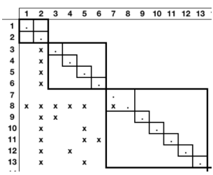
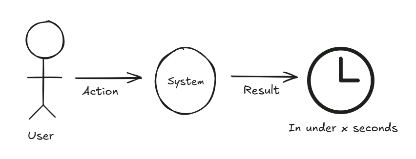

### Grupo I
#### 1. A maleabilidade do software é um dos vários fatores que colocam desafios e dificuldades únicas ao design de software. 

#### (a) Explique porquê.

> Tal acontece porque a maleabilidade permite aumentar o nível de entropia do software. Para tal, a maleabilidade do software exige um design bem pensado para minimizar os impactos negativos de alterações futuras.

#### (b) Em que consiste o Technical Debt? De que forma está este fenómeno relacionado com a maleabilidade do software?

> Technical debt refere-se ao tempo e esforço necessário para refazer melhor o código após más decisões terem sido tomadas - em vez de implementar uma solução boa em long-term, foi implementada uma solução fácil como atalho para resolver o problema rapidamente, o que implica futuro retrabalho para corrigir e implementar uma nova solução mais apropriada ao problema. 
> Quanto maior a maleabilidade e flexibilidade do software, maior é a facilidade em tomar este tipo de decisões "short-term", acumulando maior technical debt.

#### 2. A modularidade é um conceito de qualidade aplicável ao design de um sistema de software.

#### a) Explique em que consiste.

> A modularidade refere-se à organização do software em módulo independentes, onde cada um tem uma única função (SRP). Isto reduz o acoplamento entre módulos e aumenta a coesão dentro de cada um, tornando o sistema mais fácil de entender, testar e manter.

#### b) Indique, justificando, dois conceitos de qualidade dos sistemas de software diretamente relacionados com a modularidade dos seus designs.

> **Maintainability:** a modularidade facilita a manutenção do código, pois reduz o acoplamento entre componentes, permitindo que mudanças em um módulo tenham impacto limitado nos outros, resultando num sistema mais previsível e menos propenso a erros.
>
> **Separation of Concerns:** a modularidade promove a separação de responsabilidades, garantindo que cada módulo tenha uma única função bem definida. Isso torna o sistema mais organizado e compreensível, simplificando alterações e extensões futuras.

#### c) Indique de que forma matrizes como a mostrada ao lado (uma Design Structure Matrix) podem ser usadas para analisar a modularidade de um design.

> A matriz ajuda a avaliar a modularidade de um design ao identificar grupos de componentes coesos (módulos) e dependências (acoplamento). Assim, permite otimizar o design para garantir maior independência entre os módulos e facilitar a maintability, scalability e reusability.

#### d) O Information Hiding é uma abordagem, introduzida por David Parnas, para conceber as estruturas modulares do design de um sistema de software. De acordo com esta abordagem, como devem ser tomadas as decisões de modularização?

> Esta abordagem diz que as decisões de modularização devem ser tomadas com base em quais decisões são mais prováveis de mudar ao longo do tempo - maior encapsulamento e menor acoplamento. 
> Então, os módulos devem:
> 	- Disponibilizar apenas os campos ou métodos estritamente necessários as outros, ou seja, a visibilidade default dos mesmos deve ser privada ou protegida.
> 	- Ocultar ao máximo detalhes de implementação, para que mudanças internas nao afetarem os módulos. 
> Isto permite maior maintability, scalability e reliability.

#### e) Em que medida poderá ser útil uma ferramenta que, recorrendo à história das versões de um sistema de software, é capaz de produzir matrizes DSM que também exibem o número de vezes que dois módulos mudaram juntos (i.e., no mesmo commit)?

> Tal ferramenta seria útil para determinar se um dado commit aumentou o acoplamento entre módulos, o que é indesejável. Por vezes, é difícil identificar dependências entre módulos, e, com esta forma automatizada, o problema poderia ser rapidamente identificado e corrigido, em vez de permanecer oculto na base de código.

### Grupo II
#### Pretende-se desenvolver um sistema que permita monitorizar as tendências no uso de palavras numa língua. O nome já foi escolhido — WordTrending e, grosso modo, os requisitos do sistema também já foram elicitados e são os descritos abaixo.

(...)

#### 1. Indique um estilo arquitetónico que considere apropriado para usar neste sistema. Descreva, em abstrato, esse estilo (nomeadamente o tipo de componentes e conectores, e o modelo de computação) e as principais vantagens e desvantagens que lhe estão associadas.

> **Pipe-and-filter**, pois é necessário produzir um fluxo contínuo de informação, o que não é possível com outro estilo arquitetónico.
> **Componentes:** Filters - recebe informação no seu input e transforma-a, devolvendo esse resultado no output
> **Conectores:** Pipes - transmitem a informação do output de um filter para o input do próximo
> **Modelo de computação:** todos os elementos continuam em execução até não haver mais inputs a processar.
> **Vantagens:** 
> 	- Modularidade e reuso: os filtros são independentes e modulares, podendo ser trocados ou adicionados ou removidos da cadeia de filtros já existente.
> 	- Eficiência: como os filtros funcionam de modo sequencial sem terem que esperar que todo o stream seja concluído antes do próximo, podem funcionar de modo concorrente, o que contribui para a performance do sistema, ao contrário do modelo batch sequential.
> **Desvantagens:**
> 	- As estruturas de dados têm que ser relativamente simples de modo a todos os filtros a conseguirem interpretar (parse e unparse)
> 	- Não existe interação entre componentes

#### 3. Explique porque se usam várias vistas para apresentar a arquitetura de um sistema e exemplifique com o WordTrending, indicando que outras vistas seria útil produzir neste caso e porquê.

> Diferentes vistas são úteis para representar o sistema para diferentes stakeholders, pois cada um tem preocupações distintas sobre o design e operação do sistema.
> Neste caso, por exemplo:
> 	- **Module views:** mais relevantes para os programadores
> 	- **C&C views:** mais relevantes para os arquitetos de software
> 	- **Allocation views:** mais relevantes para o CEO ou para os utilizadores

### Grupo III
#### 1. É sabido que a arquitetura de um sistema influencia fortemente diferentes atributos de qualidade
#### a) Explique qual a estrutura típica de um cenário de qualidade e indique as vantagens de usar estes cenários para exprimir os requisitos relativamente aos atributos de qualidade

Estrutura típica de quality attribute scenarios:

**Vantagens:** clareza, foco em casos concretos, compliance com os requirements, suporte à comunicação entre stakeholders e performance.

