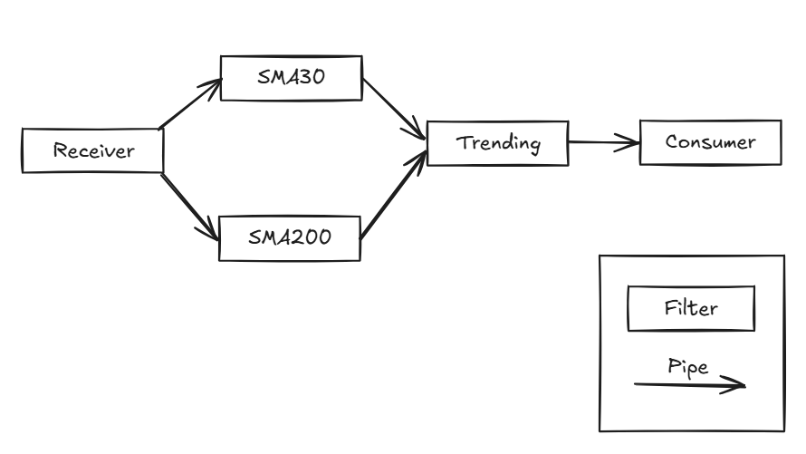

#### 1. Existem três formas de caracterizar a manutenção de um sistema: Manutenção Perfeccionista, Manutenção Adaptativa e Manutenção Corretiva (Perfective maintenance, Adaptive maintenance, Corrective maintenance). Escolha duas e explique em que consistem.

> **Manutenção Perfecionista:** tem como objetivo extender ou melhorar funcionalidades do sistema já operacional.
> **Manutenção Adaptativa:** tem como objetivo ajustar o sistema para cumprir mudanças impostas por fatores externos, por exemplo mudança de sistema operativo, leis ou hardware.
> **Manutenção Corretiva:** tem como objetivo corrigir bugs no sistema.


#### 2. O software é algo intangível, o que faz com que a medição de progresso seja uma tarefa delicada. Indique duas estratégias para observação do progresso num projeto, justificando.

> Criação de milestones e deliverables, de modo a dividir o projeto em tarefas mais pequenas, cada uma com um objetivo definido.

#### 3. A manutenibilidade (maintainability) é um conceito de qualidade que agrega vários subconceitos. Escolha dois e explique em que consistem.

> **Modularidade:** os vários elementos do software devem ser modulares, cada um com uma funcionalidade bem definida - facilita a identificação de problemas e resolução dos mesmos.
> **Extensabilidade:** refere-se à capacidade de um elemento ser extensível e capaz de acomodar mudanças ou adicionar funcionalidades com o mínimo impacto no código já existente - reduz o esforço necessário para implementar novos requisitos e torna o sistema mais flexível aos mesmos.
> **Testabilidade:** refere-se à facilidade em que o software pode ser testado para garantir o seu correto funcionamento - ajuda a identificar rapidamente problemas com alterações recentes do código, reduzindo o risco de falhas após manutenção


#### 4. Explique qual a ideia-chave em que assenta a medida de complexidade ciclomática (cyclomatic complexity); não se esqueça de referir o que esta medida aproxima.

> A ideia chave desta medida de complexidade é o número de caminhos possíveis que podem existir no código (fluxo de controlo) - quantos mais caminhos possíveis, mais imprevisível pode ser o seu comportamento, aumentando a dificuldade de deteção de erros.
> Esta medida aproxima o número de testes necessários de modo a ter o maior test coverage possível (% linhas executadas em testes).

#### 5. O seguinte diagrama representa uma vista de módulos de um sistema (System) com um módulo cliente (Client) e um módulo servidor (Server). Indique qual o estilo representado, qual o tipo de relação, e quaisquer restrições que eventualmente existam neste estilo (caso considere que não existem restrições, explicite-o).


> Trata-se de uma decomposition view, que tem uma relação "is-part-of" entre o system e os outros dois modulos, client e server.
> Nesta view, existem duas restrições: não podem haver loops, e um elemento filho só pode ter um elemento pai. 


#### 6. Considere um sistema com 2 servidores com diferentes disponibilidades e taxas de serviço (pedidos/unidade de tempo): 
```
Servidor1: a1 (disponibilidade), s1 (taxa de serviço) 
Servidor2: a2 (disponibilidade), s2 (taxa de serviço)
```
onde s1<s2. Os pedidos de um Cliente são enviados para o Servidor1 em
primeira instância, que dará uma resposta ao pedido caso esteja disponível.
Caso este não esteja disponível, o pedido é reencaminhado para o Servidor2,
que de igual modo dará uma resposta ao pedido caso esteja disponível.
Considerando apenas as situações em que uma resposta é obtida, calcule o
tempo médio que o Cliente demora a receber uma resposta.


> 1º Caso - Servidor1 Disponível: d1 = a1
> 2º Caso - Servidor1 Indisponível: d2 = (1 - a1)a2
> Tempo Médio Servidor1: t1 = 1/s1
> Tempo Médio Servidor2: t2 = 1/s2
> Tempo Médio = d1 \* t1 + d2 \* t2 = a1 \* 1/s1 + (1 - a1)a2 \* 1/s2 = a1/s1 + (1-a1)a2/s2  

#### 7. Pretende-se desenvolver um sistema StockTrend que a partir de um fluxo contínuo de cotações em bolsa de um conjunto de títulos calcula a tendência (de subida ou descida) tendo em conta os valores de SMA30 e SMA200 (simple moving average).

#### a) Indique um estilo arquitetónico que considere apropriado para usar neste sistema. Descreva, em abstrato, esse estilo (nomeadamente o tipo de componentes e conectores, e o modelo de computação) e as principais vantagens e desvantagens que lhe estão associadas.

> **Pipe-and-filter**: de modo a acomodar o fluxo contínuo de informação.
> **Componentes:** Filters - recebe informação no seu input e transforma-a, devolvendo esse resultado no output
> **Conectores:** Pipes - transmitem a informação do output de um filter para o input do próximo
> **Modelo de computação:** todos os elementos continuam em execução até não haver mais inputs a processar.
> **Vantagens:** 
> 	- Modularidade e reuso: os filtros são independentes e modulares, podendo ser trocados ou adicionados ou removidos da cadeia de filtros já existente.
> 	- Eficiência: como os filtros funcionam de modo sequencial sem terem que esperar que todo o stream seja concluído antes do próximo, podem funcionar de modo concorrente, o que contribui para a performance do sistema, ao contrário do modelo batch sequential.
> **Desvantagens:**
> 	- As estruturas de dados têm que ser relativamente simples de modo a todos os filtros a conseguirem interpretar (parse e unparse)
> 	- Não existe interação entre componentes

#### b) Conceba uma arquitetura para o sistema baseada nesse estilo. Apresente uma vista de componentes e conectores que descreva a organização geral do sistema em tempo de execução, não esquecendo de (i) incluir uma legenda e (ii) descrever minimamente todos os elementos envolvidos no(s) diagrama(s) que apresentar.



> Componentes:
> **Receiver:** recebe a informação a ser analizada, enviando-a para os dois filtros especializados
> **SMA30**: calcula o valor de SMA30
> **SMA200**: calcula o valor de SMA30
> **Trending:** baseado nos valores dos dois filtros anteriores, calcula a tendência (subida ou descida)
> **Consumer:** recebe o output que diz se houve uma subida ou descida nas cotações da bolsa
> 
> Conectores:
> **Pipes:** responsáveis por transmitir a informação de um filtro para outro

#### c) Explique qual a estrutura típica de um cenário de qualidade e indique as vantagens de usar estes cenários para exprimir os requisitos relativamente aos atributos de qualidade.

> 