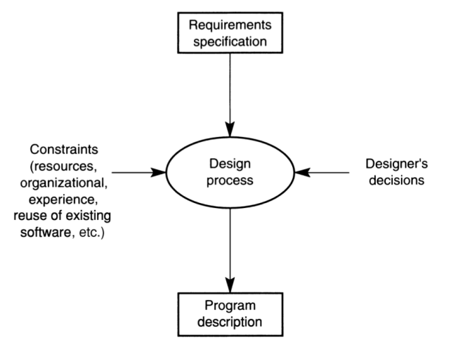
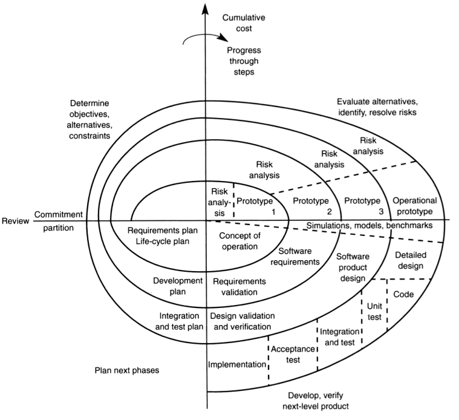

# Design Process
- The making of a set of decisions regarding the form and operation of the artifact to be built.
- Results in a detailed and precise plan that, if followed, leads to the realization of the desired artifact.

A software development process organizes activity into distinct phase, such as:
```
Planning and requirements gathering -> Design -> Coding -> Testing -> Deployment -> Maintenance -> ... 
```
Processes can increase efficiency but are often implemented poorly. Also, it's very difficult to measure *progress*. 

#### Design vs Fabrication
- Design is not the only factor that matters in the production of artifacts.
- While good design may be marred by poor fabrication, usually no amount of constructional skill makes up to poor design.

#### Path of Science vs Path of Engineering
- Obviously are not isolated from one another.
- The interplay between them has always provided an important element for both.

#### The Purpose of Design
- **To produce a solution to a problem.**
- The **design process** involves evaluating different options and making choices using decision criteria that may be complex and may involve trade-offs between factors such as size, speed and ease of adaption, as well as other problem-specific factors.

##### How to make decisions?
- **Design methods and patterns**: help determine which choice may be most appropriate in a given situation.
- **Representations**: help with the process of building models of the intended system and with evaluating its behavior.
- **Abstraction**: is concerned with the removal of detail from a description of a problem, while retaining the essential properties of its structure, which helps building manageable models of large and complex systems.

##### Design as a Problem-solving Process
- The **problem** is summarized by means of some form of requirements specification.
- The **designer** provides a description of how the requirements are met.
- It is **not an analytical** process, but rather a highly creative one:
	- involving evaluating different options,
	- making choices using decision criteria,
	- involving trade-offs between problem-specific factors,
	- and also physical factors.

##### Software as a Unique Design Discipline
- Software is **malleable**:
	- It allows for incremental development;
	- Consequently, it is more susceptible to the effects of entropy, accumulating technical debt;
	- Restoring order requires a explicit effort.
- **Entropy**: measure of disorder in a system.
- **Technical debt**: implied cost of future reworking needed when choosing an easy but limited solution instead of a better and well-thought that could take more time but be more effective in a long-term perspective - technical debt accumulates, making it harder to implement changes over time.

## The Software Design Process
Unique features of software:
- **Intangibility/invisibility**:
	- Any forms of representation that are used to describe it will lack any form of visual link that can provide an easily grasped relationship between the representation and the system.
	- It is symbolic and abstract, not constrained by any physical laws.
	- Resulting in a vast space of feasible solutions, primarily conditioned by intellectual complexity - many different solutions to a specific problem might solve it in different ways.
	- Constraints our ability to conceptualize the characteristics of software.
	- Hinders communication among those involved with its development.
- **Complexity**:
	- A system may possess many states during execution.
	- The complexity is arbitrary, being dependent upon the designer rather than the problem.
- **Conformity**:
	- Software, being *pliable*, is expected to conform to the standards imposed by other components, such as hardware, external bodies or existing software.
- **Evolution**:
	- Software suffers constant need for change, thereby needing maintenance.
- **Discrete behavior** (not continuous):
	- The effects of a change do not correlate with the magnitude of the change.
	- Solutions require an unprecedented level or rigor due to the discontinuous nature of its operation.
- **Design-intensive nature**:
	- The construction of software is the result of intensive human work and thinking. The majority of time and resources are not consumed in the manufacturing activity but instead in the design activity.
	- Software development cannot be managed like manufacturing processes.
- **Atypical cost distribution**:
	- The older a problem is, the more expensive it will be to detect and correct it, and the less likely it will be appropriately fixed.
	- Maintenance is not necessary due to wear and tear but because of other factors.
	- It costs more to maintain a software rather than to develop it in its early stages.

### A General Model of the Software Design Problem: an Idealized View



#### Constraints
Decisions to be made involve many different elements, many of which are not within the problem domain:
- **Business model** for the product, which can range from single-use licenses to subscription services.
- **Delivery model**, which can vary from discrete product delivery to the continuous flow of new features in an ever-evolving product.
- **How intellectual property is managed**, which can range from proprietary approaches to high levels of openness and transparency.
And many others related to the domain, especially the structure:
- **Architectural decisions:** monolithic system vs. decentralized micro-services system

#### Exceptional Designers
- **Familiarity with the application domain**: enables them to map between problem structures and solution structures.
- **Skill in communicating technical vision to others**: much of the design work is accomplished interacting with others.
- **Identification with project performance**: designers often are found taking on significant management responsibilities for ensuring technical progress.

> *"Interestingly, though, the exceptional designers studied often did not possess particularly good programming skills..."*

#### Opportunistic Software Design Steps
Even where designers aim to follow a strategy such as ‘top-down’ (systematically refining the description of the solution into ever smaller actions), they may deviate from this plan, either:
- to **postpone a decision**, if the information required is not yet available at this design level;
- or to **process information that is readily to hand**, and which can be used for defining modules in anticipation of further developments in the design.

#### Software Development with a Team 
- By **recording the decisions and rationales** taken:
	- New team members can absorb project knowledge more easily.
	- The system's maintenance becomes easier.
- **Version control and documentation** are essential for managing efforts.
- **Team size influence:**  a team size of 10–12 is the upper limit for productive work.

## Design in the Software Development Process
### Waterfall Model
- Recognizes feedback loops between stages.
- Evaluates feasibility, identifies user needs, and models those needs.
- Detailed design, coding, and testing ensure that the system meets requirements.

```
Feasibility study  
  ↔ Requirements elicitation and analysis  
    ↔ Architectural design  
      ↔ Detailed design  
        ↔ Coding  
          ↔ Unit testing  
            ↔ Integration testing  
              ↔ Operation and maintenance
```

The **motivations** to develop life-cycle models are: 
- Provide strong management framework for planning developments;
- Provide great source of monitoring and control of developments;
- Enable to identify milestones that can be used to record progress.

However, this might end up being more used as description of **what has been done** than for assisting on **what is to be done**.
A **major limitation** of linear development processes is the need to **identify exactly what is required of the system from the very beginning**, which can be impractical.
This can be often resolved with some form of a prototype.
#### From Linear to Incremental Development
- Incremental approaches like prototyping help resolve situations where requirements evolve.
- **Prototype Types:**
    - **Evolutionary:** gradually adapts to changing requirements and evolves into the final product.
    - **Experimental:** used to evaluate potential solutions, intended to be discarded later.
    - **Exploratory:** helps clarify user requirements and test organizational impacts.
    
(In software production it’s quite possible that the prototype will be the product in due course)

### The Spiral Model
- Combines waterfall experience with practical knowledge of software project development.
- Each stage involves:
    - **Identifying objectives**,
    - **Exploring options and constraints**,
    - **Evaluating risks**,
    - **Planning the next stage**, which may include prototyping.



#### Reactive Development Processes
- A variation of the incremental approach.
- Open source software is the best-known example of this model.
- In the linear and incremental development process, there are few designers and a lot of programmers, while in the open-source model there are few coordinators and a lot of contributors.

#### Some Process Issues and Outcomes 
- **Requirements**: Mid-project scope changes by customer/manager -> scope expands 25-50% 
- **Quality Assurance**: Late detection of issues -> release with known defects 
- **Defect Tracking**: Informal bug reporting -> bugs forgotten 
- **System Integration**: Late integration of components -> interfaces out of sync 
- **Source Code Control**: Accidentally overwritten changes -> lost work 
- **Scheduling**: Repeated new estimates -> project delays, missed deadlines

#### Verification & Validation 
- **Verification**: Are we building the product right? - detects inconsistencies between design and specification. 
- **Validation**: Are we building the right product? - detects inconsistencies between design and actual user needs.

#### Maintenance Types 
- **Perfective Maintenance**: extending/improving a system with new functionality. 
- **Adaptive Maintenance**: adjusting to external changes like new laws or operating systems. 
- **Corrective Maintenance**: fixing bugs in the operational system. 

>_"Flexibility cannot be an afterthought"_

### Agile Development
- **Iterative and incremental approach** that emphasizes flexibility, customer collaboration and rapid delivery.
- Best for projects with rapidly changing requirements or where frequent feedback is necessary.

### Scrum
- Framework under Agile methodology focusing on **small teams** working in time-boxed iterations called **sprints**.
- Best for teams that need a structured, iterative process with defined roles.