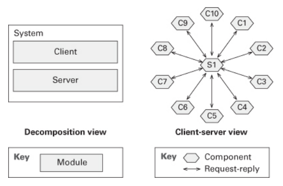
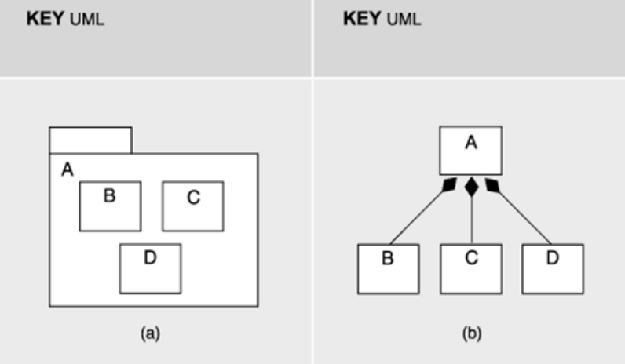
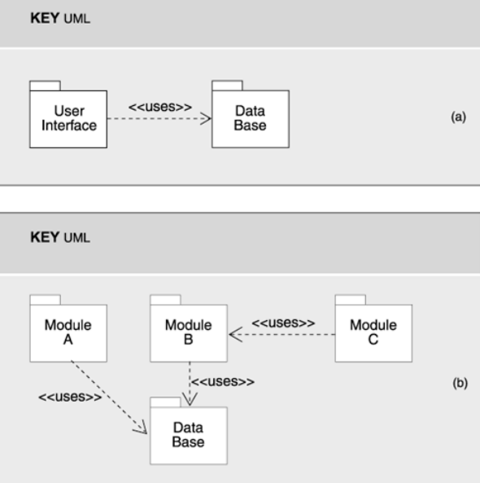
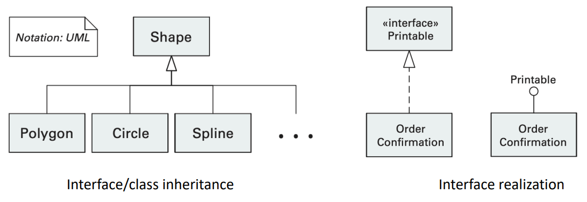
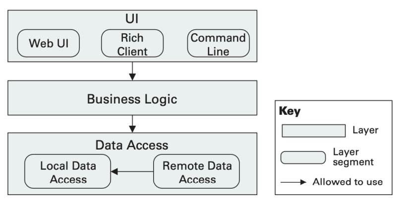
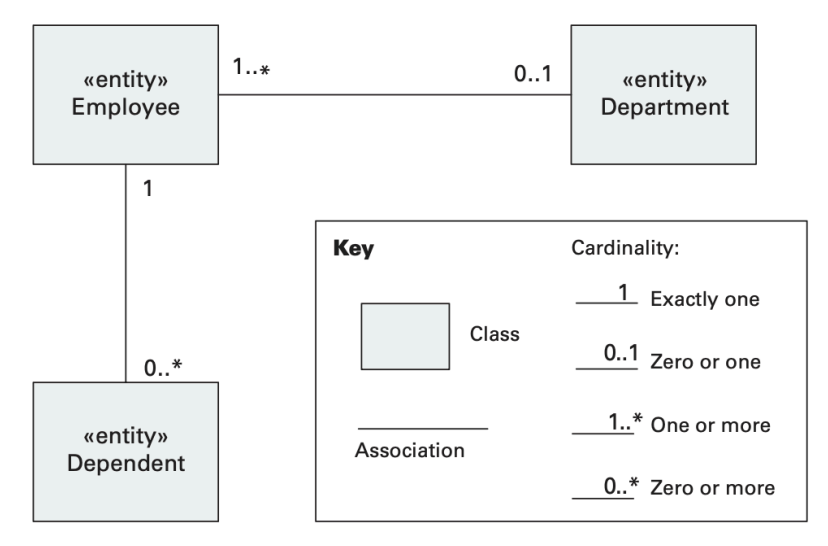

# Architectural Views - Module Views
### Software Architecture
- The software architecture of a system is the **set of structures** needed to reason about the system, which comprise:
	- software **elements**
	- **relations** among them
	- external visible **properties** of both
- These structures, carefully chosen and designed by the architect, are the **key to achieving and reasoning about the system's design goals**.
- **Prescriptive**:
	- Decisions of the future - architecture as it should be
	- Idealized version of the past - architecture as it should have been
- **Descriptive**:
	- Decisions of the past - architecture as it is
	- Maybe complex due to repeated violations and shortcuts taken
	- May have to be "recovered" from actual system (architectural archeology)

#### The Role of Software Architecture
It establishes a connection between the requirements - objectives and constraints - and the system implementation, in the transition from problem definition to the space of solutions.

**Requirements → ??? → Code**
> *“A software architecture is developed as the first step toward designing a system that has a collection of desired properties.”*

- It conveys important **design decisions**:
	- Initial decisions made to satisfy requirements
	- Decisions that affect more than one system quality
	- Decisions that restrict what can be done subsequently
	- Decisions that are difficult to modify later
- The ability of a system to fulfil specific objectives, particularly to exhibit certain qualities, is substantially determined by its architecture, namely:
	- Performance, modifiability, availability, security, reusability, scalability, ...

#### Stakeholders
- Each party involved in a system is concerned with its different characteristics, which depend on the chosen architecture, and often, their interests conflict.
- Some stakeholders include:
	- **End user:** the architecture ensures the reliability, usability and availability of the system.
	- **Client:** possibility of the system with this architecture being implemented within a certain timeframe and budget.
	- **Project manager:** ensuring that the client's expectations are met plus the possibility of the system being developed by different teams independently, interacting in a disciplined and controlled manner.
	- **Architect:** strategies to achieve all these objectives that are difficult to reconcile.

#### The Importance of Software Architecture
- Three major aspects:
	- **Communication among stakeholders**
	- **Early design decisions**
	- **Transferable abstraction of a system**
- The architecture of a software system in general is not reduced to the decisions that are reflected in the code.
- The explicit description of a system's architecture in the form of an **architectural design** is important at different levels:
	- **Communication and understanding**
	- **Reuse**
	- **Construction and evolution**
	- **Analysis**

##### Communication and Understanding
- A documented architecture is an effective **communication vehicle** within the project, among all parties involved.
- The architecture represents a common abstraction of the system that most stakeholders can use:
	- as a basis for **mutual understanding**
	- for **negotiation and communication** at a level of abstraction that can be managed, even in the case of large and complex systems

##### Analysis, Construction and Evolution
- **Prescriptive architecture**
- Restricts how the system can be implemented:
	- Defining that the implementation must be carried out using certain elements, which must interact in a certain way and assume the responsibilities dictated by the architecture.
	- Expressing decisions about the allocation of resources.
- Defines an organizational structure, whether it is for the development project or even the company, which assists in planning and managing development activities.
- Helps in analyzing and managing change.
- Enables predictions regarding different quality attributes.
- Assists in defining cost and time estimates.

##### Reuse
- Abstraction of the system which is **transferable** between different systems.
- Applied in systems with similar requirements, promotes widespread reuse.
- Effective basis for the reuse of knowledge.
- Systems can be built using externally developed elements.
- Allows training new elements of the projects.

#### Software Structures
- A structure is a set of elements held together by a relationship.
- There is a multiplicity of structures in software systems.
- None of these structures alone can be considered "the architecture" of the system.

#### Views
- Represent and document software structures.
- Representation of a set of system elements and the relations associated with them.
- Only some system elements are shown.
- Provide different abstractions of the system for different people with different purposes.
- When referring to the architecture of a system, it is important to make clear which view we are considering.
- No right set of views exist - we just try to choose the best ones for the particular situation or system, which depend on:
	- the structures that are inherent in the software
	- who the stakeholders are and how they will use the documentation

#### Architectural Styles
- Specialization of elements and relation types, together with a set of constraints on how they can be used.
- Influence the choice of the **view**.
- Different parts of the system might exhibit different styles.
- **Bridging elements** provide the continuity of understanding from one view to the next.

### Types of Views
The different views correspond to different types of decisions involved in the architectural design.
- **Module Views (Implementation):** shows how the system is structured as a set of implementation units - **decomposition, uses, layered, class**.
- **C&C Views (Execution):** shows how the system is structured as a set of elements with runtime behaviors **(components)** and interactions **(connectors)** - **process, concurrency, shared data, client-server**.
- **Allocation Views (Deployment)**: shows how the system relates to non-software structures in its environment (CPUs, file systems, networks, etc.) - **allocates to, deployment, implements**.

#### Modules vs. Components
- A **module** refers to an implementation unit or artifact (not so focused on the delivery medium and runtime).
- A **component** refers to a runtime entity - unit of software active at runtime (not visible into the implementation structure.

##### Example

- **2 modules** (implementation units)
- **11 components** (runtime units)

#### Module Views
- Represent code structures.
- The system is seen as a collection of implementation units (code and data) - **modules**.
- Specific (computational) responsibilities are assigned to the modules.
- In large projects, they also serve as the basis for distributing work among different development teams.
- They also support the analysis of aspects related to the maintenance and evolution of the system.
- **Definitions**:
	- **Elements:**
		- Modules that are implementation units and implement a set of responsibilities. Properties of modules include name, responsibilities, visibility and interface. Other properties are style-specific.
	- **Relations**:
		- **A is part of B**: defines a part-whole relation among modules.
		- **A depends on B**: defines a dependency relation among modules - specific module views specify which dependency is meant.
		- **A is B:** defines specialization/generalization relation among modules - child/parent relationship.
- **Purpose**:
	- **Construction:**
		- Blueprints for the code
		- Assignment for team development
		- Basis for subsequent design (e.g., interfaces), subsets and deployment procedures.
	- **Analysis**:
		- Traceability and impact analysis
		- Project management, budgeting, planning and tracking
	- **Education**:
		- Learn about the project's structure through understanding module views.
- **Types of Module Views**:
	- **Decomposition View:** shows the structure of modules and submodules.
	- **Uses View:** indicates functional dependency relations among modules.
	- **Generalization View:** indicates specialization relations among modules.
	- **Layered View:** describes the allow-to-use relation between groups of modules.
	- **Data Model View:** shows the relations among data entities.

#### Decomposition View
Shows the organization of the implementation units as **modules** and **submodules**.

- Decompositions relation, which is a form of the **"is-part-of" relation**.
- **Criteria** for decomposition:
	- Achievement of modifiability
	- Build versus buy (or reuse of components)
	- Software product lines: common versus unique parts
	- Developer's skills
- **Constraints**:
	- No loops are allows in the decomposition graph
	- A child can only have one parent
- **Purpose**:
	- Assigning responsibilities to modules as a prelude to downstream work
	- Conducting change/impact analysis
	- Developing work assignments
	- Communicating to newcomers, in digestible chunks, how the software is organized

#### Uses View
Reveals which modules **use** which other modules. A module **uses** another module **if its correctness depends on the correctness of the other** to satisfy its own requirements.

- Tells the developer what other modules must exist for this portion of the system to work correctly.
- Helps in managing the dependencies of a system that is being built or maintained. The goal of this task is to keep complexity under control and avoid degradation in the modifiability of the system due to the addition of undesirable dependencies.
- The relation "uses" is a specialization of the "depends-on" relation.
- No constraints, however, long dependency chains are undesirable, as they can cause problems with incremental system delivery - **low maintability, modifiability and scalability**.
- **Purpose:**
	- Planning incremental development
	- Use in system extensions and subsets
	- Debugging and testing
	- Observer and measure the effects of specific changes
- The interaction relationships are **not shown in the representation**.

##### "Uses" vs "Calls" 
- **"Uses"** - relies on another without explicitly calling it, but still depends on its well functioning.
- "**Calls"** - directly invokes another the other without necessarily relying on the outcome.

#### Generalization View
Results when the **is-a relation** is employed.

- Useful when an architect wants to support extension and evolution of architectures and individual elements.
- The modules are defined in such a way that they capture commonalities and variations. The module is **abstract** if it does not contain a complete implementation.
- The relation generalization is a specialization of the "is-a" relation. The relation can be further specialized to indicate, for example, if it is a class inheritance, interface inheritance or interface realization.
- **Constraints:**
	- A module can have multiple parents, although multiple inheritance is often considered a dangerous design approach.
	- Cycles are prohibited: a child module cannot be a generalization of one or more of its ancestor modules in a view.
- **Purpose:**
	- Incrementally describing evolution and extension
	- Capturing commonalities, with variations as children
	- Supporting reuse

#### Layered View
Reflects the division of the software into units that represent a grouping of module.

- Documents **"allowed-to-use"** relations among elements of the system
- The relation "allowed-to-use" is a specialization of the "depends-on" relation. The design should define the layer usage rules with a key, which should make clear what is allowed to use and be used by (e.g. “a layer is allowed to use any lower layer”).
- **Constraints:**
	- Every piece of software is assigned to exactly one layer
	- There is at least two layers
	- A lower layer is not allowed to use a layer above
- **Purpose:**
	- Promoting portability and modifiability.
	- Fielding subsets and incremental development
	- Separation of concerns
	- Reuse
-  The uses view goes hand in hand with the layered view.

##### "Uses" vs "Allowed-to-use"
- **"Uses"**: describes actual dependencies that emerge during implementation and governs the production of incremental subsets.
- **"Allowed-to-use"**: specifies predefined coarse-grained permissions and constraints, providing the degrees of freedom for implementers, and must not be violated by "uses."

#### Data Model View
Describes the static information structure in terms of **data entities and their relationships**.

- Models data entities, which hold information that needs to be stored or somehow represented in the system, and the relations among them.
- **Relations:**
	- "one-to-one", "one-to-many", "many-to-one" and "many-to-many"
	- "generalization"/"specialization" which indicate an "is-a" relation between entities
	- "aggregation" which turns a relationship into an aggregate entity
- **Constraints:**
	- Normalization may impose restrictions on intra and inter-entity dependencies
- **Purpose:**
	- Describing the structure of the data used in the system
	- Performing impact analysis of changes to the data model - extensibility analysis
	- Enforcing data quality by avoiding redundancy and inconsistency
	- Guiding implementation of modules that access the data
	- Guiding database performance optimizations
	- Prior to design, capturing the result of domain analysis

### Summary
- **Modules** pertain to the way in which a system’s software is decomposed into manageable units of responsibilities, which is one of the important forms of the system architecture.
- Modules are related to one another by forms of **“is-part-of”**, **“depends-on”**, and **“is-a”** relations.
- A **module view** provides a blueprint for the source code and the data model.
- You should not depend on a module name to define the functional duties of the modules: use the **responsibility property**.
- Document **module interfaces** to establish a module’s role in the system.
- Module views are commonly mapped to **component-and-connector views**. In general, a module may participate in many runtime components.
- Types of views:
	- **A decomposition view** shows how responsibilities are allocated across modules and submodules.
	- **A uses view** shows how modules depend on one another. This view helps achieve incremental development and is especially suitable for performing change-impact analysis.
	- **A generalization view** relates modules by showing how one is a generalization or specialization of the other. This view is widely used in object-oriented systems, where inheritance is used to exploit commonality among modules.
	- **A layered view** divides a system into groups of modules that provide cohesive responsibilities. These groups are called layers and relate to each other unidirectionally by the **“allowed-to-use”** relation. A layered design helps a system achieve portability and modifiability.
	- **A data model view** describes the structure of the data used in the system in terms of data entities and their relationships. It guides implementation and helps to improve performance and modifiability in data-centric systems.
