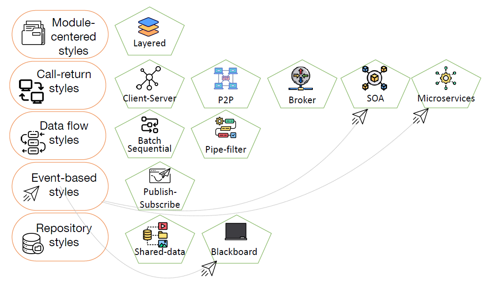
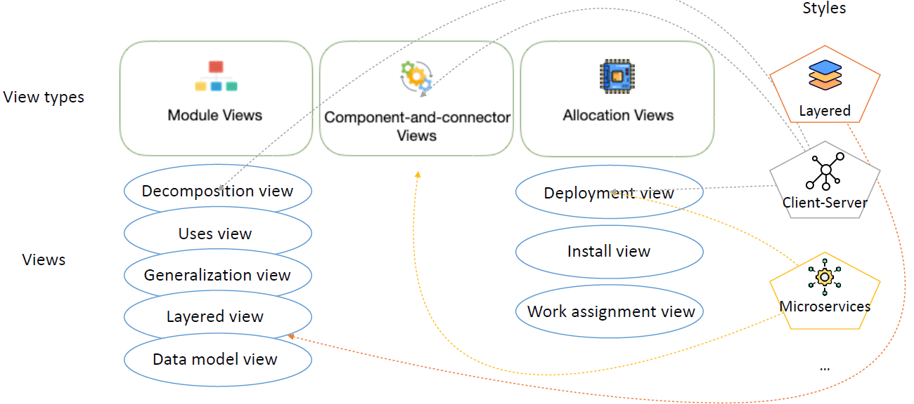
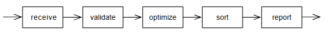
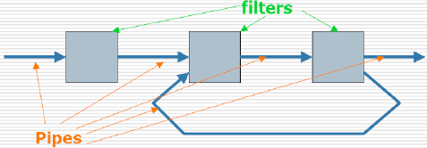
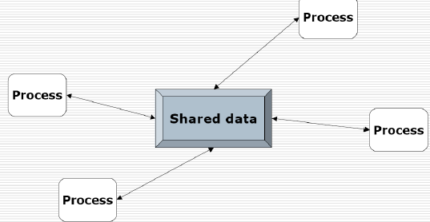
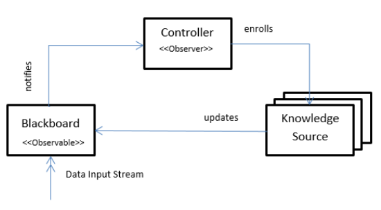
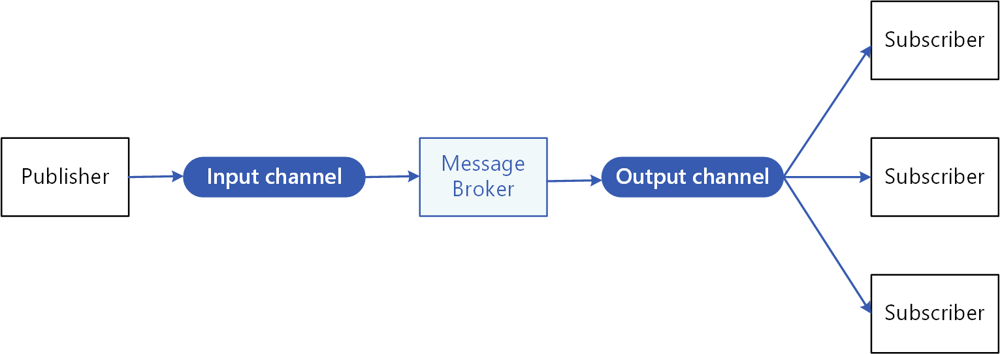
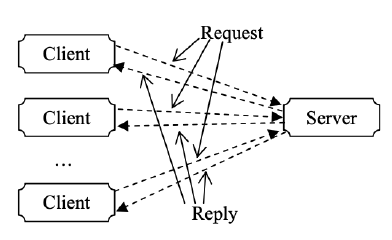
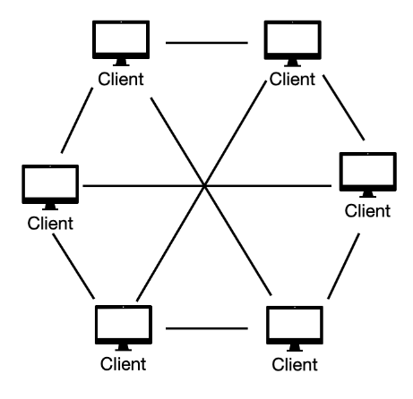

# Architectural Styles
- An architectural style is a named meta-model that defines a **high-level structuring/ organization of a system**.
	- It applies in a specific development context.
	- It restricts the design decisions applicable in that context.
	- It is associated with a set of benefits in the quality of each resulting system.
- They have multiple **purposes**:
	- Help understand and communicate the organization of the system.
	- Assist in documenting and communicating design decisions.
	- Reusability (design and code solutions).
	- Promote interoperability supported by the standardization of styles.
	- Describe the quality attributes associated with the solution.

### Architectural Styles vs Views
- In various types of views, from completely different systems, one observes the recurring use of certain ways to organize elements.
- For example:
	- In the **module view**, having the relationship of *“allowed-to-use”* between modules at a certain level of granularity as strictly unidirectional. Each of these modules – called a **layer** – is responsible for a coherent set of functionalities and can use the services of the immediately lower layer.
	- In the **C&C view**, having components act as clients and servers, and the connectors represent the protocols and messages they use for communication.

### Basic Properties
- An architectural style defines a family of architectures that:
	- **applies within a certain context**;
	- comprises a set of elements and relationships which define a vocabulary;
	- comprises a set of constraints regarding how various elements can be composed: topological rules, interfaces, required properties;
	- comprises a set of semantic models that allows determining properties of the system as a whole from the properties of its parts;
		- this enables the analysis of systems built in that style.
- **Each style has advantages and disadvantages and can be further specialized**.

## Module-Centered Styles
#### Layered
- **Context:** Used to structure systems
	- that can be decomposed into groups of functionalities, each at a particular level of abstraction
	- whose specification includes the description of high-level functionalities and the target platform (portability to other platforms is desired)
- **Proposal:** Structuring the system into layers, organized hierarchically (in a stack or concentrically).
	- Layer *N* provides services to *N+1*, relying on *N-1*.
	- Layer 1, at the lowest abstraction level, is the base and core of the system - the top layer provides high-level functionalities.
- **Elements:**
	- Layer (a type of module that groups modules offering a coherent set of services).
	- Its interface consists of the public services it provides - none of these services can depend on the existence of a specific layer below (dependencies are only on the interface).
- **Relations:**
	- *"Allowed-to-use"*: any element in a layer can use the public services of the layer below (provided by different elements).
- **Constraints:**
	- If one layer is above another, it cannot also be below.
	- There must be at least 2 layers.
	- All elementary code units belong to exactly 1 layer.
- **Properties:**
	- Promotes **modifiability**: results from the cohesion of the set of services provided by a layer.
	- Promotes **portability**: dependencies are local, and changes at one level can only affect adjacent levels.
	- Promotes **testability**: layers can be tested independently.
	- Promotes **reuse**, **evolution**, and the definition of **standards**.
	- It is not always easy or possible to structure a system this way.
	- It is difficult to establish the correct granularity of levels.
	- May incur **performance penalties**, some of which can be overcome with sophisticated compilation/linking/loading facilities.

## C&C Styles
### Data Flow Styles
- The system's structure is determined by the flow of data between components.
- Applies to systems where:
	- **data availability controls computation**
	- **the data flow pattern is explicit and is the only way components communicate**
- There are several variants distinguished by:
	- How control over computation is exercised (push vs. pull).
	- The degree of concurrency among different components.
	- Topological constraints.
- **Properties:**
	- Components are highly **independent**.
	- No global control of the components' behavior.
	- The processing elements can be executed concurrently, even on different computers - they are **capable of processing continuous streams of data**, which may be theoretically without a limit on the length of input data, and provide continuous control and monitoring functions of real-time process control systems.
	- The components are **reusable** and can be relatively easily integrated into other systems of the same architectural style.
- **Derived properties**:
	- The modification of the system can be easily performed at two levels:
		- At the **component level**
		- At the **systems' structural level**
	- Data flow architecture can be analyzed for its **performance** by applying well-established methods.
	- A **challenge** in the design and implementation of a data flow architecture is the **synchronization of the computations** of more than one processing element, if such synchronizations are necessary.

#### Batch Sequential
Sequential processing carried out by independent components that transform data and are executed sequentially - one component runs to completion before the next starts.

- The data is transmitted between components as a whole batch rather than a stream of data elements.
- Structures the system in terms of independent subsystems that encapsulate data processing steps (each element is not aware of the others).
- **Components:**
	- **Data Transformers:** transform input data into output data.
		- The interfaces of these components are limited to input and output ports.
- **Connectors:**
	- **Data Flows:** channel the result of a data transformer to the input of another.
- **Computational Model:**
	- Data transformers **execute sequentially**, with each transformation step completed before the next step begins (implicit scheduler).
	- Usually consists of a finite number of steps linearly connected. However, some of these systems contain loops that repeat some processing steps for a finite number of times.
- **Advantages:**
	- Reusability, modifiability and simplicity
	- Severable executions
	- Avoids concurrency issues
- **Disadvantages**
	- Not fault-tolerant (if one fails, all fail)
	- Parallelism is limited in distributed architectures
	- Cannot deal with continuous streams of inputs with unbounded lengths

#### Pipe-and-Filter
Sequential and incremental processing of data streams.

- Structures the system around filters that encapsulate each processing step and are independent of each other, specifically not sharing state or knowing the identity of the filters that feed them or the filters they feed.
- **Possible specializations:**
	- **Pipelines** that restrict the topology to be a linear sequence of filters.
	- **Pipes with limited capacity** that restrict the amount of data that can be in a pipe.
	- **Pipes with types** that restrict the data passing through a pipe to a have a well-defined type.
- **Components:**
	- **Filters:** can have multiple inputs and outputs - incrementally transform input data into output data
		- Filters are independent programs.
		- Filters don't know the identity of their upstream and downstream filters.
	- **Pipes:** carry the output data from one filter to the input of another filter with buffering.
- **Computational Model:**
	- All elements continue to execute until there is no more data to process.
- **Advantages:**
	- Simplicity
	- Filters are independent, which contributes to reuse (of components) and flexibility (add/change filters).
	- Performance: enables parallel processing by distributing filters across different processors (throughput).
	- Data is incrementally processed - this enables the system to process long streams of input data.
- **Disadvantages:**
	- Data structures to be exchanged should be relatively simple.
	- No interaction between components.
	- Not good at handling interactive applications.
	- May force a lowest common denominator on data transmission - before processing the data, each filter needs to parse the simplified format, and after processing, it needs to unparse the data to its original format.

### Repository Styles
- Applies to systems that access and update a widely accessed data store.
- **Components:**
	- **Data Store:** stores the shared data that other components can access.
	- **Clients:** that runs on independent threads of control and access the shared data to fulfil their functionality and to collaborate with each other.
- The shared data is the central means of communications among the clients.
- The shared data that all clients access and update may use a:
	- **Shared-Data Style:** passive repository, such as a shared file;
	- **Blackboard Style:** active repository such as a blackboard, that sends a notification to subscribers when data of interest is modified.
- **Properties:**
	- Structural solution to integrability especially when building from existing systems.
	- Clients are relatively **independent** of each other, and the data store is **independent** of the clients.
	- The system is **scalable** because new clients can be easily added.
	- It is **modifiable** with respect to changing the functionality of any client because other clients will not be affected (trade-off) - coupling among clients will lessen this benefit but may occur to enhance performance.
	- Modifiability of the representation of the data stored in the shared data component could be **problematic** because it may affect all clients in the system.

#### Shared-Data Style
The pattern of interaction is dominated by the **exchange of persistent data**. The data has multiple accessors and at least one shared-data store for retaining persistent data.

- Serve to structure systems where there is a state, involving a large amount of data that needs to be shared and manipulated by different elements, in different ways.
- Proposes structuring the system in terms of a collection of independent components that cooperate solely through a common data repository.
- Each component is specialized in a task and makes its knowledge accessible to other components through the repository.
- **Elements:**
	- Repository component
	- Data accessor component
	- Data reading and writing connector
- **Relations:**
	- Attachment relation determines which data accessors are connected to which data repositories.
- **Communication Model:**
	- Communication between data accessors is mediated by a shared-data store - control may be initiated by the data accessors or the data store.
	- The data is made persistent by the data store, for a database, ensuring that data remains available and does not get lost even after shut down.
- **Constraints:**
	- Data accessors interact with the data store(s).
- **Purpose:**
	- Allowing multiple components to access persistent data.
	- Providing enhanced modifiability by decoupling data producers from data consumers.
- **Advantages:**
	- **Consistency:** ensures a consistent view of information across components, reducing the risk of inconsistencies.
	- **Synchronization:** components can synchronize their actions by reading and writing to shared data, maintaining order and coherence in the system.
	- **Interoperability:** components can work together by accessing a common data source, reducing the need for complex communication protocols.
- **Disadvantages:**
	- **Concurrency Issues:** concurrent access to shared data can lead to race conditions and data inconsistency if not managed properly.
	- **Bottlenecks:** the shared data can become a bottleneck, causing performance issues when multiple components want to access the same resource.
	- **Dependency and Tight Coupling:** components are often tightly coupled, limiting system flexibility and making it challenging to update or replace components without affecting others.

#### Blackboard
Inspired by the metaphor of a classroom blackboard where information is incrementally written and shared.

- Designed for systems where solutions are not explicitly programmed but emerge through collaboration among independent components.
- **Components:**
	- **Knowledge Sources (KS):** independent elements that know or solve specific aspects of the problem - domain knowledge is divided into independent computations that respond to changes in the blackboard.
	- **Blackboard (BB):** stores data to solve the problem, modifiable by KS - hierarchical and non-homogenous structure.
- **Components:**
	- Data access connectors (reading and writing).
- **Computational Model:**
	- Changes in data in the BB caused by one of the KS determine actions in other KS to produce new data for the blackboard:
		- The KS inquires if data of interest has changed.
		- The BB notifying interested KS of the change.
-  The flow of control results from changes in the state of the blackboard.
- **Advantages:**
	- Efficient sharing of a large amount of data
	- Allows different control strategies
	- Knowledge bases are reusable
	- Supports fault tolerance and robustness through the addition of redundant components
	- Scalability provided by parallel processing
	- Flexibility and extensibility: components can be easily added or modified
	- Performance: allows parallelization
- **Disadvantages:**
	- The data flow is not visible
	- The repository can become a bottleneck in performance
	- The repository can become a single point of failure
	- Producers and consumers of data may have strong connections (in particular, they have to agree on a difficult-to-evolve data model and schema)

### Event-Based Styles
- Allow components to communicate through **asynchronous messages**
- Such systems are often organized as a loosely coupled federation of components that **trigger behavior** in other components **through events**.
- A variety of event styles exist:
	- In some event styles, connectors are point-to-point, conveying messages in a way similar to call-return, but allowing more concurrency, because **the event sender does not need block while the event is processed by the receiver**.
	- In other event styles, connectors are multi-party, allowing an event to be sent to multiple components - often called publish-subscribe systems, where **the event announcer is viewed as publishing the event that is subscribed to by its receivers**.

#### Publish-Subscribe
It is used to structure systems that can be organized around an independent number of data producers and consumers that need to interact, where the number and nature of producers and consumers are not predetermined or fixed, nor are the data they need to share.

- Components **publish and subscribe to events**.
- When an event is announced by a component, the infrastructure sends the event to all subscribers of that event through an **event bus** or **message broker**.
- It is the infrastructure's responsibility to make sure that each published event is delivered to all
subscribers of that event.
- **Components:**
	- **Processes:** which have a set of procedures and publish events (multicast) while subscribing to events by associating them with a procedure call.
- **Connectors:**
	- **Event Space:** dispatcher, event bus or message broker.
- **Computational Model:**
	- When an event is announced, it triggers the invocation of associated procedures in various processes.
- **Properties:**
	- Loosely coupled components that don't have knowledge of the components they interact with.
	- The correctness of a component does not depend on the correctness of the components subscribing to its events.
- **Advantages**:
	- **Evolution:** modifications can be made by connecting new components that register for existing events with minimal impact on the remaining components.
	- **Reuse**.
- **Disadvantages:**
	- **Implicit** execution control.
	- **Correctness** is difficult to ensure as it heavily depends on the context in which it is used - interactions are unpredictable.
	- No control or guarantee over the **order of message delivery**.
	- Difficult to understand global properties of the system.
	- **Increases latency** and has a negative impact on **scalability** and predictions regarding message delivery times.

### Call-Return Styles
- Components provide a set of services (generic operations or functions that can be invoked via a
call-return connector) that may be invoked by other components.
- A component invoking a service pauses (or is blocked) until that service has completed.
- Similar to procedure call in programming languages.
- The connectors are responsible for conveying the service request from the requester to the provider and for returning any results.

#### Client-Server
Proposes the structuring of the system with servers responsible for the resources and services that need to be shared.

- There are resources and services that a large number of distributed clients need to access, and it is important to control the quality of service.
- Clients can interact with the servers, but not with each other.
- Clients are aware of the servers, but not vice-versa.
- There may be a **limit on the number of clients**.
- Connections can be **stateful** or **stateless**.
- **Elements:**
	- **Clients:** components that invoke services of a server component.
	- **Servers:** components that provide services to client components.
	- **Request/Reply Connectors:** used by a client to invoke services on a server.
- **Relations:**
	- The attachment relation associates client service-request ports with the request role of the connector and server service-reply ports with the reply role of the connector.
- **Computational Model:**
	- Clients initiate interactions, invoking services as needed from servers and waiting for the responses of those requests.
- **Constraints:**
	- Clients are connected to servers through request/reply connectors.
	- Server components can be clients to other servers.
	- Specialization may impose restrictions:
		- Number of attachments to a given port;
		- Allowed relations among servers.
- **Purpose:**
	- Presents a system view that separates client applications from the services they use.
	- Components can be arranged in tiers.
	- Promotes **modifiability** and **reuse** by factoring out common services.
	- Improves **scalability** and **availability** in case server replication is in place.
	- Helps analyzing **dependability**, **security** and **performance**.
- **Advantages:**
	- Modifiability, reusability and scalability.
- **Disadvantages:**
	- The server can be a **bottleneck** and a **single point of failure**.
	- Decisions regarding where functionalities are placed (client or server) are generally complex and difficult to change.
	
##### Multi-Tier Client-Server
Form of the client-server style in which clients and servers are **organized into multiple hierarchical levels (tiers)**. Each level behaves as a client to the level below and as a server to the level above. The system environment only has access to the first level.
- **Tier:** group of components that encapsulates a set of services (for allocation to
hardware).

#### Peer-to-Peer (P2P)
- Serves to support distributed computing.
- Components interact directly as peers through the exchange of services.
- In general, all provide similar services and can act as both clients and servers.

- **Elements:**
	- **Peer:** component that is an independent program with their own state and execution control, running on different nodes on the network.
	- **Call-Return:** connector used to join the network, discover other peers and invoke services of other peers.
- **Relations:**
	- The attachment relation associates peers with call-return connectors.
- **Computational Model:**
	- Achieved by cooperating peers that request services of one another.
- **Constraints:**
	- Restrictions may be placed on the number of allowable attachments to any given port or role.
	- Special peer components can provide routing, indexing and peer search.
	- Specializations may impose visibility restrictions on which components can know about other components.
- **Advantages:**
	- **Availability**: very robust regarding failures.
	- **Scalability:** in terms of resource access and computational power.
	- **Highly Distributed:** such as file sharing and instant messages.
- **Disadvantages:**
	- Security.
	- Decentralization.