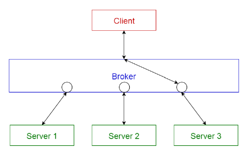
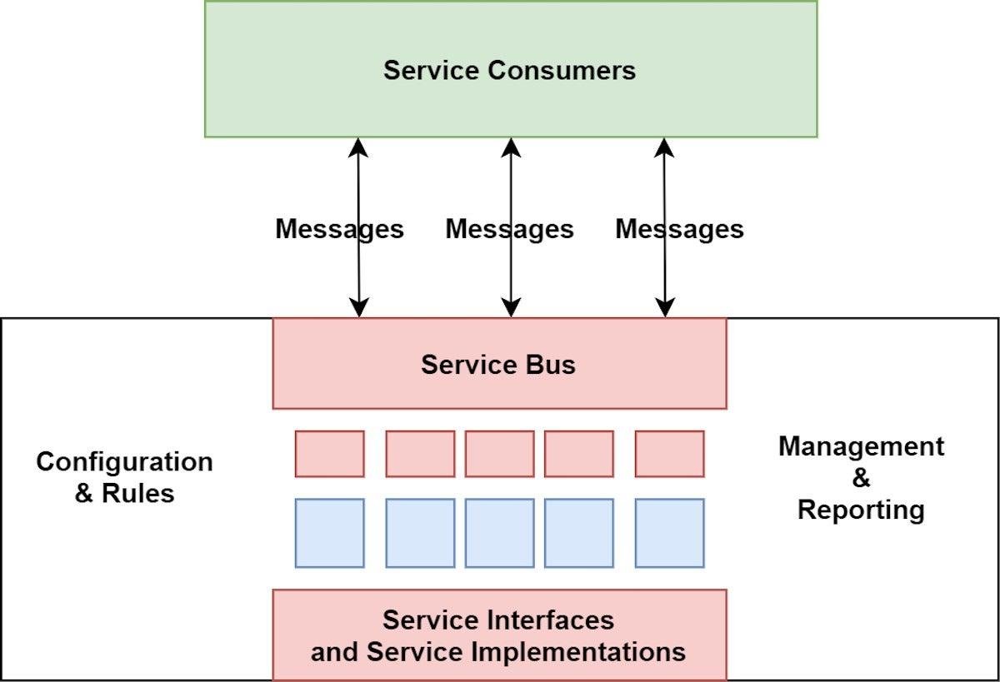
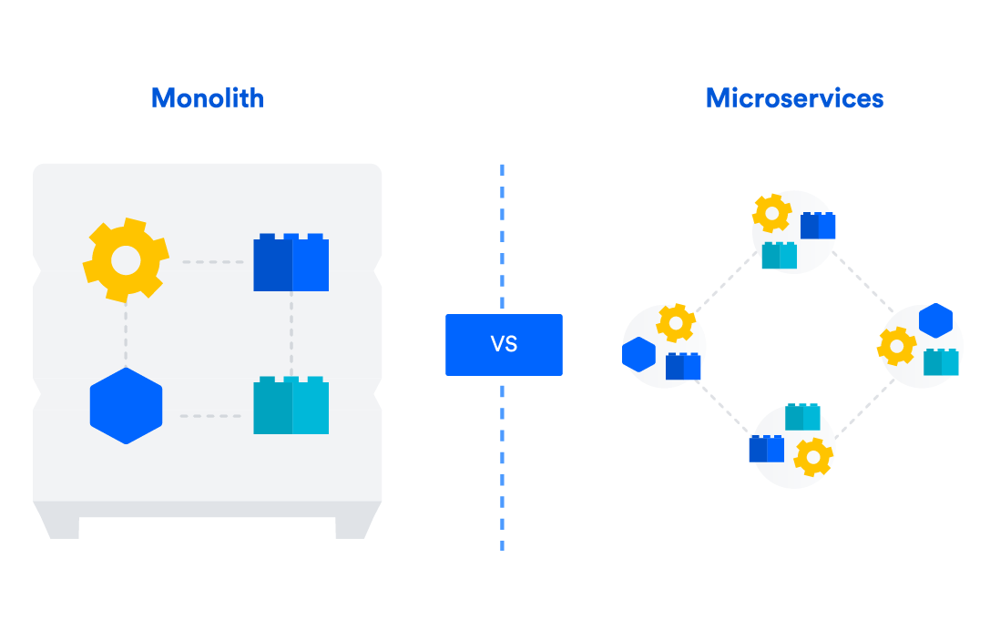
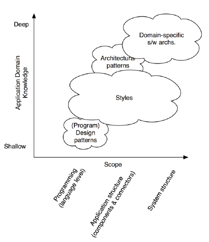
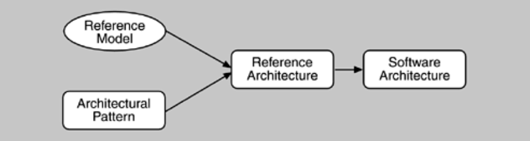

# More Architectural Styles
## Call-Return Styles
### Broker
Proposes that remote service invocation can be done transparently via a special component - **the broker** - responsible for coordinating the interaction.

- Used to structure distributed systems:
	- In which there are components on different platforms that need to interoperate;
	- With independent components that interact through remote service invocation.
- Clients and service providers are thus **decoupled**.
- **Elements**:
	- **Components**:
		- **Broker**: coordinates communication between other distributed components, locating suitable servers, forwarding requests and transmitting results.
		- **Server:** registers with the broker and provides services.
		- **Client:** accesses services by making requests via the broker.
	- **Connectors:**
		- **Service Invocation**.
- **Advantages:**
	- **Location transparency**: clients do not need to know the server's location.
	- **Changeability:** allows changing servers as long as the interface is preserved.
	- **Portability** of the broker, which is facilitated if it is structured in layers.
- **Disadvantages:**
	- May affect **performance**, notably increasing latency between clients and servers and potentially becoming a **bottleneck.**
	- Can become a **single point of failure**.
	- Can become a **target for security attacks**.
	- Can be **challenging to test**.

### Service-Oriented Architecture (SOA)
Serves to structure systems that can be organized around an independent number of consumers and providers of distributed services, very possibly by different organizations. Providers may vary over time and consumers must be able to use services without knowing anything about how they are implemented or the platforms on which they run.

- **Elements:**
	- **Components:**
		- **Service Providers:** provide services according to interfaces published on brokers.
		- **Service Consumers:** consume services invoking them directly on through an intermediary (service bus).
		- **Service Bus:** intermediary that can redirect and transform between consumers and providers (e.g., perform security checks and manage transactions).
		- **Service Broker/Registry:** used to register/search for services.
	- **Connectors:**
		- **Call-Return Connector:**
			- **a)** SOAP (Simple Object Access Protocol): uses the SOAP protocol for synchronous communication between web services, typically over HTTP.
			- **b)** Rest Connector: relies on the basic request/reply operations of the HTTP protocol.
		- **Asynchronous Messaging Connector:** supports point-to-point or publish-subscribe message exchange.
- **Advantages:**
	- **Interoperability** between components running on different platforms, written in different languages and provided by different organizations.
- **Disadvantages:**
	- **Complexity** of construction:
	- **Lack of control** over the evolution of independent services.
	- **Performance** affected by middleware and services that become bottlenecks and typically do not offer performance guarantees.

### Microservices
In multi-tier web applications and SOA, the services of each tier are "packaged" and placed together in an artifact for installation, known as a **monolith** - traditional, tightly-coupled software design where all components of an application are built and deployed as a single, unified unit.
Horizontal scalability is achieved by replicating the monolith across multiple servers, and any small change in the application required building and reinstalling the entire monolith on each service.
**Microservices** proposes structuring an application as a set of small, independent services that can be installed separately. These services can be developed using different technologies and managed by different teams. Scalability can be managed at the level of microservices and changed are quickly deployed to production.

- Lightweight **SOA** services that don't use orchestration and communicate via request/reply connectors or asynchronous messages/events.
- The microservice architectural style is becoming the **default** for building enterprise applications.
- It's an approach to developing a single application as:
	- a suite of small services, each running its own process and communicating with lightweight mechanisms, often an HTTP API.
	- built around business capabilities
	- independently deployable by fully automated deployment machinery
- Style closely related to the **deployment allocation view**.
- Dictates that the deployment unit should contain only one service or a very small, cohesive set of service.
- Independently installed by fully automatable processes.
- **Advantages:**
	- **Complexity** introduced by the distribution.
	- **Deployability** is more challenging.
	- **Performance:**
		- In terms of time, affected by non-local communication between services;
		- In terms of memory footprint, affected by the replication of many classes and libraries in various bundles.

---

# Architectural Styles vs Architectural Patterns
### Architectural Styles
- An architectural style defines a **set of principles that shape the organization and structure of a system**.
- Different areas of a system may adopt different architectural styles.
- Styles can coexist within the same system:
	- A tier can adopt one style while another tier uses a different style.
	- Components can have substructures designed in styles distinct from their surroundings.
- **Examples:**
	- **Pipe-and-Filter:** a data processing pipeline where each filter processes data and passes it to the next.
	- **Client-Server:** a centralized server provides services to multiple clients.

### Architectural Patterns
- An architectural pattern is a **reusable solution for a recurring design problem in software architecture**.
- Patterns are more domain-specific than styles.
- They describe the resolution of a specific problem and offer a solution configurable for different contexts.
- **Examples:**
	- **Model-View-Controller (MVC):** separates the user interface (View) from the logic (Controller) and data (Model).
	- **CQRS (Command and Query Responsibility Segregation):** separates data read and write operations into distinct models.
	- **Event Sourcing:** stores events instead of the current state; replaying events reconstructs the system's state.
## Style vs Pattern
- Some people use the two terms interchangeably.
- **Key Differences:**
	- **Scope:** styles are broad and focus on system structure, while patterns address specific design problems.
	- **Domain Specificity:** styles reflect general structural organization, whereas patterns are tied to specific problems and domains.
	- **Reuse:** styles define high-level communication and structural decomposition, while patterns offer insights into functionality and operation.

## Reference Model & Architecture
- **Reference Model:**
	- Divides functionality and defines standard data flows between pieces.
	- Represents mature solutions to known problems.
- **Reference Architecture:**
	- Maps the reference model onto software elements and their data flows.
	- A practical implementation of a reference model in a system.

## Views and View Types
### Views
- Way to represent different aspects of a system’s architecture to address specific concerns or dimensions.
- **Purpose:**
	- Architectures are complex and cannot be fully described with a single model.
	- Architectural decisions span multiple dimensions, including:
		- **Functional aspects**;
		- **Implementation details**.
- **Operational Concerns**:
	- Grouping design decisions by related concerns simplifies understanding and communication.
- **Key Principles:**
	- Produce any views that stakeholders find useful for the architecture.
	- Engage stakeholders to identify the views relevant to their concerns.
	- Document:
		- All assumptions underlying the design.
		- The rationale for design decisions associated with each view.

