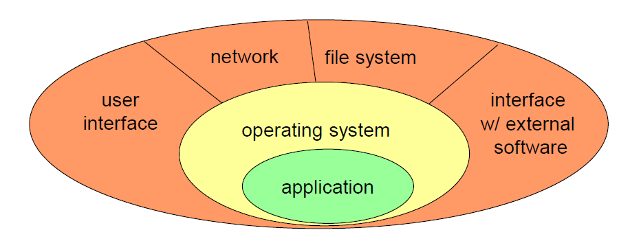
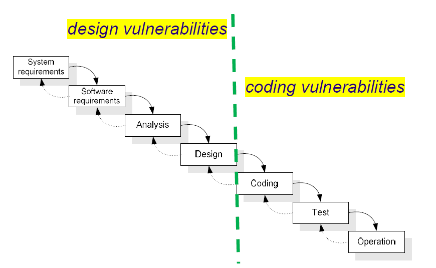
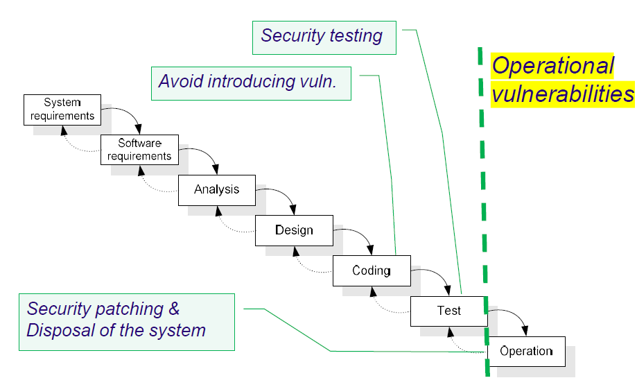
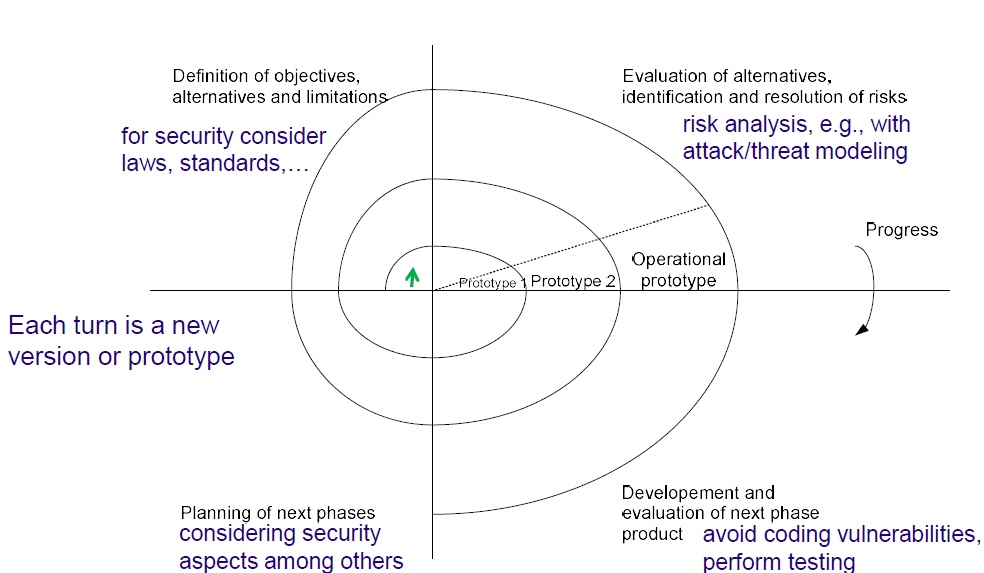

## Basic Concepts
- **Confidentiality**: refers to the assurance that information is accessible only to those authorized to access it - it involves protecting data from unauthorized access, disclosure or theft.
- **Integrity**: ensures that data remains accurate, complete and unaltered during storage, transmission or processing - it guards against unauthorized modification or corruption of information.
- **Availability**: ensures that data and systems are accessible and usable when needed by authorized users - it involves preventing and minimizing downtime or disruptions to services.

These concepts, often referred to as the **CIA** triad (Confidentiality, Integrity, Availability), form the foundation of cybersecurity and data protection practices.
#### Additional Concepts
- **Authenticity**: confirms that data, transactions or communications are genuine and originate from a trusted source - it involves verifying the identity of entities and ensuring the validity if information exchanged.
- **Privacy**: focuses on protecting individuals' personal information and ensuring that they have control over how their data is collected, used, and shared - it involves compliance with regulations and ethical considerations regarding data handling.

Determining whether someone is "authorized" or "non-authorized" to access a system or data depends on the presence of a **security policy**.

A **security policy** is a set of rules or guidelines that specify who has access to what resources, under what conditions and what level of authorization is needed. This can be:
- **Explicit**: clearly documented and formalized in access control lists, permissions or rules.
- **Implicit**: based on unwritten or assumed rules, such as inferred roles or contextual factors like location or device.

### Vulnerability
- **Definition**: a weakness in an information system, system security procedures, internal controls, or implementation that could be **exploited or triggered by a threat source**.
- **0-day vulnerability**: a vulnerability not publicly known (only a group of people has the knowledge that it exists; sold in dark-web marketplaces)

#### Types of Vulnerabilities
- **Design vulnerability**: inserted during the software design (e.g., a weak authentication mechanism, or forgetting that communication can be listened in the network).
- **Coding vulnerability**: a bug introduced during coding with security implications (e.g., missing end of buffer verification).
- **Operational vulnerability**: caused by the environment in which the software is executed or its configuration (e.g., database accounts with empty password).

### Other Definitions
- **Attack**: malicious action that attempts to exploit one or more vulnerabilities.
- **Exploit**: an attack directed to a certain vulnerability or a piece of code that can be used to activate a vulnerability.
- **Patch**: a software update that fixes a defect and therefore should remove the vulnerability
	- the user needs to spend effort to apply the patch
	- the patch can cause instability in the software execution
	- the patch can be reverse engineered to create an exploit in the outdated version of the software

> (*Attack + Vulnerability) => Intrusion*

### Attack Vector
- Can be used in several senses
	- Type of vulnerability (buffer overflow, SQL injection, ...)
	- How the attack is performed (virus, worm, ...)
- Can be directed or not
	- e.g., against a specific company or the internet in general (spear phishing vs. phishing)
- Can be technical or social engineering
- Can be manual or automated
	- both can be used together to achieve the desired result 

### Attack Surface
- The attack surface of a software environment **is the sum of the different points where an attacker can try to enter or extract data**.
- Reducing the attack surface is a basic security measure.
- Attacks come through interfaces, which correspond to the attack surface.

- The **hardware** can also be part of the attack surface.

## Goals of Software Development
- The goals of security are often **contradictory** with other objectives of software development:
	- **Functionality:** more is better
	- **Usability:** easier the better
	- **Performance:** higher the better
	- **Simplicity:** more is better
	- **Time-to-market:** faster the better

- Typically, the objective is (not to achieve 100% security but) **to have an acceptable risk**.

> `Probability of successful attack = Threat level x Vulnerability level`
> `Risk = Probability of successful attack x Impact`

- Risk depends on the system environment
	- **All software is 100% secure in a computer locked in a safe with no internet connection**
	- Basic arithmetic: `Tx0xI=0, 0xVxI=0, TxVx0=0`

#### Factors That Affect the Vulnerability Level
- The kinds of **vulnerabilities** that exist in the software (design/coding/operational)
- The implemented **security controls**
- **Maturity level of the software development processes used in the company**
- **Uncertainty** of the above factors

#### Software Development Life Cycle (SDLC)
- Is a formal or informal methodology for **designing, creating and maintaining software**.
- Most SDLC models **do not address software security** - secure software development practices usually need to be added to and integrated within each SDLC model to ensure the software being developed under that model is well-secured.
- Why should we address it?
	- to **reduce the number of vulnerabilities** in released software
	- to **mitigate the potential impact of the exploitation of those undetected or unaddressed vulnerabilities**
	- to **understand and address the root causes of vulnerabilities** to prevent future recurrences
- For example, in the **waterfall and spiral models**, security should be considered in all the steps.

##### Waterfall Model

##### Spiral Model

#### NIST Secure Software Development Framework (NIST SSDF)
- Describes a subset of high-level practices based on established standards and guidance for secure software development practice, which can be integrated SDLC methodologies
- Practices are organized into four groups  
	- **Prepare the Organization**: ensure the organization’s people, processes, and technology are prepared to perform secure software development;
	- **Protect the Software**: protect all components of the software from tampering and unauthorized access;
	- **Produce Well-Secured Software**: produce well-secured software that has minimal security vulnerabilities in its releases  
	- **Respond to Vulnerability Reports**: identify vulnerabilities in software releases and respond appropriately to address those vulnerabilities and prevent similar vulnerabilities from occurring in the future

##### What should we do to produce better software?
- **During software design**, take into consideration **security requirements and risk information**.
	- Create threat and attack models, and analyze how to address the risks and implement mitigations.
	- Perform more rigorous assessments for high-risk areas.
	- Review vulnerability reports and statistics for previous software.
- **Review the software design** to verify compliance with security requirements and risk information.
	- **Have someone qualified** who was not involved with the software design review **to do the checks**.
- **Verify that third-party software complies** with security requirements.
	- Communicate requirements to vendors, open-source communities, and other third  
	parties.
	- Use appropriate means to verify third-party software, including ensuring it is still  
	actively maintained, especially remediating new vulnerabilities found.
- **Reuse existing, well-secured software** when feasible instead of duplicating functionality  
	- Create or acquire well-secured software and reuse it in the organization  
	- Build in support for using standardized security features and services, such as log management, identity management, and vulnerability management system
- **Create source code adhering to secure coding practices**  
	- Have someone qualified who was not involved with the software design review to do the checks
- **Configure the compilation and build processes** to improve executable security
- **Review and/or analyze human-readable code** to identify vulnerabilities and verify compliance with security requirements
- **Test executable code to identify vulnerabilities and verify compliance** with security requirements
- **Configure the software** to have secure settings by default

##### Other factors that affect software security
- **Programming Language**: the language has an impact on security, so it should be selected taking this aspect into account
	- C/C++ are fast but prone to vulnerabilities
	- Java/C# are not perfect but limits these problems
	- Perl is slower but has better security features
- **Closed vs. Open Source**: there are two perspectives in this methodologies regarding software security:
	- *“Open source is much better because many eyeballs see the code and detect vulnerabilities”*
		- but do they look?
		- can they see?
		- are all well-behaved?
	- *“Closed source is much better because it is harder for the attacker to find vulnerabilities”*
		- not really true, since many tools can be used to reverse engineer the executables.
		- security by obscurity is not a good idea.

## Design Principles to Avoid Vulnerabilities
The goal is to avoid introducing design vulnerabilities:
1. **Never Assume or Trust**
	- Systems built out of several components are vulnerable if one of them has weaknesses.
2. **Use Authentication Mechanisms that Cannot be Circumvented**
	- Ensure there are appropriate measures to authenticate users (e.g., multi-factor authentication);
	- Prevent users from changing their identity (e.g., it should not be possible to leave behind the token for others);
	- Perform authorization only after authentication.
3. **Identify and Protect Sensitive Data**
	- Sensitive data depends on the context;
	- Steps to protect sensitive data:
		- **Identify** the sensitive data
		- **Discover** location and accessibility
		- **Classify** data according to its value to the organization
		- **Secure** with appropriate controls to ensure integrity, availability and confidentiality
		- **Monitor** by measuring and evolving security practices
4. **Understand External Components**
	- Systems are built out of components, and therefore they have an impact on the attack surface - the system inherits the weaknesses of the external components;
	- To minimize the impact:
		- Isolate the external components (e.g., in a sandbox)
		- Activate only the necessary functionalities (e.g., in the configuration)
		- Validate the integrity of the component (e.g., signatures)
		- Maintain a list of external components
		- Authenticate/validate data coming/going to the components
5. **Be Prepared for System Evolution**
	- Successful systems need to evolve over time (changes where it is executed, threats are different, functionality is added)
	- Areas that must be considered
		- Secure updates required, e.g., signed patches and their validation;
		- Capacity to activate or deactivate functionalities, e.g., that are perceived as insecure;
		- Change the secrets, e.g., passwords, password recovery mechanisms, stored data;
		- Choose another external component, e.g., because crypto algorithm is no longer secure.

Other very important design principles that should be followed are:
- **Economy of mechanism**: *“Keep the design of the security mechanisms as*
*simple and small as possible”* - systems fail because they are large and complex.
- **Fail-safe defaults**: *“Base access decisions on giving permission rather*
*than defining the exclusion”* - the default situation should be no access.
- **Complete mediation**: *“Every access to every object must be checked for authority”* - there should be no way to circumvent access control.
- **Open design**: “The design should not be secret” - no security by obscurity (because it does not work)
- **Separation of privilege**: *“A protection mechanism that requires two keys to unlock is more robust and flexible than one that allows access to the presenter of only a single key”* - a single compromise does not break security.
- **Least privilege**: *“Every program and every user of the system should operate using the least set of privileges necessary to complete the job"* - limits the damage from accidental and malicious faults (keep everything on a *need to know* basis).
- **Least common mechanism**: *“Minimize the amount of mechanisms common to more than one user and depended on by all users”* - because every shared mechanism (e.g., shared variables, files, devices…) is a potential information path that may compromise security.
- **Psychological acceptability**: *“It is essential that the human interface be designed for ease of use”* - so that users routinely and automatically apply the protection mechanisms correctly.

## Design Principles by Microsoft SD3+C
1. **Secure by Design**
   - the overall system should be built to be secure, from design to deployment.
2. **Secure by Default**
   - software shall be developed considering the possibility of intrusion.
   - Implies, for instance, enforcing the principle of least privilege and not running unnecessary services.
3. **Secure in Deployment**
   - the software shall contain tools and documentation that allow proper security configuration and patching.
4. **Communication**
   - between the developers and end-users about security aspects.
   - patches must be provided and installed by the users.

## Other Principles
#### Security From Start
- **"Build it first, secure it later"**
	- "We are very concerned about security. However the release deadline arrived, and we didn’t have time, etc."
- Early design decisions have important security implications
	- two equally sound paths may lead to two very different systems in terms of security
	- adding security later may have large costs and involve major redesign
	- it may also involve discarding functionality that had a cost to be developed
#### Secure the Weakest Link
- **Security is a chain as strong as its weakest link**
- Part of risk assessment (e.g., attack modeling)
- Protecting everything usually not possible – **it's important to prioritize**
#### Fail Securely
- Many systems **become less secure when they fail**:
	- Banks have a maximum limit of cash that can be withdrawn daily; however, if the ATM is disconnected, what should we do?
	- Downgrade attacks: e.g., if the client does not support the latest protocol version, should the server use an older one?
- **Always check for error conditions** and handle them properly.
