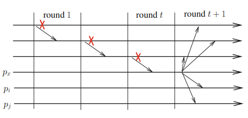
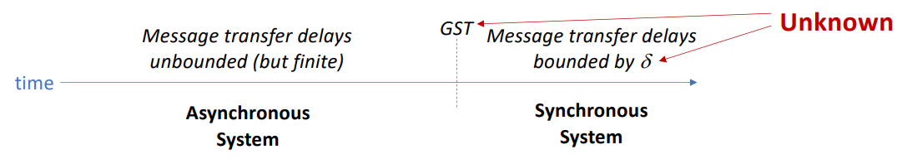

# Implementing Consensus in Enriched CrashProne Asynchronous Systems with Failure Detectors
- **FLP Impossibility:** there is no algorithm implementing the consensus agreement abstraction in the system model CAMP(n,t)\[t > 0].
- Consensus can be implemented in CSMP but not in CAMP.
- Such impossibility comes from the net effect of crashes and asynchrony.
- There are two ways to deal with this impossibility:
	- Make the consensus problem weaker;
	- Add assumptions to CAMP:
- Three approaches to enrich CAMP for solving consensus:
	- **Message deliveries assumption** (add assumption);
	- **Randomized protocols** (add assumption and make the problem weaker);
	- **Failure detectors** (add assumption).

### Consensus Algorithm in CAMP(n,t)\[P]
```vhdl
operation propose (vi) is
(1) esti ← vi; ri ← 1;
(2) while ri ≤ t + 1 do
(3)     begin asynchronous round
(4)     if (ri = i) then broadcast EST (esti) end if;
(5)     wait ((EST (est) received from pri ) ∨ (ri ∈ suspectedi));
(6)     if (EST (est) received from pri ) then esti ← est end if;
(7)     ri ← ri + 1
(8)     end asynchronous round
(9) end while;
(10) return (esti)
```
- The same ideas for making synchronous consensus fair and early deciding can also be adapted here.



### The ◇P Failure Detector
- The use of P makes CAMP almost as strong as a synchronous system.
- P provides more than the minimal information required to solve consensus.
- ◇P is not a perpetual failure detector, is weaker than P, and cannot be implemented in CAMP, requiring some weak form of eventual synchrony.
- ◇P can be used to solve consensus, but it is **still not the weakest failure detector to solve consensus**.

### The CAMP(n,t)\[◇SYNC] System Model
- An *eventually synchronous* system, which runs satisfy the following properties:
	- There is an upper bound δ on message transfer delays, but this bound:
		1. is not known;
		2. holds only after a finite and unknown time (Global Stabilization Time - GST).
	- Local processing times are negligible with respect to message transfer delays.



##### Implementing ◇P in CAMP(n,t)\[◇SYNC]
```vhdl
(1) init: suspectedi ← ∅;
(2)     for each j ̸= i do
(3)         timeouti[j] ← arbitrary value;
(4)         set timeri[j] to timeouti[j]
(5)     end for

(6) repeat forever every βi time units
(7)     for each j ̸= i do send ALIVE (i) to pj end for
(8) end repeat

(9) when timeri[j] expires do suspectedi ← suspectedi ∪ {j}

(10) when ALIVE (j) is received do
(11)     if (j ∈ suspectedi) then % fix mistake %
(12)         suspectedi ← suspectedi \ {j};
(13)         timeouti[j] ← timeouti[j]+1
(14)     end if;
(15)     set timeri[j] to timeouti[j]
```

### The Ω Eventual Leader Failure Detector
- Gives each process access to a read-only local variable leader, satisfying the following properties:
	- **Validity:** ∀i: ∀τ : leaderτ i contains a process identity.
	- **Eventual leadership**. ∃ℓ ∈ Correct(F), ∃τ : ∀τ ′ ≥ τ : ∀i ∈ Correct(F): leaderτ′ i = ℓ.
- **Eventually** all correct processes will have the same correct leader.
- Ω is the **weakest failure detector** able to solve consensus, thus is a computability lower bound.
	- It represents the minimal information about failures needed for solving consensus.


### Implementing Ω with Minimal Assumptions
- **Eventual timely channel:** let each bidirectional channel connecting a pair of processes be replaced by two unidirectional channels.
	- Let *ch(i, j)* denote the channel from *pi* to *pj*;
	- A channel *ch(i, j)* is *eventually timely* if there is a bound δ such that after some finite time τ, the transit time of the messages from *pi* to *pj* message from is bounded by δ.
	- The values of δ and τ are not necessarily known by the processes.
- **Eventual t-source:** there is a non-faulty process *p* that has *t* output channels that are eventually timely.
	- The corresponding system model is denoted *CAMP(n,t)\[◇t-SOURCE]*.
	- This model is particularly weak, as only *t* output channels of a non-faulty process are required to be eventually timely, all the other *n(n-1)-t* channels can be fully asynchronous.

##### Leader Election Algorithm in *CAMP(n,t)\[◇t-SOURCE]*
- Algorithm that elects the least suspected non-faulty process as the leader:
```vhdl
(1) init: for each k do
(2)     counti[k] ← 0; suspecti[k] ← ∅; timeouti[k] ← β;
(3)     if (k ̸= i) then set timeri[k] to timeouti[k] end if
(4) end for

(5) repeat every β time units
(6)     for each j ̸= i do send ALIVE(counti) to pj end for
(7) end repeat

(8) when ALIVE(count) is received from pj do
(9)     for each k ∈ {1,...,n} do counti[k] ← max(counti[k], count[k]) end for;
(10)    set timeri[j] to timeouti[j]

(11) when timeri[k] expires do
(12)     broadcast SUSPECT(k);
(13)     timeouti[k] ← timeouti[k]+1; % increases timeout value %
(14)     set timeri[k] to timeouti[k]

(15) when SUSPECT(k) is received from pj do
(16)     suspecti[k] ← suspecti[k] ∪ {j};
(17)     if (|suspecti[k]| ≥ (n − t))
(18)         then counti[k] ← counti[k]+1; suspecti[k] ← ∅ % when n-t processes suspect a process, increases count %
(19)     end if

(20) when leaderi is read by the upper layer do
(21)     let (−, ℓ) = min({(counti[x], x)}1≤x≤n); % returns the process with smallest count %
(22)     return(ℓ)
```

- **Why does this work?** A correct process *pk* with *t* eventually-timely output channels leads to bounded *counti \[k]*.

##### Consensus Algorithm in *CAMP(n,t)\[t < n/2, Ω]*
```vhdl
operation propose (vi) is
(1) est1i ← vi; ri ← 0;
(2) while (true) do
(3)     begin asynchronous round
(4)     ri ← ri + 1;

% Phase 1 : select a value with the help of Ω %
(5)     my leaderi ← leaderi; % read the local output of Ω %
(6)     broadcast PHASE1 (ri, est1i, my leaderi);
(7)     wait ((PHASE1 (ri, −, −) received from (n − t) processes)
(8)     ∧ (PHASE1 (ri, −, −) received from pmy leaderi ∨ my leaderi ̸= leaderi)); % detects leader changes %
(9)     if ((∃ℓ: PHASE1 (ri, −, ℓ) received from > n/2 processes) ∧ ((ri, v, −) received from pℓ)) % majority has the same leader, and the leader proposed v %
(10)         then est2i ← v else est2i ← ⊥ end if;
% Here, we have ((est2i ̸= ⊥) ∧ (est2j ̸= ⊥)) ⇒ (est2i = est2j = v) %

% Phase 2 : try to decide a value from the est2 values %
(11)     broadcast PHASE2 (ri, est2i);
(12)     wait (PHASE2 (ri, −) received from (n − t) processes);
(13)     let reci = {est2 | PHASE2 (ri, est2) has been received};
(14)     case (reci = {v}) then broadcast DECIDE(v); return(v)
(15)         (reci = {v, ⊥}) then est1i ← v
(16)         (reci = {⊥}) then skip
(17)     end case
(18)     end asynchronous round
(19) end while

(20) when DECIDE(v) is received do broadcast DECIDE(v); return(v)
```
- Due to the ***quasi-agreement*** property, i.e., (est₂ᵣᵢ ≠ ⊥) ∧ (est₂ᵣⱼ ≠ ⊥) ⇒ (est₂ᵣᵢ = est₂ᵣⱼ = v), we have recᵢ ⊆ {⊥, v} **for all correct processes**.

### Indulgence and Zero-degradation
- Let A be an algorithm based on a failure detector of a class C. A is **indulgent** with respect to the failure detector class C if its safety is never violated, whatever the behavior of its failure detector.
	- Meaning that if the underlying failure detector behaves arbitrarily, *the termination of A can be compromised, but its safety is never violated*.
- A failure detector of the class **Ω** has a *perfect behavior* if its eventual leadership property is satisfied from the very beginning of the execution.
	- Consider a failure-free execution of the previous algorithm in which **Ω** has a perfect behavior. In this execution, processes decide at the end of the first round, i.e., in **two communication steps, which is optimal**.
	- We do not consider DECIDE messages as they are not needed for a process to decide in this execution.
- The consensus abstraction is typically used in a repeated form (e.g., total order broadcast), and a process failure during a consensus instance appears as an *initial* failure in the following instances.
- Assuming its failure detector behaves perfectly, a consensus algorithm is **zero-degrading** if a crash in one consensus instance does not impact the performance of the future consensus instances.
	- Previous algorithm satisfies zero-degradation: if the failure detector behaves perfectly, processes decide in two communication steps, whatever the number of processes that have crashed before this consensus instance.

- **Indulgent algorithm**: always ensures correctness (safety) even if the failure detector behaves badly, but it might not always finish (termination can fail).
- **Perfect failure detector**: works flawlessly, allowing the algorithm to make decisions in the fastest possible time.
- **Zero-degradation**: even if processes fail, future decisions remain just as fast and unaffected by those failures.

### A Paxos-inspired Consensus Algorithm
- **Paxos** is a classical consensus protocol by L. Lamport for networks that can lose messages and processes that crash and recover. Here, we present a variant for *CAMP{n,t}\[t < n/2, Ω]*.
- The *Alpha abstraction* captures the essence of Paxos with respect to safety: it provides processes with a single operation *alpha()*, which receives a round number and a value as parameters and returns a value: **v' ← alpha(r, v)**
- Assuming processes use distinct and increasing round numbers, Alpha must satisfy:
	- **Alpha-validity**: the value returned by an invocation *alpha(r, v)* is either ⊥, or a value *v'* such that there is a round *r' ≤ r* and *alpha(r', v')* has been invoked by some process.
	- **Alpha-agreement**: let *alpha(r, –)* and *alpha(r', –)* be two invocations that return *v* and *v'*, respectively. We have:  *((v ≠ ⊥) ∧ (v' ≠ ⊥)) ⇒ (v = v').*
	- **Alpha-convergence**: if the invocation *l = alpha(r, –)* is such that any invocation *l' = alpha(r', –)*, which started before *l* terminates, with *r' < r*, *l* returns a non-⊥ value.
	- **Alpha-termination**: any invocation *alpha()* by a correct process terminates.
- **Alpha works like a shared write-once register**:
	- If accessed concurrently, it might store nothing (⊥).  
	- If accessed sequentially, it stores the first written value and holds it forever.

##### Paxos-insp. Consensus in CAMP(n,t)\[ALPHA, Ω]
- This simple algorithm **separates safety and liveness of consensus** using Alpha and Ω.
- This is the essence of Paxos.
	- Alpha is a shared one-shot storage object, that holds its first stored value;
	- Ω is used to (eventually) elect a leader that would write the decision in Alpha.

```vhdl
operation propose (vi) is
(1) ri ← 0;
(2) while (resi = ⊥) do
(3)    if (leaderi = i)
(4)       then resi ← ALPHA.alpha(r + i, vi);
(5)          if (res ̸= ⊥) then broadcast DECIDE(v); resi ← v;
(6)          else ri ← ri + n
(7)          end if
(8)    end if
(9) end while;
(10) return(resi)

(11) when DECIDE(v) is received do broadcast DECIDE(v); resi ← v
```

### Implementation of Alpha in *CAMP(n,t)\[t < n/2]*

- **Local variables:**
	- **valueᵢ**: the value proposed by pi, and eventually the value stored in the Alpha object. Its initial value is ⊥.
	- **lreᵢ**: the number of the last round entered by a process, as known by pi. Its initial value is 0.
	- **lrwwᵢ**: the number of the last round with write. More precisely, if *lrwwᵢ = d*, the value stored in valueᵢ was written in Alpha in round *d*. Its initial value is 0.
- **Two phases:**
	1. **Stages 1 and 2:** reads the current state of Alpha.  
	2. **Stage 3:** writes its value to Alpha.

##### Implementation
```vhdl
% [Stage 1]
% 1.1: pi first makes public the date of its last attempt %
(1) broadcast ROUND&READ(r);
% 1.2: pi reads the variables of the other processes to know their progress %
(2) wait (ACK_ROUND&READ(r, value, lre, lrww) received from a majority of processes pj);
(3) let triplets = set of triplets (value, lre, lrww) received;
% 1.3: pi aborts its attempt if another process has started a higher round %
(4) if (∃ (_, lreᵢ, _) ∈ triplets such that lreᵢ > r) then return (⊥) end if;

% [Stage 2]
% Then pi adopts the last value deposited; if there is no value, it adopts its own value v %
(5) let (val, _, lrww) ∈ triplets: ∀ (_, _, lrww′) ∈ triplets: lrww ≥ lrww′;
(6) if (val = ⊥) then val ← v end if;

% [Stage 3]
% 3.1: pi writes the value it adopted (together with its current date r) %
(7) (valueᵢ, lreᵢ, lrwwᵢ) ← (val, r, r);
(8) broadcast CWRITE&READ(r, valueᵢ, lreᵢ, lrwwᵢ);
% 3.2: pi waits to learn the progress of a majority of processes %
(9) wait (ACK_CWRITE&READ(r, lreᵢ) received from a majority of processes pj);
(10) let lre_set = the set of round numbers lreᵢ received;
% 3.3: pi aborts its attempt if another process has started a higher round %
(11) if (∃ lreᵢ ∈ lre_set such that lreᵢ > r) then return (⊥) end if;

% Otherwise, value is the result of the Alpha abstraction: pi returns it %
(12) return (valueᵢ)

% When ROUND&READ(r) is received from pj:
(13) lreᵢ ← max(lreᵢ, r);
(14) send ACK_ROUND&READ(r, valueᵢ, lreᵢ, lrwwᵢ) to pj;

(15) When CWRITE&READ(v, r, _, _) is received from pj:
(16) if ((r ≥ lreᵢ) ∧ (r > lrwwᵢ)) then (valueᵢ, lreᵢ, lrwwᵢ) ← (v, r, r); % updates the stored value %
(17) end if;
(18) send ACK_CWRITE&READ(r, lreᵢ) to pj;
```

### Summary
- **Consensus** is a fundamental building block for fault-tolerant systems.
- Fault-tolerant consensus is **impossible** in asynchronous systems.
- However, **it can be solved in CAMP with additional assumptions**:
	- Message Scheduling (MS);
	- Randomization with LC and CC;
	- Perfect failure detector of P (on top of underlying synchronized system);
	- Eventual leader abstraction Ω (on top of eventually synchronized system).