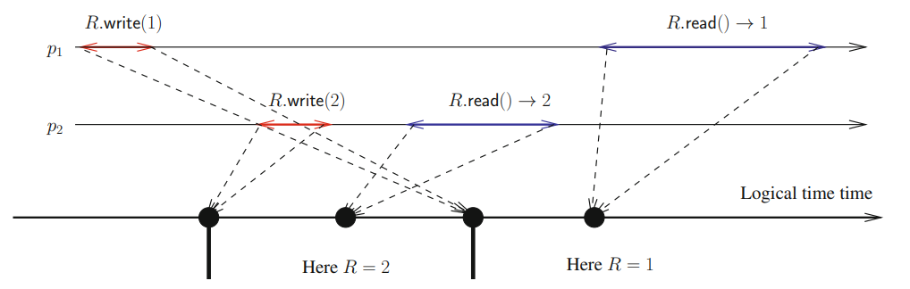
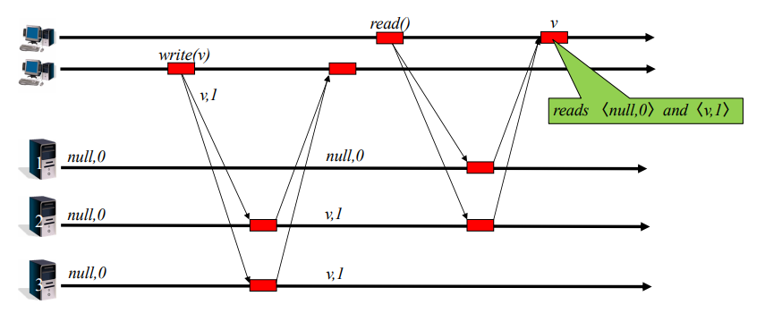
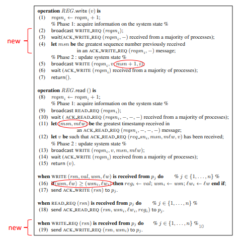
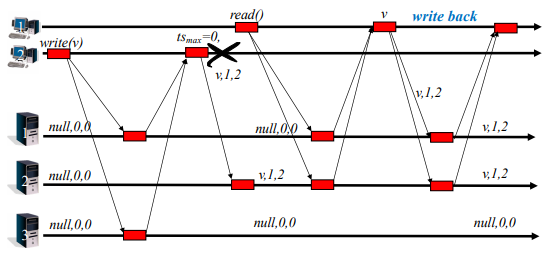

# The Read/Write Register Abstraction
- A **register** is a concurrent object (i.e., access by two or more processes) that represents some storage space on a shared memory or disk.
- A register *R* provides two operations with the following **sequential specification**:
	- *R.write(v)*, to write *v* on the register;
	- *R.read()* → v, to read the last written value *v* from the register.
- There are two types of registers:
	- The ones that cannot be defined by their sequential specification - the value returned by a read depends on the *concurrency pattern*;
	- The ones that can be defined by their sequential specification - their correct behavior is defined by all the allowed sequences of read/write operations, in accordance with some *consistency condition*.
- A **sequential specification** refers to the idea that operations (both reads and writes) should behave as if they occur in a specific order, one after the other, in some global, consistent sequence. This means every read should return the value from the latest write operation, in the order the operations occur.
##### Updatable & Sharable Storage Model

##### (Dependable) Storage Model

> Example storage services: Block device, Key-value store

### Regular Register
- A register that *cannot be defined by the register sequential specification*;
- A **regular register** is a single-writer/multi-reader (SWMR) register, meaning it can be written by a single predetermined process and read by any process (there is no write conflicts)
- The value returned by a read is defined as follows:
	- **If the read operation is not concurrent with write operations**, it returns the current value of the register (the value written by the last write)
	- **If the read operation is concurrent with write operations**, it returns the value written by one of these writes or the last value of the register before these writes.
- If a read invocation is concurrent with several write invocations, these writes are necessarily consecutive.


- The only possible values for *v* are {0, 1, 2}.
- The only possible values for *v'* are {1, 2}.
- This is called the ***new/old inversion problem***, because a read can read an outdated value after reading the updated value.

##### Why doesn't a regular register have a sequential specification?
- A regular register only ensures that a read operation returns either the most recent write value or any previous write value. However, this might not match a global sequential order for operations.


To totally order the read and write operations in such a way that the sequence obtained belongs to the specification of a sequential register, we need to:
- Place all the write operations and then the read operations - this is because *R.write(2)* needs to precede *R.read() → 2*
- On the other hand, as the read is sequential, it imposes a total order on its read operations (process order):
	- *R.write(0), R.write(1), R.write(2), R.read() → 2, **R.read() → 1***
- This sequence does not belong on the specification of a sequential register, since once the register reads 2 (the most recent value), it should always return 2 or any future value from subsequent writes. The fact that the register reads 1 later shows that the total order (process order) doesn't respect the sequential model. 
- **Due to the possibility of *new/old inversions*, a regular register cannot have a sequential specification**.

Despite this limitation, regular registers are still very useful:
- They can be easily built on top of message passing systems
- In the absence of concurrency, they are just like other registers - this is especially relevant when concurrency is expected to be rare
- They allow for an incremental construction of registers defined by a sequential specification, which are nothing more than regular registers without *new/old inversions*.

### Registers from Sequential Specification

#### Atomic registers
- Differently from regular registers, an **atomic register**:
	- can be a multi-writer/multi-reader (MWMR) register
	- does not allow for *new/old inversions*
- An atomic register is defined by the following properties:
	- All the read and write operations appear as if they have been executed *sequentially*.
	- The sequence of operations *S* respects the **time order** of the operations, meaning that if *op1* terminated before *op2* started, then *op1* appears before *op2* in *S*.
	- Each read returns the value written by the closest preceding write in the sequence *S*.
- The sequence of operations *S* is called a *linearization* of the register execution:
	- Concurrent operations can be ordered arbitrarily if the sequence obtained is a linearization.
	- Hence, it is possible that an execution has several linearizations, capturing the inherent non-determinism of concurrent systems.
- Intuitively, the definition of an **atomic register** states that everything must appear as if each operation has been executed instantaneously at some point on the timeline (of an omniscient external observer) between its invocation (start event) and its termination (end event).


#### Sequentially-Consistent Register
- A **sequentially-consistent register** is a *weakened form* of an **atomic register**, which satisfies the following three properties:
	- All the read and write operations appear as if they have been executed sequentially.
	- The sequence of operations *S* respects the **process order** relation (instead of time order of atomic registers), meaning that for any process *pi*, if *pi* invokes *op1* before *op2*, then *op1* must appear before *op2* in the sequence *S*.
	- Each read returns the value written by the closest preceding write in S.
- Hence, while the order of the operations in the sequence *S* must respect the time of an omniscient external observer in the definition of an atomic register, the sequence S is required to respect only the process order relation in a sequentially consistent register.

##### Why cannot be from an atomic register?

In an atomic register, it is guaranteed that once a write is observed, all subsequent reads must return that value or a newer one. In this example, once one process reads the updated value 2, no other process should be able to read an older value 1, which is what happens.

### Composability
- Let *P* be any property defined on a set of objects. *P* is **composable** if the set of objects satisfies the property *P* whenever each object taken alone satisfies *P*.
- From a theoretical point of view, composability means that we can keep *reasoning sequentially* independently of the number of atomic registers involved in the computation. Namely, we can reason on a set of registers as if they were a single atomic object.
- From a practical point of view, composability means *modularity*:
	- Each atomic register can be implemented in its own way - the implementation of one atomic register is not required to interfere with the implementation of another atomic register.
	- As soon as we have an algorithm that implements an atomic register, we can use multiple independent instances of it and the system will behave correctly without any additional control or synchronization.
- **Atomicity is composable**: this is expected since all objects are specified using real time precedence.
- **Sequential consistency is not composable**.

In this example, even though the executions are individually sequentially consistent, **when combined**, they produce an execution that violates sequential consistency.

]

- The core of the issue is that each sequentially consistent register can have its own internal "logical time" for ordering operations. When you combine multiple sequentially consistent registers, these independent logical times can conflict with each other, resulting in a combined execution that is no longer sequentially consistent.
- There is no way to arrange all the operations in E + E' into a single sequence that would satisfy sequential consistency for both R and R' simultaneously:
	1. *R.write(2)* must precede *R.read()→ 1*
	2. *R'.write(b)* must precede *R'.read()→ a*
- To maintain sequential consistency for *R* in the combined execution, *R.read()→ 1* must come after *R.write(1)*. Similarly, for *R'*, *R'.read()→ a* must come after *R'.write(a)*. This leads to conflicting orderings between the two registers, making a sequentially consistent global ordering impossible.

# Building Read/Write Registers Despite Asynchrony and Less than Half of Processes Crash

### Shared Memory Structural View
- The local algorithm executed by each process consists of two parts:
	- A client side composed of two local algorithms implementing the operations *REG.read()* and *REG.write()*;
	- A server side defining the processing associated with each message reception.
- It is possible to have multiple registers on the system.


### SWMR Regular Register on *CAMP(n,t)\[t < n/2]*
- A regular register enforces a safety property where the value returned by a read operation is either the last value written or a value written concurrently with the read operation.
- The algorithm for an SWMR regular register relies on the single writer associating sequence numbers with write operations and broadcasting pairs of values and sequence numbers.
- Each process saves the pair with the highest sequence number it has seen.
- Both safety and liveness properties are derived from the "majority of correct processes" assumption (t < n/2), enabling a process to communicate with at least one non-faulty process before completing a read or write.
```vhdl

% Client

operation REG.write (v) is % This code is only for the single writer pw %
(1) wsnw ← wsnw + 1;
(2) broadcast WRITE (v, wsnw);
(3) wait (ACK WRITE (wsnw) received from a majority of processes;
(4) return ()

% The code snippets that follow are for every process pi (i ∈ {1,...,n}) %

operation REG.read () is % This code is for any process pi %
(5) reqsni ← reqsni + 1;
(6) broadcast READ REQ (reqsni);
(7) wait (ACK READ REQ (reqsni, −, −) received from a majority of processes;
(8) let ACK READ REQ (reqsni, −, v) be a message received at the previous line with the greatest write sequence number;		  
(N1) ...
(N2) ...
(9) return (v)


% Server

when WRITE (val, wsn) is received from pw do
(10) if (wsn ≥ wsni) then regi ← val; wsni ← wsn end if;
(11) send ACK WRITE (wsn) to pw

when READ REQ (rsn) is received from pj do % (j ∈ {1,...,n}) %
(12) send ACK READ REQ (rsn, wsni, regi) to pj
```
- *regi* is a local data variable that contains the current value (as known by *pi*) of the regular register REG;
- *wsni* is a local control variable that keeps the sequence number associated with the value currently saved in *regi*. As far as *pw* is concerned, *wsnw* is also used to generate the increasing sequence numbers associated with the values written into REG;
- *reqsni* is a local control variable containing the sequence number that *pi* has associated with its last read of REG (these sequence numbers allow every acknowledgment message to be correctly associated with the request that gave rise to its sending).
- All the local variables used to generate a sequence number are initialized to 0. The register REG is assumed to be initialized to some value (say *v0*). Consequently, all the local variables *regi* are initialized to *v0*.

> The key idea is to associate each written value with a sequence (or version) number.

- This algorithm could be improved for better efficiency.
- This algorithm has a cost of a read or write operation of **2n messages**.
- This algorithm has **two communication steps**.

##### Algorithm Execution Example


##### Why is this algorithm not atomic?

- In the above execution:
	- *read1* → *read2* → *read3*
	- *read1* returns *v15*
	- *read2* returns *v14*
	- *read3* returns *v15*
- If this algorithm was atomic, *read2* must return *v15.*
- Atomic registers cannot go back in time.
- For simplicity, we consider the writer never crashes, so all writes execute normally

### From Regular to SWMR Atomic Register
- How can we avoid the lack of atomicity? How to make *read2* return *v15*?
	- **Force a reader to write, preventing *new/old inversions* to happen**
- When *pi* obtains a pair *<v, msn>* such that *msn* is the highest sequence number from a majority of processes, it should write back this pair before returning.
- With this modification, the writer is not the only process to send write messages anymore.

```vhdl
(N1) broadcast WRITE(v, msn)
(N2) wait (ACK WRITE (msn) received from a majority of processes)
(9) return (v)
```

### Supporting Multiple Writers (MWMR)
- Multiple processes need to be able to generate sequence numbers
- Two main modifications are required:
	- One additional phase on writes for reading the current sequence number before incrementing it;
	- A way to differentiate the same sequence number from different processes.
- The second modification is important to break ties, and can be done by replacing sequence numbers by timestamps.
- A timestamp is a pair *<logical time, process identity>* such that:
	- *⟨sn1, i⟩ < ⟨sn2, j⟩ ≡ ((sn1 < sn2) ∨ (sn1 = sn2 ∧ i < j))*

##### MWMR Atomic Register on *CAMP(n,t)\[t < n/2]* Protocol


##### Illustration of the Algorithm Execution


### Sequentially Consistent Registers with MWMR
- Sequential consistency is not composable
- To make sequentially-consistent registers composable we must use a common underlying physical or logical time reference for all registers
- Two approaches for implementing this are:
	- Based on the use of total order broadcast (*CAMP(n,t)\[TO-broadcast]*)
	- Based on the use of Lamport logical clocks (*CAMP(n,t)\[t < n/2]*)
		- Logical clock: every process *pi* has a logical clock *lci*
			- Before sending a message: *lci ← lci + 1*
			- Every message *m* carries the value of the logical clock of its sender in *m.lc*
			- After the reception of the message *m* by *pi: lci ← max(lci, m.lc) + 1*
		- Using a logical clock, the protocol works similarly to the one for MWMR atomic registers, with one crucial difference: *there's no need to read the current value of the register timestamp, since we will use logical clocks instead of timestamps to order operations*.


