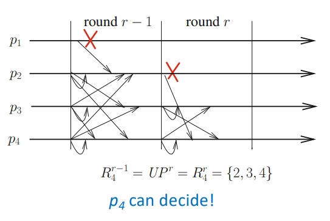
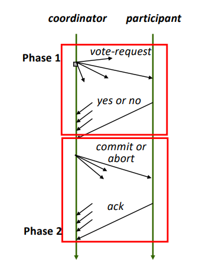

# Consensus and Interactive Consistency in Synchronous Systems Prone to Process Crash Failures

#### Synchronous Algorithm
- A **synchronous algorithm** is a distributed algorithm governed by an external global clock.
- The processes collectively execute a sequence of *rounds*, each corresponding to a value of the global clock.
- During a *round* a process sends a message to a subset of its neighbors. The fundamental property of a synchronous system is that a **message sent by a process during a round *r* is received by its destination process during the same round** - when a process proceeds to the round *r+1*, it has already received and process all the messages that have been sent to it during round *r*, and it knows the same holds for any process.

#### Asynchronous Algorithm
- An **asynchronous** algorithm on the other hand is a distributed algorithm designed to run on an asynchronous environment, which has no notion of external time - *time-free system*.
- In an asynchronous algorithm, **the progress of a process is ensured by its own computation and the messages it receives** - when a process receives a message, it processes the message and, according to its local algorithm, possibly sends messages to its neighbors.

### Consensus
- One of the most important problems of fault-tolerant distributed computing - it abstracts a lot of problems where, in one way or another, **processes must agree**.
- The consensus abstraction provides processes a single operation denoted *propose()* which takes a value as an input parameter and returns a value. If a process *pi* invokes *propose(vi)* and obtains the value *w*, we say "*pi* proposes *vi*" and "*pi* decides *w*".
- Consensus is a **one-shot problem**, with the following properties:
	- **(Safety) CC-validity:** a decided value is a proposed value.
	- **(Safety) CC-agreement:** no two processes decide different values.
	- **(Liveness) CC-termination:** each correct process decides a value.
- These properties define ***Uniform Consensus*** - prevents a process that decides and then crashes from deciding differently from the correct processes.
- ***Non-Uniform Consensus*** allows a process that crashes to decide differently from the other processes, and is defined by replacing the CC-agreement property with:
	- **(Safety) Non-uniform CC-agreement:** no two *correct* processes decide different values.
- **Binary vs multivalued consensus:** let *V* be the set of values that can be proposed to a consensus algorithm.
	- *|V|=2*, the consensus is **binary**, typically, *V={0,1}*.
	- *|V|>2*, the consensus is **multivalued**, typically, the set *V* can be finite or infinite.
- **Lower bound** - consensus can be solved in CSMP for any value *t < n*.

#### Unfair Consensus Algorithm for *CSMP(n,t)*
- The main idea of the algorithm - since at most *t* processes may crash (model assumptions), any set of *t+1* processes **contains at least one correct process**.
- The idea of the algorithm is to be executed in **rounds**. 
- On each round, one process disseminates its proposal, with other processes receiving it and updating their estimate.
- After *t+1* rounds, a process decides its estimate - this number of rounds is the lower bound on the number of rounds.

```vhdl
operation propose (vi) is
(1) esti ← vi;
(2) when r = 1, 2,...,(t + 1) do
(3) begin synchronous round
(4)    if (i = r) then broadcast EST(esti) end if;
(5)    if (EST(v) received during round r) then esti ← v end if;
(6)    if (r = t + 1) then return(esti) end if
(7) end synchronous round
```
- **Time complexity:** *t +1* rounds.
- **Message complexity:** *(n-1)(t+1)b* bits (messages broadcasted in each round \* number of rounds \* bit size of the proposed values).
- However, this algorithm is not **fair** - the first process' value will always be the one decided unless it fails.
- This issue could be eliminated by adding a preliminary shuffle round during which the processes exchange their values - would come with the additional cost of one extra round.

#### Fair Consensus Algorithm for *CSMP(n,t)*
- The input vector of a given a run is the size *n* vector such that, for any *j*, its *j-th* entry contains the value proposed by *pj*. No process *pi* initially knows this vector, it only knows the value it proposes to that consensus instance.
- **Main idea:** for a process to decide, during the last round, a value according to a deterministic rule among all values it has seen. An example of a deterministic rule is to select the smallest proposed value.

```vhdl
operation propose (vi) is
(1) esti ← vi; prev esti ← ⊥;
(2) when r = 1, 2,...,(t + 1) do
(3) begin synchronous round
(4)    if (esti ̸= prev esti) then broadcast EST(esti) end if;
(5)    let recvali = {values received during round r};
(6)    prev esti ← esti;
(7)    esti ← min(recvali ∪ {esti}); -- selects smallest proposed value
(8)    if (r = t + 1) then return(esti) end if
(9) end synchronous round
```
- **Time complexity:** *t+1* rounds.
- **Message complexity:**
	- **Binary consensus** (*b=1, |V| = 2*): *2n(n-1)* bits.
	- **Multivalued consensus:** *n(n − 1)b × min(t + 1, |V|)* bits.
### Interactive Consistency (Vector Consensus)
- While consensus is an agreement abstraction on a value proposed by the processes, **interactive consistency** is agreement abstraction where the processes agree on the input vector of the proposed values. This is why it is sometimes named **vector consensus**.
- Like consensus, each process proposes a value and all processes must agree on the vector of proposed values.
- Since a process can crash before or while it executes the algorithm, its entry in the decided vector can be ⊥.
- Interactive consistency in the crash failure model (ICC) is defined by the following properties:
	- **ICC-validity:** let *Di\[1..n]* be the vector decided by *pi*. *∀j ∈ \[1..n]: Di\[j] ∈ {vj , ⊥}* where *vj* is the value proposed by *pj*. Moreover, *Di\[j] = vj* if *pj* is correct.
	- **ICC-agreement:** no two processes decide different vectors.
	- **ICC-termination:** every correct process decides on a vector.
- Notice that, if *Di\[j] = ⊥* and *pi* is correct, it knows that *pj* crashed. Whereas, if *Di\[j] ≠ ⊥*, *pi* cannot conclude that *pj* is correct.
- Interactive consistency is a **stronger** abstraction than consensus:
	- We can solve consensus from interactive consistency.
	- However, interactive consistency cannot be solved from consensus - because the value decided by a consensus instance is the value proposed by *any* process.
##### An Interactive Consistency Algorithm for *CSMP(n,t)*
- **Main idea:** same principle as the consensus algorithm, namely, at every round, each process broadcasts what it learned during the previous round, which is now a set of pairs <process id, proposed value>.
	- Given a process *pi*, the local variable *viewi* represents its current knowledge of the values proposed by the other processes - *viewi\[k] = v* means that *pi* knows that *pk* proposed the value *v*, while *viewi\[k] = ⊥* means that *pi* does not know the value proposed by *pk*. Initially, *viewi* contains ⊥ in all entries, except the *i*th entry, which contains *vi* (line 1).
	- In order to forward the value of a process only once, the algorithm uses pairs *<k,v>* to denote that *pk* already proposed *v*. The local variable *newi* is a (possibly empty) set of such pairs. At the end of a round *r*, *newi* contains the new pairs that *pi* learned during this round (lines-9-13).
		- Send phase (line 4): when *pi* starts a new round *r*, it broadcasts *EST(newi)* if *newi ≠ ∅*, to inform the other processes of the pairs it has learned during the previous round.
		- Receiving phase (lines 5-7): then *pi* receives round *r* messages and saves their values in the local array *recfromi\[1..n]* - it is possible that a process receives no message in some rounds.
		- Local computation phase (lines 8-14): after having reset *newi*, *pi* updates its array *view* according to the pairs it has receives. Moreover, if *pi* learns (receives for the first time) a pair *<k,v>* during the current round, it adds it to the *newi* set. Finally, if *r* is the last round, *pi* returns *viewi* as the vector it decides on.

```vhdl
operation propose (vi) is
(1) viewi ← [⊥,..., ⊥]; viewi[i] ← vi; newi ← {⟨i, vi⟩}; -- new values observed in the last round
(2) when r = 1, 2,...,(t + 1) do
(3) begin synchronous round
(4)    if (newi ̸= ∅) then broadcast EST(newi) end if; -- only new values are sent
(5)    for each j ∈ {1,...,n}\{i} do
(6)    if (newj received from pj ) then recfromi[j] ← newj else recfromi[j] ← ∅ end if;
(7)    end for;
(8)    newi ← ∅;
	   -- collect the new values and update the vector to be decided
(9)    for each j such that (j ̸= i) ∧ (recfromi[j] ̸= ∅) do
(10)      for each ⟨k, v⟩ ∈ recfromi[j] do
(11)         if (viewi[k] = ⊥) then viewi[k] ← v; newi ← newi ∪ {⟨k, v⟩} end if
(12)      end for
(13)   end for;
(14)   if (r = t + 1) then return(viewi) end if
(15) end synchronous round
```
- **Time complexity:** *t + 1* rounds.
- **Message complexity:** *n²(n − 1)(b + log₂ n)* bits.
- **From interactive consistency to consensus:** consensus can easily be solved as soon as one has an algorithm solving interactive consistency. As the processes that decide in the interactive consistency agreement abstraction decide the very same vector, they can use the same deterministic rule to extract a non-⊥ value from this vector (e.g., the first non-⊥ value or the greatest value, etc.). The only important point is that they all use the same deterministic rule.

### Early Deciding Interacting Consistency
- In the previous interactive consistency algorithm in executions with no failures:
	- All processes will send their estimates in *r=1*;
	- All processes will send other estimates (received in *r=1*) in *r=2*;
	- After that, no process will send messages in *t-1* rounds - **waste of time!**
- We want to make the algorithm to be able to **decide and stop earlier if possible**.
- Let f ≤ t be the number of failed processes in an execution (processes don't know this value).
- Is it possible to devise protocols with a latency proportional to *f* - that finish in *f+2* rounds if *f<t*.
- **Why *f+2* and not *f+1* lower bound?** As there are only *f* failures in the execution, after *f+1* rounds there is at least one process that executed a round in which it saw no failures - so this process knows which value can be decided, but doesn't know if other processes are aware of it - therefore, it needs an additional round to inform other processes of this before deciding.
- Then, the latency lower bound becomes ***min(f+2, t+1)***.
- **How does a process know when to stop?**

#### Early Decision Predicate
- In previous algorithms, processes sent messages only in rounds they have something new to communicate.
- We need to remove the uncertainty about messages:
	- **Each process must send messages on every round until it decides** - so we can differentiate if *pj* crashed or didn't have anything new to forward.
	- **All messages must indicate if the sender is about to decide.**
	- This is to ensure that other processes can differentiate between crashes and decisions, propagate critical information, and maintain consistency in the consensus process.
- With this, let:
	- ***UP^r:*** the set of processes that start round *r*;
	- ***Ri^r:*** the set of processes from which *pi* received messages during round *r ≥ 1*.;
	- ***Ri^0:*** the set of n processes that start on round *r=0*.
- We have *∀r ≥ 1: Ri^r ⊆ UP^r ⊆ Ri^r−1*.
- *Ri^r-1 = Ri^r* is the predicate we need - meaning that no process crashed, so the algorithm can safely terminate earlier.
	- It means that *pi* received (during the rounds 1 to *r*) all the pairs <k, v> known by the processes that are alive at the beginning of *r*.
	- All the other pairs are lost forever and consequently no process can learn them in a future round.
	- Process *pi* can consequently decide the current value of its local vector *viewi*.



##### Early Deciding IC Algorithm for *CSMP(n,t)*
- Processes broadcast their state until they decide.
- Processes stop sending messages immediately after deciding.
- Broadcast *newi* and *earlyi* in each round until decision.
- If the early decision predicate is satisfied in round *r*:
	- The process broadcasts *earlyi = true* in round *r+1*.
	- It decides and stops execution in round *r+1*.

```vhdl
operation propose (vi) is
(M1) viewi ← [⊥,..., ⊥]; viewi[i] ← vi; newi ← {⟨i, vi⟩}; nbri[0] ← n; earlyi ← false;
(2) when r = 1, 2,...,(t + 1) do
(3) begin synchronous round
(M4)    broadcast EST(newi, earlyi) end if;
(5)     for each j ∈ {1,...,n}\{i} do
(6)         if (newj received from pj) then recfromi[j] ← newj else recfromi[j] ← ∅ end if;
(7)     end for;
(N1)    if (earlyi) then return(viewi) if;
(N2)    nbri[r] ← number of processes from which round r messages have been received;
(N3)    decidei ← any(earlyj received during round r);
(8)     newi ← ∅;
(9)     for each j such that (j ̸= i) ∧ (recfromi[j] ̸= ∅) do
(10)        foreach ⟨k, v⟩ ∈ recfromi[j] do
(11)            if (viewi[k] = ⊥) then viewi[k] ← v; newi ← newi ∪ {⟨k, v⟩} end if
(12)        end for
(13)    end for;
(N4)    if ((nbri[r − 1] = nbri[r]) ∨ decidei) then earlyi ← true end if;
(14)    if (r = t + 1) then return(viewi) end if
(15) end synchronous round
```

###### Data Structures
- *viewi\[1..n]*: vector to store proposed values.
- *newi*: set of newly learned values.
- *nbri\[0..n]*: tracks the number of processes from which *pi* received messages each round.
- *earlyi*: true if the early decision predicate is satisfied.
- *decidei*: true if *pi* learns that another process is about to decide.

##### Early Deciding Consensus Algorithm for *CSMP(n,t)*
```vhdl
operation propose (vi) is
(1) esti ← vi; nbri[0] ← n; earlyi ← false;
(2) when r = 1, 2,...,(t + 1) do
(3) begin synchronous round
(4)    broadcast EST(esti, earlyi);
(5)    if (earlyi) then return (esti) end if;
(6)    let nbri[r] = number of messages received by pi during r;
(7)    let decidei ← any(earlyj values received during current round r);
(8)    esti ← min({estj values received during current round r});
(9)    if ((nbri[r − 1] = nbri[r]) ∨ decidei) then earlyi ← true end if
(10)   if (r = t + 1) then return(esti) end if
(11) end synchronous round
```

# Non-Blocking Atomic Commitment (NBAC) in the Presence of Process Crash Failures 
### Introduction
- **Atomic commitment** originated from databases and is one of the key abstractions employed to ensure that distributed decisions are done in a consistent way.
- In this problem, we have a set of processes that need to decide if some sequence of actions will be executed or not.
- A job is split into *n* independent parts, executed by different processes - all of them execute each part, and in the end, they have to agree to commit or not that job - if one of them fails, all of them must agree to abort it (all or nothing).
- Example: a **distributed transaction** with two sub-transactions in a distributed database, which are two physically separated parts of the same database.

### The NBAC Problem
- The **Non-Blocking Atomic Commitment** (NBAC) agreement abstraction provides processes a single operation *nbac_propose()* with a single input parameter, whose value is *yes* or *no* - when such input parameter by *pi* is *yes*, we say that *pi* "votes" *yes* (same for *no*).
- This agreement abstraction is defined by the following properties:
	- **(Safety) NBAC-validity:** an invocation of *nbac_propose()* can return only commit or abort.
		- *NBAC-justification*: if a process returns commit, all processes voted *yes*.
		- *NBAC-obligation*: if all processes vote *yes* and no process crashes, abort cannot be decided.
	- **(Safety) NBAC-agreement:** no two processes decide differently.
	- **(Liveness) NBAC-termination:** every correct process decides.
- The *NBAC-agreement* and the *NBAC-termination* properties are similar to the ones defining the consensus problem.
- The *NBAC-validity* relates the decided value (commit or abort) not only to the votes but also to the failure pattern - basically, the *NBAC-obligation* states that, in “good circumstances” (all processes voted yes and there are no crashes), the decision must be **commit**.
	- Without *NBAC-obligation*, it would be possible for processes to always decide abort, i.e., this property implicitly states that an abort decision must be justified.
- The NBAC definition does not prevent correct processes from deciding commit despite crashes.
- Unlike consensus, where crashes are mentioned in the termination property, they also appear in the validity property (*NBAC-obligation*).

### Practical Solutions for Atomic Commitment
- A typical solution for implementing atomic commitment is to use a coordinator for orchestrating the decision of multiple participants.
- When there are no failures, the coordinator just needs to ask for participants' votes and send a final decision respecting NBAC-validity.
- With failures, the coordinator needs to be able to reliably detect them. Consequently, this solution needs a system model like *CAMP(n,t)\[trusted coordinator, P]*.
	- (P is the perfect failure detector – which is not the weakest for solving NBAC).

### (Blocking) Two-phase Commit
- If the coordinator fails - we remove the *trusted coordinator* assumption -  we need the classical **two-phase commit** protocol, used in several practical systems.
- This protocol can block if the coordinator crashes before sending a global decision to the participants.
- This limitation is addressed in practice by considering that the coordinator can recover and resume its processing, which requires storing every step on a durable log.



##### A Simple Slgorithm for NBAC in *CSMP(n,t)*
- It is very simple to reduce the NBAC problem to synchronous consensus, removing the need for the trusted coordinator.
- Uses an additional round before the consensus to vote a collect votes.
- If all *n* processes vote *yes*, propose 1 to consensus, otherwise propose 0.

```vhdl
operation nbac propose (votei) is
(1) begin synchronous round -- preliminary round
(2)    broadcast EST(votei);
(3)    let msvotesi = multiset of votes received during the current preliminary round;
(4)    if (|msvotesi| = n) ∧ (no ∉ msvotesi) then vi ← 1 else vi ← 0 end if
(5) end synchronous round; -- end of the preliminary round
(6) deci ← propose (vi); -- underlying synchronous consensus instance
(7) return(deci)
```