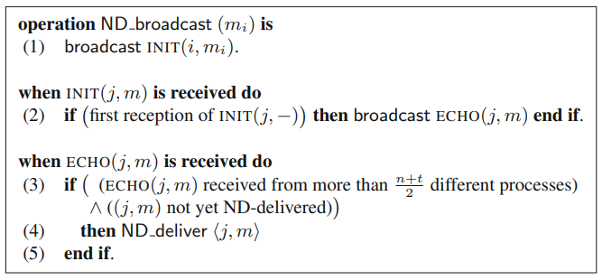
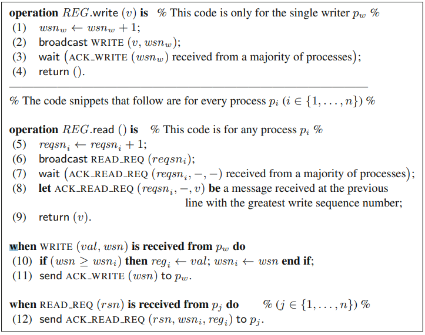
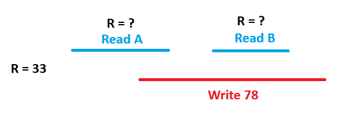

# Example questions for exams 2022/23

#### For the next questions, consider the following Broadcast protocol.

#### a) How many messages are exchanged in this protocol when running on a fault-free system with n=7 processes?

> n (INITs) + n (ECHOs) x n (processes). With n=7, 7+7x7 = 56

#### b) This protocol cannot solve Reliable Broadcast with Byzantine failures. Show why.

> Because this protocol does not guarantee that either all correct processes deliver the same message or none of them do, so it's possible a process could send two different messages to two different processes and both of them deliver them.

#### c) Can this protocol solve Reliable Broadcast in the CAMPn,t system model? Justify.

> Yes, since processes retransmit the same message on each iteration, so as long as at least n/2 are alive it solves the CAMPn,t system model.

#### 3. For the next questions, consider the following Single-Writer Multi-Reader Regular Register algorithm for CAMPn,t\[t < n/2].

#### a) How many communication steps are needed for executing a read?

> 2 communication steps: READ_REQ and ACK_READ_REQ.

#### b) How many communication steps are needed for executing a write?

> 2 communication steps:  WRITE and ACK_WRITE.

#### c) How can this protocol be modified to support multiple writers?

> To support multiple writers:
> 1. One additional phase on writes for reading the current sequence number before it increments it;
> 2. A way to differentiate the same sequence number from different processes, by using timestamps in the format \<logical time, process identity\>

####  d) How can we further modify this protocol to satisfy atomic semantics?

>To satisfy atomic semantics, readers should be forced to rewrite on every read to prevent new/old inversions. When a reader obtains a pair \<v, msn\>, with a msn being the highest number from a majority of processes, it should write back the pair before returning it.

# Exam 2017

#### 4. A message delivered using a reliable causal broadcast primitive also satisfies:

(A) Total order delivery

(B) FIFO order delivery.

(C) Both total and FIFO order delivery.

(D) None of them.

> (B) FIFO order delivery.

#### 5. The properties of atomic (total order) broadcast (in asynchronous systems with crash failures) ensure that:

(A) If a correct process delivers message M, then the sender of M must be a correct process.

(B) If a correct process delivers M1 before M2 then all correct processes deliver M1 before M2.

(C) If a correct process broadcasts M1 before M2 then all correct processes deliver M1 before M2.

(D) All of the above.

> (B) If a correct process delivers M1 before M2 then all correct processes deliver M1 before M2.

#### 6. When using a Perfect Failure Detector (of class P), it is guaranteed that:

(A) Eventually, all correct processes permanently suspect all crashed processes.

(B) If a process crashes then it will be immediately suspected by all correct processes.

(C) If a correct process is suspected by mistake, the mistake will be eventually corrected.

(D) Eventually, all correct processes will never become suspected.

> (A) Eventually, all correct processes permanently suspect all crashed processes.

#### 8. An atomic register R initially holding value 33 is used by two process P and Q that perform the following operations: P executes A=read(R) during time interval \[2,5] and B=read(R) during interval \[6,8]; Q executes write(R,78) during time interval \[4,9] (the operation overlaps in time with both reads performed by process P). In this situation, since the register provides the atomic semantics, it is guaranteed that:

(A) The value of A will be 33.

(B) The value of B will be 78.

(C) If the value of A is 33 then the value of B will also be 33.

(D) If the value of A is 78 then the value of B will also be 78.

> (D) If the value of A is 78 then the value of B will also be 78.