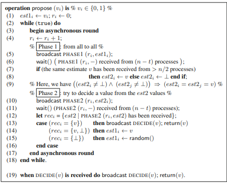

# Example questions for exams 2022/23
#### Explain why consensus is impossible in an asynchronous system even with a single process failure
##### a) In terms of intuition
> Because of the net effect of asynchrony and crashes - we cannot differentiate if a process is slow or it crashed - because processes may be delayed indefinitely. This uncertainty prevents the system from achieving consensus because the remaining processes cannot be sure whether a delay is due to a failure or a slow execution.

##### b) What is the idea behind the main impossibility theorem?
> The FLP theorem states that we cannot implement consensus in the asynchronous system model even with a single failure, because we cannot distinguish a slow process from a failed process. It says that we can always find an execution when a slow process does not respond in time, where consensus cannot be resolved.

##### c) Why can the Omega failure detector break such impossibility?
> Because it provides just enough synchrony by guaranteeing that after some unknown time, all processes agree on the same correct leader to make decisions. This allows the system to reach consensus despite asynchrony and failures. It is the weakest failure detector class able to implement consensus (represents the minimal information needed for it).

#### For the next questions, consider the following Binary Consensus protocol for *CAMP(n,t)\[t < n/2, LC]* .

##### How many messages are exchanged in this protocol in an execution of a system with n = 5 processes in which there are no failures, and all processes propose 1?
> PHASE1 = n², PHASE2 = n², DECIDE = n² (because it uses URB).
> When all processes propose the same value, the algorithm ends in a single round.
> Messages in a single round = n²+n²+n².
> So the result it 5²+5²+5² = 75 messages.

##### In which conditions the *random()* call will be executed by a process? How this helps this protocol solve consensus?
> The *random()* call will only be executed when the proposed values are different. This helps solving consensus because *eventually*, all processes will choose the same value (0 or 1) with a high probabilistic termination.