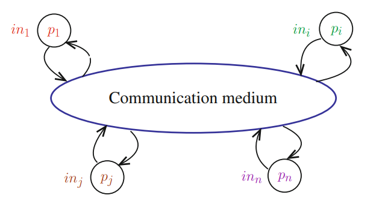
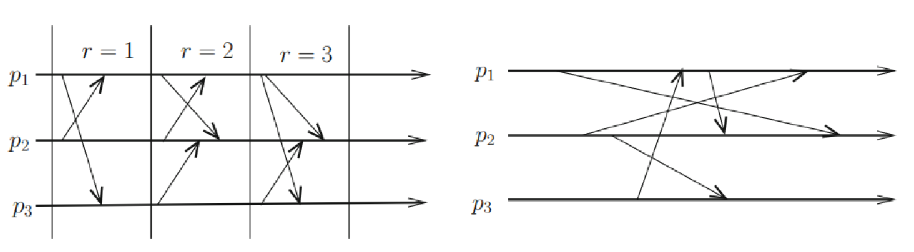

# Distributed Computing
Arises when one must solve a problem in terms of distributed entities (processors, nodes, processes, peers, etc.) such that each entity has only a partial knowledge of the many parameters involved in the problem at hand.
### Definitions
- A **sequential algorithm** is a formal description of the behavior of a sequential state machine: the text of the algorithm states the transitions that must be sequentially executed.
- When written in a programming language, an algorithm is called a **program**.
- The concept of a **process** was introduced to highlight the difference between an algorithm as text and its execution on a processor.
- At any time, a process is characterized by its state (which comprises, among other things, the current value of its program counter).
- A sequential process is a process defined by a single control flow **(thread)**: its behavior is managed by a single program counter, which means it executes a single step at a time.

- **Distributed system**: a (static) set of processes P ={p1, ..., pn} interconnected by a communication medium that cooperate on a common goal.
- **Communication medium**: we assume processes communicate by sending messages through bidirectional channels.
- **Structural view**: a distributed system can also be represented from a structural point of view as a connected graph G = (P, C), where C denotes the set of channels.
- A **distributed algorithm** is a collection of *n automata*, one per process. In addition to the power of a Turing machine, each automaton can call *send()* and *receive()* to place and retrieve messages from any of its channels.

- A **synchronous algorithm** is a distributed algorithm governed by an external global clock R. The processes collectively execute a *sequence of rounds* each corresponding to a value of the global clock.
- An **asynchronous algorithm** is a distributed algorithm designed to run on asynchronous systems, which hash no notion of external time (time-free system) - the progress of a process is ensured by its own computation and the messages it receives. 

- An **event** models the execution of a step issued by a process, where a step is either *local* (communication-free local computation), or a *communication step* (the sending or reception of a message).
- An **execution** E is a partial order on the set of events produced by processes
	- *(Synchronous systems)* **E** is the partial order on the set of events produced by the processes, such that all the events occurring in a round r precede all the events of the round r + 1, and, on every round, all sending events, precede all reception events, which in turn precede all local events executed in this round.
	- *(Asynchronous systems)* **E** is the partial order on the events produced by the processes such that, for each process, E respects the order on its events, and, for any message m sent by a process pi to a process pj , the sending of m by pi occurs before its reception by pj.
### Types of Failures
- **Process failure model**:
	- **Crash failures**: a process commits a crash failure when it prematurely stops its execution - until it crashes (if ever), a process correctly executes its local algorithm.
	- **Byzantine failures**: a process commits a Byzantine failure when it does not follow the behavior assigned to it by its local algorithm - also called arbitrary (or malicious when the failure is intentional).
		- Note that crash failures are a proper subset of Byzantine failures.
- **Channel failure model**:
	- Is similar but given that we can detect and discard corrupted messages using error detection and message authentication codes, the possibility to lose messages is the main failure mode.
### Solving a Distributed Computing Problem
- A **problem** is defined by a set of properties.
	- One of these properties, called **liveliness**, states that "something happens".
	- The other properties, which are called **safety** properties, state that "nothing bad happens" - safety properties are *invariants*.
	- The decomposition of a problem definition in multiple properties facilitates its understanding and the correctness proof of algorithms that solve it.

> An **algorithm A** solves a **problem P** in a **system model M** if there is a proof that any run of A on M satisfies all properties of P.
### System Models

|                    | Crash failure model | Byzantine failure model |
|--------------------|---------------------|-------------------------|
| Asynchronous model | CAMP                | BAMP                    |
| Synchronous model  | CSMP                | BSMP                    |
- C or B stands for "Crash" or "Byzantine" process failures (up to `t < n`).
- A or S stands for "Asynchronous" or "Synchronous" system models.
- MP means "Message Passing" on a fully connected graph of reliable channels.

> t = failure threshold, n = number of messages

- The models can be strengthened/weakened with additional assumptions, e.g.:
	- `CAMP(n,t) [t < n/2]`: `CAMP(n,t)` enriched with additional assumption of `t < n/2`.
	- `BAMP(n,t) [-FC]`: `BAMP(n,t)` weakened with fair channels instead of reliable channels.