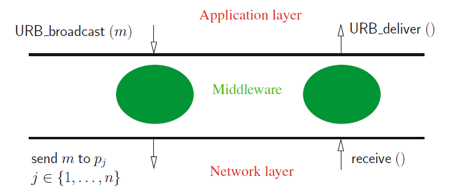

# Reliable Broadcast in the Presence of Process Crash Failures

### Best-Effort Broadcast
- Consider the `CAMP(n,t)` (asynchronous crash failure) system model
- Consider the following implementation of a "broadcast *m*"

```vhdl
for each j ∈ {1,...,n} do send m to pj end for
```

- What happens when the sender crashes in the middle of the `for` statement?
	- **Inconsistency across different processes** - while some might receive the message, others might not.
- We have to guarantee that if one process receives the message *m*, all other processes receive it.

### Uniform Reliable Broadcast (URB)
- **URB** is an abstraction that ensures that any message delivered to a process, will be delivered to all correct processes of the system.
- URB is implemented through two primitives:
	- `URB_broadcast(m)`, to reliably broadcast *m*;
	- `URB_deliver(m)`, to deliver *m* to the application.
- In practice, URB acts as a *middleware* between the network layer and the application layer, using a layered design.



- At low level, these primitives use *send* and *receive* calls.
- We assume that every message *m* has a unique identifier `⟨m.sender, m.seq_nb⟩`, where `m.sender` is the id of the sender process and `m.seq_nb` is a sequence number generated locally by `pm.sender`.
##### URB Protocol
```vhdl
operation URB broadcast (m) is
(1) send MSG(m) to pi.
when MSG (m) is received from pk do
(2) if (first reception of m) then
(3)     for each j ∈ {1, . . . , n} \ {i, k} do send MSG (m) to pj end for;
(4)     URB deliver (m) % deliver m to the upper application layer %
(5) end if
```

##### Uniform Reliable Broadcast (URB)
- **Safety**:
	- ***URB-validity***: if a process urb-delivers a message *m*, then *m* has been previously urb-broadcasted (by `pm.sender`) - "a process does not deliver made up messages".
	- ***URB-integrity***: a process urb-delivers a message *m* at most once - "a process does not deliver the same message more than once".
- **Liveness**:
	- ***URB-termination-1***: if a non-faulty process urb-broadcasts a message *m*, it urb-delivers *m* - "non-faulty processes receives message".
	- ***URB-termination-2***: if a process urb-delivers a message *m*, then each non-faulty process urb-delivers *m* - "if one process receives a message, then all non-faulty process also receive it".

An illustration of URB delivery guarantees: different messages are delivered by different processes. However, **correct processes deliver all messages that were ever delivered**.


- URB is a paradigm that represents a family of distributed coordination problems:
	- ``URB_broadcast`` can be given the meaning “this is an order”
	- ``URB_deliver`` can be given the meaning “I execute it”
	- All correct processes will execute the same set of orders, including all orders issued by correct processes and a subset of orders issued by faulty processes
	- URB is a **one-shot problem**: its specification considers a single message
- **Removing uniformity**: the Reliable Broadcast (RB) problem is a weakened
form of URB. It has the same Validity and Integrity properties, and the following weaker termination: if a non-faulty process (1) urb-broadcasts a message *m*, or (2) urb-delivers
a message *m*, then each non-faulty process urb-delivers *m*.

An illustration of RB vs URB delivery guarantees: in RB, correct processes deliver the same messages.


### Establishing Order in URB
- The URB abstraction can be enriched (in a modular way) with ordering guarantees on the delivery of messages:
	- **FIFO order**: messages from the same sender are delivered in the order they were sent.
	- **Causal order**: message delivery satisfy cause-effect precedence.
	- **Total order**: messages are delivered in the same order.
- All ordered URB are **multi-shot problems**, since their specifications consider all messages broadcasted in the system.

#### FIFO Message Delivery
- The **FIFO-URB** abstraction is defined by the URB properties plus one more: 
	- *FIFO-URB message delivery*: if a process fifo-broadcasts a message *m* and later fifo-broadcasts a message *mʹ*, no process fifo-delivers *mʹ* unless it has previously fifo-delivered *m* - to establish order between messages
- Messages are retained in the FIFO middleware until previous messages are received.
- There are no constraints on messages sent by different processes


FIFO-URB utilizes the URB middleware layer (to broadcast messages reliably) plus its layer (to deliver messages in order).


##### FIFO-URB Protocol
```vhdl
operation FIFO broadcast (m) is
(1) m.sender ← i; m.seq nb ←pi’s next seq. number (starting from 1);
(2) URB broadcast MSG(m).
when MSG(m) is urb-delivered do % m carries its identity (m.sender, m.seq nb) %
(3) let j = m.sender;
(4) if (nexti[j] = m.seq nb)
(5)     then FIFO deliver (m);
(6)         nexti[j] ← nexti[j] + 1;
(7)         while (∃m′ ∈ msg seti : (m′.sender = j) ∧ (nexti[j] = m′.seq nb))
(8)             do FIFO deliver (m′);
(9)                 nexti[j] ← nexti[j] + 1;
(10)                msg seti ← msg seti \ {m′}
(11)        end while
(12)    else msg seti ← msg seti ∪ {m}
(13) end if
```

#### Causal Order Message Delivery
- A **partial order on messages**: Let *M* be the set of messages that are urb-broadcasted during an execution, and *M\* = (M,→M)* be the relation where *→M* is defined on *M* as follows.
- Given *m, mʹ* ∈ *M, m →M mʹ* (meaning “*m* causally precedes *mʹ* ”) if:
	- *m* and *mʹ* are co-broadcast by the same process and *m* was co-broadcast before *mʹ*, or
	- *m* has been co-delivered by a process *pi* before *pi* co-broadcasts *mʹ*, or
	- there is a message *mʹʹ* ∈ M such that *m →M mʹʹ* and *mʹʹ →M mʹ*.
- As a message cannot be co-delivered before being co-broadcast, *M\** is a **partial order**.

- The CO-URB abstraction is defined by the URB properties plus one more:
	- *CO-URB message delivery*: if *m* → *Mm'*, no process co-delivers *m'* unless it has previously co-delivered *m*.
- FIFO delivery is a weakening of CO delivery applied to each channel.


##### A Causal Order URB Protocol
```vhdl
operation CO broadcast (m) is
(1) URB broadcast MSG (causal pasti ⊕ m);
(2) causal pasti ← causal pasti ⊕ m.
when MSG (⟨m1, . . . , mℓ⟩) is urb-delivered do
(3) for x from 1 to ℓ do
(4)     if (mx not yet CO-delivered) then
(5)         CO deliver (mx);
(6)         causal pasti ← causal pasti ⊕ mx
(7)     end if
(8) end for
```

However, this is not efficient because we have to store the whole causal past, making it very larger over time.

##### Another Causal Order URB Protocol
```vhdl
operation CO broadcast (m) is
(1) FIFO broadcast MSG (im causal pasti ⊕ m);
(2) im causal pasti ← ϵ.
when MSG (⟨m1, . . . , mℓ⟩) is FIFO-delivered do
(3) for x from 1 to ℓ do
(4)     if (mx not yet CO-delivered) then
(5)          CO deliver (mx);
(6)          im causal pasti ← im causal pasti ⊕ mx
(7)     end if
(8) end for
```

This version is slightly better, since building CO on top of FIFO is more advantageous:
- FIFO URB has **memory**, so we can **reset the causal sequence**;
- In the end, the causal precedence is respected.

#### Total Order Message Delivery
- Total Order (TO) message delivery means (informally) that **all messages are delivered in the same order on all correct processes**.
- Differently from FIFO and CO, which depends on the causal past of message deliveries (i.e., messages are related), **TO applies even for completely unrelated messages**.
- TO cannot rely on information piggybacked on URB, requiring additional interactions for establishing a common delivery order.
- TO broadcast cannot be implemented on `CAMP(n,t)`, requiring a stronger system model, i.e., there is a computability gap between FIFO/CO and TO.

---

- **The FIFO and CO broadcast abstractions can be built on any system model where URB broadcast is available**.
- This is not the case for TO broadcast.
- This means they can be used on top of the URB broadcasts implemented on weaker system models.
