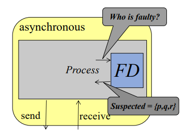

# Reliable Broadcast in the Presence of Process Crashes and Unreliable Channels
### Reliable Channel Abstraction
- ***RC-validity***: if *pj* receives a message *m* from *pi*, then *m* was previously sent by *pi* to *pj*.
- ***RC-integrity***: process *pj* receives a message *m* at most once.
- ***RC-termination***: if *pi* completes the sending of *k* messages to *pj*, then, if *pj* is non-faulty and executes *k* times *"receive() from pi"*, *pj* receives *k* messages from *pi*.

This is similar to the reliable broadcast specification, and it's not a one-shot problem.

### A System Model with Unreliable Channels
- Having *reliable channels* is a strong assumption
- If the channel can lose all messages, no distributed problem can be solved (Two Generals Problem)
- Losses need to be admitted but in some restricted way
- Useful definitions:
	- All messages transmitted are called protocol messages (not application messages)
	- Each protocol message has a type (e.g., MSG, DECIDE, ACK)
	- Let a µ-message be a protocol message of type µ
	- Consider a channel in which *pi* sends protocol messages to *pj*

### Fair Channel (FC)
- ***FC-validity***: if *pj* receives a message *msg* from *pi*, then *msg* has been previously sent by *pi* to *pj*.
- ***FC-integrity***: for any message *msg*, if *pj* receives *msg* from *pi* an infinite number of times, then *pi* has sent *msg* to *pj* an infinite number of times.
- ***FC-termination***: for any message *msg*, if *pi* sends *msg* an infinite number of times to *pj*, and *pj* executes *“receive() from pi”* infinitely often, it receives *msg* from *pi* an infinite number of times.

Each protocol message defines a specific message of type µ and the channel is fair to all types of messages.

### Fair Lossy Channel (FLC)
- ***FLC-validity***: if *pj* receives a message from *pi*, this message has been previously sent by *pi* to *pj*.
- ***FLC-integrity***: if *pj* receives an infinite number of messages from *pi*, then *pi* has sent an infinite number of messages to *pj*.
- ***FLC-termination***: if *pi* sends an infinite number of messages to *pj* and *pj* is non-faulty and executes *“receive() from pi”* infinitely often, it receives an infinite number of messages from *pi*.

FLC-termination states the channel transmits messages but gives no information about which messages are received.

### Fair vs Fair Lossy Channels (FC vs. FLC)
- FC and FLC are different, but neither is stronger than the other.
- **Example 1:**
	- *pj* sends infinitely-many messages 1, 2, 3, 4, 5, ...
	- What can *pj* receive with FC in the worst case? **Nothing** - it might take so long that the messages are considered to be not received (yet).
	- What can *pj* receive with FLC in the worst case? **An infinite set of integers** - some of them dropped, but many being received (it cannot indefinitely delay all messages).
- **Example 2:**
	- *pi* sends infinitely-many messages 1, 2, 1, 2, 1, ...
	- What can *pj* receive with FC in the worst case? **1 and 2 (infinitely many times)** - the messages might be delayed, but eventually, both 1 and 2 will be received repeatedly.
	- What can *pj* receive with FLC in the worst case? **Just 1 or just 2** - the receiver might only get all instances of either 1 or 2, but not both.

### Uniform Reliable Broadcast (URB) with Fair Channels (FC)
- Using fair channels instead of reliable channels weakens the system model from `CAMP(n,t)` to `CAMP(n,t)[-FC]`
- The URB solution requires also that `t < n/2`, weakening the system even more, resulting in `CAMP(n,t)[-FC, t < n/2
- This relies on two simple techniques:
	1. Use the re-transmissions to build a reliable channel on top of a fair channel.
	2. Locally urb-deliver an application message *m* only when this message has been received by **at least one non-faulty process**. As there are at least *n - t* non-faulty processes and *n - t -> t* (model assumption), this means that, without risking remaining blocked forever, a process *pi* may urb-deliver *m* as soon as it knows that at least *t + 1* processes have received a copy of m.

##### URB in *CAMP(n,t)\[-FC, t < n / 2]*
```vhdl
operation URB broadcast (m) is send MSG (m) to pi.

when MSG (m) is received from pk do
(1) if (first reception of m)
(2)     then allocate rec byi[m]; rec byi[m] ← {i, k};
(3)         activate task Diffusei(m)
(4)     else rec byi[m] ← rec byi[m] ∪ {k}
(5) end if.

when (|rec byi[m]| ≥ t + 1) ∧ (pi has not yet urb-delivered m) do
(6) URB deliver (m).

task Diffusei(m) is
(7) repeat forever
(8)     for each j ∈ {1,...,n} do send MSG (m) to pj end for
(9) end repeat.
```

There is no algorithm implementing URB-broadcast in *CAMP(n,t)\[-FC, t ≥ n/2]*, due to the **uniformity** URB.

### Failure Detectors (FDs)
- A failure detector (FD) is an approach to circumvent impossibilities.
- Different problems may require different types/classes of FDs to be solved.
- A failure detector is a distributed oracle, with each process associated with a FD module.
- Advantages:
	- Modularity
	- Assumptions on failures



- Let *t* be the value of external real-time clock
- *Failure pattern* *F(t)* is the set of processes failed at a given instant *t*
- *Faulty(F)* is the set of processes that fail during an execution
- *Correct(F) = PI - Faulty(F)*
- An environment captures everything that is not under the control of the algorithm (failures, speed of processes, message transit times, etc).
- The FD output does not depend on the computation executed by the algorithm; it depends only on the actual failure pattern, a feature of the environment.

##### URB in *CAMP(n,t)\[-FC]* with Failure Detector
- **Definition of failure detector of class theta:** returns a set of trusted processes that always contains at least one correct (**accuracy**) and eventually will contain only correct processes (**liveness**)

Theta can be implemented on *CAMP(n,t)\[-FC, t < n/2]*, making URB solvable in a more general *CAMP(n,t)\[-FC, theta]* system model.

```vhdl
initialization: trustedi ← any set of ⌈ (n+1) / 2 ⌉ processes.
background task: repeat forever broadcast ALIVE() end repeat.
when ALIVE () is received from pk do
(1) suppress pk from queuei; add pk at the head of queuei;
(2) trustedi ← the ⌈ (n+1) / 2 ⌉ processes at the head of queuei.
```

### Quiescent Uniform Reliable Broadcast
- **Quiescence**: An algorithm that implements a communication abstraction is ***quiescent*** if each application message it must transfer to its destination processes results in a finite number of protocol messages.
- **Quiescence vs Termination**: termination is the property of an algorithm in which it eventually stops executing - termination is stronger that quiescence.
- These properties are from the algorithm, not the problem.
- URB algorithm is quiescent if for each application message it transmits a finite number of protocol messages are exchanged.
- Quiescence is like everyone stopping for a moment, while termination is like everyone finishing the job.

### Quiescent URB with a Perfect Failure Detector
- **Definition of failure detector class P:** it returns a set of suspected processes that *eventually* contains all faulty processes (**completeness**) and never contains processes not yet crashed (**strong accuracy**).
- P is a failure detector class strictly stronger than theta, since theta can be implemented with P, by defining *trustedi = P\\\suspectedi*.

##### Quiescent URB in *CAMP(n,t)\[-FC, theta, P]*

> **Quiescent** and **terminating**
```vhdl
operation URB broadcast (m) is send MSG (m) to pi.
when MSG (m) is received from pk do
(1) if (first reception of m)
(2)     then allocate rec byi[m]; rec byi[m] ← {i, k};
(3)         activate task Diffusei(m)
(4)     else rec byi[m] ← rec byi[m] ∪ {k}
(5) end if;
(6) send ACK (m) to pk.

when ACK (m) is received from pk do
(7) rec byi[m] ← rec byi[m] ∪ {k}.

when (trustedi ⊆ rec byi[m]) ∧ (pi has not yet urb-delivered m) do
(8) URB deliver (m).

task Diffusei(m) is
(9)  repeat
(10)     for each j ∈ {1,...,n} \ rec byi[m] do
(11)         if (j /∈ suspectedi) then send MSG (m) to pj end if
(12)     end for
(13) until (rec byi[m] ∪ suspectedi) = {1,...,n} end repeat
```

### The ◇P Failure Detector
- A variant of P that can output arbitrary values for some time.
- ◇P returns a set of suspected processes that *eventually* contains all faulty processes (**completeness**) and *eventually* never contains processes not yet crashed (**eventual strong accuracy**).
- ◇P is weaker than P, and incomparable to theta.

##### Quiescent URB in CAMP(n,t)\[-FC, theta, ◇P]

> **Quiescent** and but **not terminating**
```vhdl
operation URB broadcast (m) is send MSG (m) to pi.
when MSG (m) is received from pk do
(1) if (first reception of m)
(2)     then allocate rec byi[m]; rec byi[m] ← {i, k};
(3)         activate task Diffusei(m)
(4)     else rec byi[m] ← rec byi[m] ∪ {k}
(5) end if;
(6) send ACK (m) to pk.

when ACK (m) is received from pk do
(7) rec byi[m] ← rec byi[m] ∪ {k}.

when (trustedi ⊆ rec byi[m]) ∧ (pi has not yet urb-delivered m) do
(8) URB deliver (m).

task Diffusei(m) is
(9)  repeat
(10)     for each j ∈ {1,...,n} \ rec byi[m] do
(11)         if (j /∈ suspectedi) then send MSG (m) to pj end if
(12)     end for
(13) until (rec byi[m]) = {1,...,n} end repeat
```

### The Heartbeat (HB) Failure Detector
- Both P and ◇P require synchrony to be implemented, but quiescence can be provided in *CAMP(n,t)\[-FC]* with the HB failure detector.
- *HBi\[j]* counts heartbeats from process *pj* at process *pi* such that if *pj* is faulty, *HBi\[j]* will be bounded (**completeness**) and, if *pj* is correct, *HBi\[j]* keeps increasing (**liveness**).
- Contrary to previous FD classes, the output of HB is unbounded.

##### Quiescent URB in *CAMP(n,t)\[-FC, q, HB]*

> **Quiescent** but **not terminating**
```vhdl
operation URB broadcast (m) is send MSG (m) to pi.
when MSG (m) is received from pk do
(1) if (first reception of m)
(2)     then allocate rec byi[m], prev hbi[m], cur hbi[m];
(3)         rec byi[m] ← {i, k};
(4)         activate task Diffuse(m)
(5)     else rec byi[m] ← rec byi[m] ∪ {k}
(6) end if;
(7) send ACK (m) to pk.

when ACK (m) is received from pk do
(8) rec byi[m] ← rec byi[m] ∪ {k}.

when (trustedi ⊆ rec byi[m]) ∧ (pi has not yet urb-delivered m) do
(9) URB deliver (m).

task Diffusei(m) is
(10) prev hbi[m] ← [−1,..., −1];
(11) repeat
(12)     cur hbi[m] ← HBi;
(13)     for each j ∈ {1,...,n} \ rec byi[m] do
(14)         if (prev hbi[m][j] < cur hbi[m][j]) then send MSG (m) to pj end if
(15)     end for;
(16)     prev hbi[m] ← cur hbi[m]
(17) until rec byi[m] = {1,...,n} end repeat.
```

### Final Remarks
- Fair channel is the most common non-reliable channel model used
- It is impossible to implement URB in *CAMP(n,t)\[-FC, t ≥ n/2]*
- Failure detectors are used obtain information about the environment
- Several FDs for URB:
	- **Class theta:** weakest FD for implementing URB
	- **Class P:** FD for implementing quiescent and terminating URB
	- **Class ◇P:** weakest bounded FD for implementing quiescent URB
	- **Class HB:** weakest (unbounded) FD for implementing quiescent URB - contrary to P and ◇P, HB can be implemented in asynchronous systems