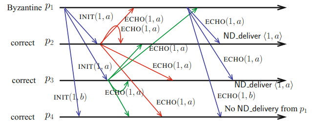
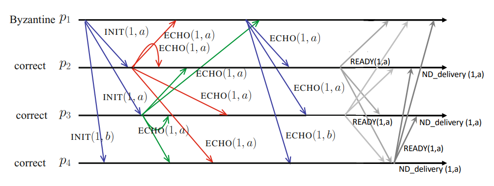

# Reliable Broadcast in the Presence of Byzantine Processes

### Byzantine Process and *BAMP(n,t)\[t < n/3]*
- A byzantine process is a process that **deviates arbitrarily from its intended behavior** (as defined by the algorithm it is supposed to execute), whether because of a bug or an attack.
- Examples of this anomaly:
	- a process crash;
	- omitting to send or receive messages;
	- the sending of erroneous values;
	- the sending of different values to different subsets of processes, when assumed to broadcast the same value to all;
	- ...
- It is also possible for several byzantine processes to collude, polluting the computation and foil correct processes.
- Byzantine failures **represent non-deterministic bugs bugs/defects and intrusions**.
- We assume the channels are **reliable**.
- **There is no algorithm implementing *ND-broadcast* in the system model *BAMPn,t\[t ≥ n/3]*.**

### No-Duplicity Broadcast
- **ND-validity**: if a non-faulty process *nd-delivers* an application message *m* from *pi*, then, if *pi* is correct, it *nd-broadcasted m*.
- **ND-integrity**: no correct process *nd-delivers* a message more than once.
- **ND-no-duplicity**: no two non-faulty processes *nd-deliver* distinct messages from *pi*.
- **ND-termination**: **if a non-faulty process *pi nd-broadcasts* an application message *m*, all non-faulty processes eventually *nd-deliver m***.

##### No-Duplicity Broadcast Algorithm
```vhdl
operation ND broadcast (mi) is
(1) broadcast INIT(i, mi)

when INIT(j, m) is received do
(2) if !first reception of INIT(j, −) then broadcast ECHO(j, m) end if

when ECHO(j, m) is received do
(3) if ! (ECHO(j, m) received from more than (n+t)/2 different processes) ∧ ((j, m) not yet ND-delivered)
(4)     then ND deliver ⟨j, m⟩
(5) end if.
```
> \> 2t and > 2n/3 with n=3t+1


Consider the following execution with n=4 (t=1):



- *p4* does not *nd-deliver* since it does not receive 3 ECHOS for *a* or *b*.
- Therefore, **NBD is weaker than reliable broadcast**.

### Limitations of Asynchronous Protocols
- In asynchronous systems (*CAMP* or *BAMP*), a process cannot wait more than *n-t* messages from different processes to proceed to a "next-phase" of the protocol.
- The reason is that up to *t* processes can fail, so waiting for *w > n - t* would make the system block forever in case *f > n - w* processes fail.
- This limitation can be removed if we assumed a failure detector:
	- A process waiting for messages from (PI \\ suspect) will always unblock;
	- This means we need P or even ◇P.

### Byzantine Reliable Broadcast (BRB)
- **BRB-validity**: If a non-faulty process *brb-delivers* a message *m* from a correct process *pi*, then *pi brb-broadcasted m*.
- **BRB-integrity:** no correct process *brb-delivers* a message more than once.
- **BRB-no-duplicity**: no two non-faulty processes *brb-deliver* distinct messages from *pi*.
- **BRB-termination-1: if the sender *pi* is non-faulty, all the non-faulty processes eventually *brb-deliver* its message.**
- **BRB-termination-2: if a non-faulty process *brb-delivers* a message from *pi* (possibly faulty) then all the non-faulty processes eventually *brb-deliver* a message from *pi*.**

##### BRB Algorithm
```vhdl
operation BRB broadcast (mi) is
(1) broadcast INIT(i, mi)

when INIT(j, m) is received do
(2) if !first reception of INIT(j, −)
        then broadcast ECHO(j, m) end if

when ECHO(j, m) is received do
(3) if ! (ECHO(j, m) received from more than (n+t)/2 different processes) ∧ (READY(j, m) not yet broadcast)
(4)     then broadcast READY(j, m) % replaces ND deliver ⟨j, m⟩ of Fig. 4.1
(5) end if

when READY(j, m) is received do
(6) if !(READY(j, m) received from (t + 1) different processes) ∧ (READY(j, m) not yet broadcast)
(7)     then broadcast READY(j, m)
(8) end if
(9) if !(READY(j, m) received from (2t + 1) different processes) ∧ (⟨j, m⟩ not yet brb-delivered)
(10)     then BRB deliver ⟨j, m⟩
(11) end if
```

##### Example Execution of BRB



- Messages can be received out of order due to asynchrony.
- Previous BRB algorithm require 3 communication steps.
- This can be solved with two communication steps, by sacrificing the resilience of the protocol, i.e., the algorithm works in *BAMP(n,t)\[t < n/5]*.

##### Communication Efficient BRB Algorithm
```vhdl
operation BRB broadcast (mi) is
(1) broadcast INIT(i, mi)

when INIT(j, m) is received from pj do
(2) if !(first reception of INIT(j, −)) ∧ (WITNESS(j, −) not yet broadcast)
(3)     then broadcast WITNESS(j, m)
(4) end if

when WITNESS(j, m) is received do
(5) if ! (WITNESS(j, m) received from (n − 2t) different processes)
(6) ∧ (WITNESS(j, m) not yet broadcast)
(7)     then broadcast WITNESS(j, m)
(8) end if
(9) if ! (WITNESS(j, m) received from (n − t) different processes)
(10) ∧ (⟨j, −⟩ not yet brb-delivered)
(11)     then BRB deliver MSG(j, m)
(12) end if
```

### BRB Application: Payments without Consensus
- There is no need to solve consensus for implementing a decentralized cryptocurrency
- Astro, a new decentralized payment system that uses only BRB was proposed, solving double spending without solving consensus.
- System model:
	- Asynchronous (*BAMP*)
	- *n > 3t* replicas (users)
	- Assumes public-key signatures
	- Instead of having a single blockchain with all transactions, each replica has one xlog for each user.