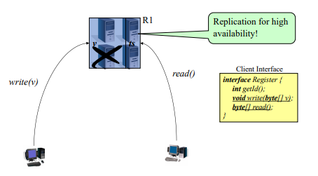
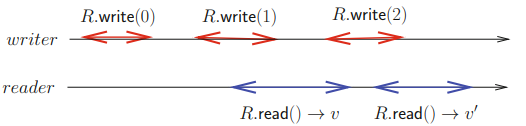
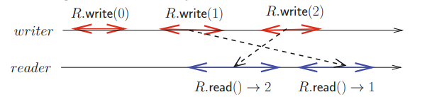
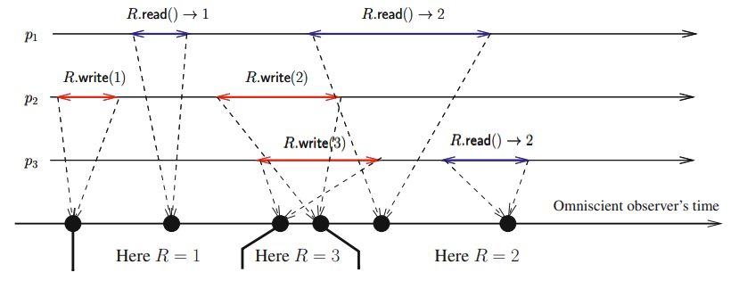
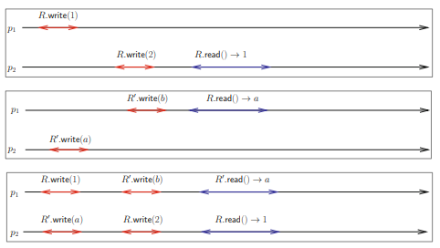

# The Read/Write Register Abstraction
- A **register** is a concurrent object (i.e., access by two or more processes) that represents some storage space on a shared memory or disk.
- A register *R* provides two operations with the following **sequential specification**:
	- *R.write(v)*, to write *v* on the register;
	- *R.read()* → v, to read the last written value *v* from the register.
- There are two types of registers:
	- The ones that cannot be defined by their sequential specification - the value returned by a read depends on the *concurrency pattern*;
	- The ones that can be defined by their sequential specification - their correct behavior is defined by all the allowed sequences of read/write operations, in accordance with some *consistency condition*.
- A **sequential specification** refers to the idea that operations (both reads and writes) should behave as if they occur in a specific order, one after the other, in some global, consistent sequence. This means every read should return the value from the latest write operation, in the order the operations occur.
##### Updatable & Sharable Storage Model

##### (Dependable) Storage Model

> Example storage services: Block device, Key-value store

### Regular Register
- A register that *cannot be defined by the register sequential specification*;
- A **regular register** is a single-writer/multi-reader (SWMR) register, meaning it can be written by a single predetermined process and read by any process (there is no write conflicts)
- The value returned by a read is defined as follows:
	- **If the read operation is not concurrent with write operations**, it returns the current value of the register (the value written by the last write)
	- **If the read operation is concurrent with write operations**, it returns the value written by one of these writes or the last value of the register before these writes.
- If a read invocation is concurrent with several write invocations, these writes are necessarily consecutive.

- The only possible values for *v* are {0, 1, 2}.
- The only possible values for *v'* are {1, 2}.
- This is called the ***new/old inversion problem***.

##### Why doesn't a regular register have a sequential specification?
- A regular register only ensures that a read operation returns either the most recent write value or any previous write value. However, this might not match a global sequential order for operations.

To totally order the read and write operations in such a way that the sequence obtained belongs to the specification of a sequential register, we need to:
- Place all the write operations and then the read operations - this is because *R.write(2)* needs to precede *R.read() → 2*
- On the other hand, as the read is sequential, it imposes a total order on its read operations (process order):
	- *R.write(0), R.write(1), R.write(2), R.read() → 2, **R.read() → 1***
- This sequence does not belong on the specification of a sequential register, since once the register reads 2 (the most recent value), it should always return 2 or any future value from subsequent writes. The fact that the register reads 1 later shows that the total order (process order) doesn't respect the sequential model.  

Despite this limitation, regular registers are still very useful:
- They can be easily built on top of message passing systems
- In the absence of concurrency, they are just like other registers - this is especially relevant when concurrency is expected to be rare
- They allow for an incremental construction of registers defined by a sequential specification, which are nothing more than regular registers without *new/old inversions*.

### Registers from Sequential Specification

#### Atomic registers
- Differently from regular registers, an **atomic register**:
	- can be a multi-writer/multi-reader (MWMR) register
	- does not allow for *new/old inversions*
- An atomic register is defined by the following properties:
	- All the read and write operations appear as if they have been executed *sequentially*.
	- The sequence of operations *S* respects the **time order** of the operations, meaning that if *op1* terminated before *op2* started, then *op1* appears before *op2* in *S*.
	- Each read returns the value written by the closest preceding write in the sequence *S*.
- The sequence of operations *S* is called a *linearization* of the register execution:
	- Concurrent operations can be ordered arbitrarily if the sequence obtained is a linearization.
	- Hence, it is possible that an execution has several linearizations, capturing the inherent non-determinism of concurrent systems.
- Intuitively, the definition of an **atomic register** states that everything must appear as if each operation has been executed instantaneously at some point on the timeline (of an omniscient external observer) between its invocation (start event) and its termination (end event).

#### Sequentially-Consistent Register
- A **sequentially-consistent register** is a *weakened form* of an **atomic register**, which satisfies the following three properties:
	- All the read and write operations appear as if they have been executed sequentially.
	- The sequence of operations *S* respects the **process order** relation (instead of time order of atomic registers), meaning that for any process *pi*, if *pi* invokes *op1* before *op2*, then *op1* must appear before *op2* in the sequence *S*.
	- Each read returns the value written by the closest preceding write in S.
- Hence, while the order of the operations in the sequence *S* must respect the time of an omniscient external observer in the definition of an atomic register, the sequence S is required to respect only the process order relation in a sequentially consistent register.

##### Why cannot be from an atomic register?

In an atomic register, it is guaranteed that once a write is observed, all subsequent reads must return that value or a newer one. In this example, once one process reads the updated value 2, no other process should be able to read an older value 1, which is what happens.

### Composability
- Let *P* be any property defined on a set of objects. *P* is **composable** if the set of objects satisfies the property *P* whenever each object taken alone satisfies *P*.
- From a theoretical point of view, composability means that we can keep *reasoning sequentially* independently of the number of atomic registers involved in the computation. Namely, we can reason on a set of registers as if they were a single atomic object.
- From a practical point of view, composability means *modularity*:
	- Each atomic register can be implemented in its own way - the implementation of one atomic register is not required to interfere with the implementation of another atomic register.
	- As soon as we have an algorithm that implements an atomic register, we can use multiple independent instances of it and the system will behave correctly without any additional control or synchronization.
- **Atomicity is composable**: this is expected since all objects are specified using real time precedence.
- **Sequential consistency is not composable**.
]
Even though the executions are individually sequentially consistent, when combined, they produce an execution that violates sequential consistency.