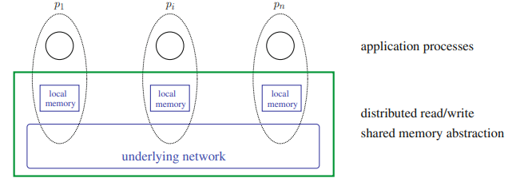
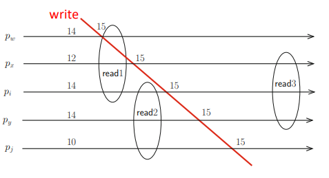

# Building Read/Write Registers Despite Asynchrony and Less than Half of Processes Crash

### Shared Memory Structural View
- The local algorithm executed by each process consists of two parts:
	- A client side composed of two local algorithms implementing the operations *REG.read()* and *REG.write()*;
	- A server side defining the processing associated with each message reception.
- It is possible to have multiple registers on the system.



### SWMR Regular Register on *CAMP(n,t)\[t < n/2]*
- A regular register enforces a safety property where the value returned by a read operation is either the last value written or a value written concurrently with the read operation.
- The algorithm for an SWMR regular register relies on the single writer associating sequence numbers with write operations and broadcasting pairs of values and sequence numbers.
- Each process saves the pair with the highest sequence number it has seen.
- Both safety and liveness properties are derived from the "majority of correct processes" assumption (t < n/2), enabling a process to communicate with at least one non-faulty process before completing a read or write.
```vhdl

% Client

operation REG.write (v) is % This code is only for the single writer pw %
(1) wsnw ← wsnw + 1;
(2) broadcast WRITE (v, wsnw);
(3) wait (ACK WRITE (wsnw) received from a majority of processes;
(4) return ()

% The code snippets that follow are for every process pi (i ∈ {1,...,n}) %

operation REG.read () is % This code is for any process pi %
(5) reqsni ← reqsni + 1;
(6) broadcast READ REQ (reqsni);
(7) wait (ACK READ REQ (reqsni, −, −) received from a majority of processes;
(8) let ACK READ REQ (reqsni, −, v) be a message received at the previous line with the greatest write sequence number;		  
(N1) ...
(N2) ...
(9) return (v)


% Server

when WRITE (val, wsn) is received from pw do
(10) if (wsn ≥ wsni) then regi ← val; wsni ← wsn end if;
(11) send ACK WRITE (wsn) to pw

when READ REQ (rsn) is received from pj do % (j ∈ {1,...,n}) %
(12) send ACK READ REQ (rsn, wsni, regi) to pj
```
> The key idea is to associate each written value with a sequence (or version) number.

##### Algorithm Execution Example


##### Why is this algorithm not atomic?

- In the above execution:
	- *read1* → *read2* → *read3*
	- *read1* returns *v15*
	- *read2* returns *v14*
	- *read3* returns *v15*
- If this algorithm was atomic, *read2* must return *v15.*
- Atomic registers cannot go back in time.
- For simplicity, we consider the writer never crashes, so all writes execute normally

### From Regular to SWMR Atomic Register
- How can we avoid the lack of atomicity? How to make *read2* return *v15*?
	- **Force a reader to write, preventing *new/old inversions* to happen**
- When *pi* obtains a pair *<v, msn>* such that *msn* is the highest sequence number from a majority of processes, it should write back this pair before returning.
- With this modification, the writer is not the only process to send write messages anymore.

```vhdl
(N1) broadcast WRITE(v, msn)
(N2) wait (ACK WRITE (msn) received from a majority of processes)
(9) return (v)
```

### Supporting Multiple Writers (MWMR)
- Multiple processes need to be able to generate sequence numbers
- Two main modifications are required:
	- One additional phase on writes for reading the current sequence number before incrementing it;
	- A way to differentiate the same sequence number from different processes.
- The second modification is important to break ties, and can be done by replacing sequence numbers by timestamps.
- A timestamp is a pair *<logical time, process identity>* such that:
	- *⟨sn1, i⟩ < ⟨sn2, j⟩ ≡ ((sn1 < sn2) ∨ (sn1 = sn2 ∧ i < j))*

##### MWMR Atomic Register on *CAMP(n,t)\[t < n/2]* Protocol


##### Illustration of the Algorithm Execution


### Sequentially Consistent Registers with MWMR
- Sequential consistency is not composable
- To make sequentially-consistent registers composable we must use a common underlying physical or logical time reference for all registers
- Two approaches for implementing this are:
	- Based on the use of total order broadcast (*CAMP(n,t)\[TO-broadcast]*)
	- Based on the use of Lamport logical clocks (*CAMP(n,t)\[t < n/2]*)
		- Logical clock: every process *pi* has a logical clock *lci*
			- Before sending a message: *lci ← lci + 1*
			- Every message *m* carries the value of the logical clock of its sender in *m.lc*
			- After the reception of the message *m* by *pi: lci ← max(lci, m.lc) + 1*
		- Using a logical clock, the protocol works similarly to the one for MWMR atomic registers, with one crucial difference: *there's no need to read the current value of the register timestamp, since we will use logical clocks instead of timestamps to order operations*.


