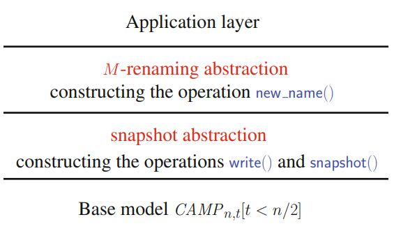
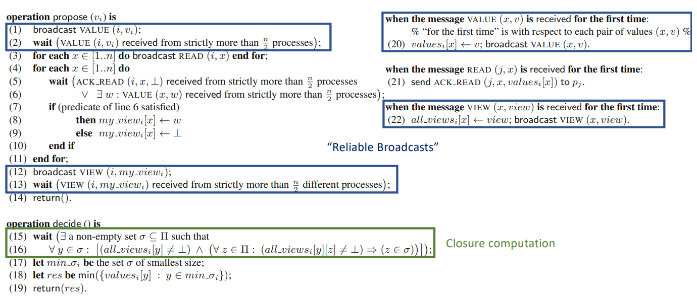

# Implementable Agreement Abstractions Despite Asynchrony and a Minority of Process Crashes
### Consensus
- Cannot be solved in asynchronous systems.
- However, there are similar problems to consensus that can:
	- **Renaming** and **Approximate Agreement** - will be solved using a shared memory emulation just like the registers implementable in *CAMP(n,t)\[t < n/2]*.
	- **Safe Agreement** - solved using message passing primitives.

### Renaming Problem
- **Agreement abstraction in which processes must decide different values**.
- Each process *pi* has an initial (permanent) name denoted *idi*. This name can be seen as a particular value that uniquely identifies it (e.g. its IP address or public key). Hence, for any process *pi* we have *idi ∈ {1, . . . , N}*, where **N is the size of the name space**.
- Moreover, N is very big compared to n:
	- Example: let n=100 processes whose names are made up of eight letters. As there are 26 letters in the alphabet, the size of the namespace is N = 26^8 (n << N).
- Renaming is an agreement abstraction that allows processes to obtain new names in a new name space whose size M is much smaller than N.
- Initially a process *pi* knows only *n* and *idi* . It does not know the initial names of the other processes.
- • It provides the processes with a single operation `new_name()`, which can be **invoked at most once** by a process and returns its new name.
- Therefore, **M-renaming** is a **one-shot problem** defined by the following properties:
	- **R-termination**: the invocation of `new_name()` by a correct process terminates.
	- **R-validity**: a new name is an integer in the interval \[1..M].
	- **R-agreement**: no two processes obtain the same new name.
	- **R-index-independence**: ∀ i, j, if a process whose index is i obtains the new name v, this process could have obtained the very same new name v if its index had been j.

#### Implementation in *CAMP(n,t)\[t < n/2]*
- **Lower bound:** M ≥ 2n – 1
- **Adaptivity:** performance dependent of p (the number of processes that are running the algorithm) instead of n (the total number of processes)
- The internal representation of the renaming state is an SWMR snapshot object denoted **STATE** - an array of SWMR atomic registers denoted STATE\[1..n]:
	- STATE\[i] can be written only by pi by invoking STATE.write(i, −)
	- STATE\[1..n] can be read atomically by pi by invoking STATE.snapshot()
- Can be implemented in *CAMP(n,t)\[t < n/2]* using a variant of causal order broadcast.



##### Snapshot-based Renaming Algorithm for CAMP(n,t)\[t < n/2]
- Each atomic register STATE\[i] is a pair made up of two fields:
	- STATE\[i].init_id: the initial name of pi
	- STATE\[i].prop: the last proposal for a new name issued by p
- Each STATE\[i] is initialized to ⟨⊥,⊥⟩.
- The idea of the algorithm is simple:
	1. First, use 1 as your proposal for name
	2. Write your proposal
	3. Check if any other process already picked this one - if not, return the value
	4. Otherwise, obtain the ordered list of names not yet assigned and use the rth name on this list, being r the rank of the process (based on its id) among the ones looking for a name. Return to step 2.
- **Why does this work?** Eventually, when all correct processes write some proposal and all faulty processes crash, processes will read the same set of ids on the snapshot and pick different ranks, thus picking different names.
##### Implementation
```vhdl
operation new name(idi) is
(1) propi ← 1;
(2) while true do
(3)     STATE.write(i,⟨idi, propi⟩);
(4)     statei ← STATE.snapshot();
(5)     if (∀ j ̸= i : statei[j].prop ̸= propi)
(6)         then return (propi)
(7)     else let set1 = {statei[j].prop | (statei[j].prop ̸= ⊥) ∧ (1 ≤ j ≤ n)};
(8)         let free = the increasing sequence 1, 2,... from which
		    	   the integers in set1 have been suppressed;
(9)         let set2 = {statei[j].init id | (statei[j].init id ̸= ⊥) ∧ (1 ≤ j ≤ n)};
(10)        let r = rank of idi in set2;
(11)        propi ← the rth integer in the increasing sequence free
(12)    end if
(13) end while
```

### Approximate Agreement Problem
- Weakened version of consensus where the processes propose real numbers and, instead of an exact agreement, obtain a controlled approximate.
	- Given an allowed disagreement defined by a positive constant ε, approximate agreement states that the decided values must be in the range of the proposed values, and no two decided values can be further apart than ε.
- The computability gap separating consensus and approximate agreement lies in the fact that, while approximate agreement cannot be solved in the system model *CAMP(n,t)\[t < n/2]*, consensus cannot.
- Considering round-based algorithm, going from approximate agreement to consensus would require an infinite number of rounds (i.e., any approximate agreement algorithm may never terminate for ε=0).
- Each process pi is assumed to propose a value vi, namely a real number belonging to some interval of integers, e.g. the interval \[x..(x + D)], where D is known by the processes, while x is not.
- The *ε-approximate agreement* abstraction provides an operation denoted *propose()*, whose invocations satisfy the following properties:
	- **AA-termination**: the invocation of *propose()* by a correct process terminates.
	- **AA-validity**: let vmin (resp., vmax) be the smallest (resp., greatest) value proposed by the processes - the value wi decided by a process pi is such that vmin ≤ wi ≤ vmax.
	- **AA-agreement**: for any pair of processes pi and pj, if pi decides wi and pj decides wj, we have |wi − wj| ≤ ε.
- Example: one might want values to diverge by at most 1%. In this case, the ratio D/ε would be 100, and log2(⌈D/ε⌉) = 7.

##### Snapshot-based Approximate Agreement Algorithm for CAMP(n,t)\[t < n/2]
- The processes execute R = 1 + log2(⌈D/ε⌉) asynchronous rounds.
- In each round r, processes communicate through a snapshot object SNAP\[r]
	- For any r, SNAP\[r] is initialized to \[⊥,...,⊥] and is accessed by pi only when it executes r.
	- SNAP\[r]\[i], r ≥ 1, stores the estimate computed by pi during the round r−1.
- The successive computation of new estimates on each round aims to decrease the distance between processes estimates.
- **Why does this work?** By running r=1+log2(⌈D/ε⌉) rounds we are guaranteed to reach vmaxR - vminR ≤ ε.

##### Implementation
```vhdl
operation propose(vi) is
(1) esti ← vi; ri ← 0; let R =1+ log2(⌈ Dϵ ⌉);
(2) repeat until (ri = R) do
(3)     ri ← ri + 1;
(4)     SNAP[ri].write(i, esti);
(5)     memi ← SNAP[ri].snapshot();
(6)     vali ← set of estimate values contained in memi;
(7)     esti ← min(vali) + max(vali)/2;
(8) end repeat;
(9) return(esti)
```

### Safe Agreement Problem
- Provides each process pi the operations *propose()* and *decide()*, which pi can invoke at most once and in that order.
	- *propose()* allows pi to propose a value, while *decide()* allows it to decide a value.
- This abstraction is defined by the following properties:
	- **SG-validity**: a decided value is a proposed value.
	- **SG-agreement**: no two processes decide distinct values.
	- **SG-propose-termination**: an invocation of *propose()* by a correct process terminates. 
	- **SG-decide-termination**: if no process crashes while executing *propose()*, any invocation of *decide()* by a correct process terminates.
- This consensus variant has a failure-dependent termination condition (SG-decide-termination) that makes it solvable in asynchronous systems where processes may crash, which is not the case for consensus.

##### Algorithm for CAMP(n,t)\[t < n/2]
- The *propose()* objective is to fill three local data structures:
	- *values(i)\[x]* contains, as known by pi, the value proposed by px.
	- *my_view(i)\[x]* contains, as known by pi, the value proposed by px and witnessed by the majority of processes (it knows at least one correct process saw this proposal).
	- *all_views(i)\[x]* contains pi's knowledge about what px registered in my_view(x).
- If *all_views(i)\[x]\[y]* = v ≠ ⊥, pi knows that px registered that a majority knows that py proposed v.
- The operation *decide()* is a "closure" computation: a process pi waits until it knows a non-empty set of processes σ such that:
	- It knows views of every processes in σ;
	- σ is closed, i.e., the processes whose values appear in a view of a process of σ are also in σ.
- When σ is discovered (something that might never happen in case of failures), pi deterministically decides a value proposed by one of the processes in σ.

##### Implementation


### Summary
- **Consensus:** the canonical form of agreement - cannot be solved in purely asynchronous systems.
- However, many weaker agreement problems can:
	- **Renaming:** it is possible to make processes decide different values.
	- **Approximate agreement:** it is possible to make processes decide numeric values within a bounded difference.
	- **Safe agreement:** it is possible to make processes decide only when there are no crashes during certain critical steps of the protocol.