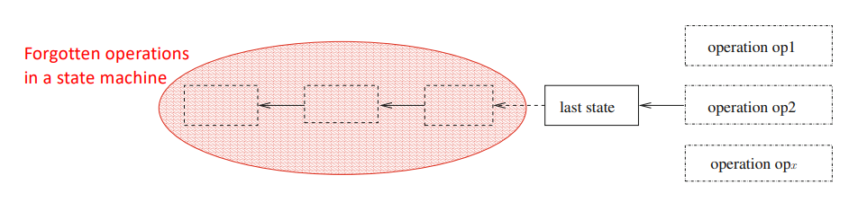

# Consensus: Power and Implementability Limit in Crash-Prone Asynchronous Systems
- **Objective:** Understand the relationship between several fundamental agreement abstractions: **Total Order Broadcast**, **State Machine Replication** and **Ledger Objects**.

### Total Order Broadcast
- TO-broadcast() and TO-deliver() are the two operations associated with Total Order (TO) broadcast.
- TO-broadcast = URB + TO-delivery.
- **Multi-shot** communication abstraction.
- URB can be extended to both FIFO-broadcast and to CO-broadcast.
- Similarly, it is also possible to extend TO-broadcast, so that, in addition to the fact that the messages must be delivered in the same order, this order respects the **local FIFO** order for each sender process or the global **Causal Order (CO)**.
- Delivering messages according to causal order is possible in CAMP(n,t) because the causal past of each message can be attached to it.
- However, this is not sufficient for delivering messages in the same order in all processes.
	- Ordering the delivery of messages whose broadcasts are **unrelated** requires synchronization that **cannot be implemented in presence of asynchrony and failures** - as admitted in the CAMP(n,t) model.
- For this, we consider CAMP(n,t)\[CONS]: CAMP(n,t) enriched with the **consensus abstraction**.

### From Consensus to TO-broadcast with CAMP(n,t)\[CONS]
- Each process pi manages three local variables:
	- *urb_deliveredi* is a set (initially empty) containing the messages that have been urb-delivered from the lower layer.
	- *to_deliverablei* is a FIFO queue (initially empty), which contains the sequence of messages that have been ordered the same way at all the processes.
	- *sni* is a sequence number (initialized to 0) used to address the consensus instances.

```vhdl
init: sni ← 0; to_deliverablei ← ϵ; urb_deliveredi ← ∅

operation TO broadcast (m) is URB broadcast MSG(m)

when MSG(m) is urb-delivered do
(1) urb_deliveredi ← urb_deliveredi ∪ {m}

when (to_deliverablei contains messages not yet to-delivered) do
(2) let m be the first message ∈ to_deliverablei not yet to-delivered;
(3) TO_deliver(m)

background task T is
(4) repeat forever
(5)     wait (urb_deliveredi \ to_deliverablei) ̸= ∅;
(6)     let seqi = (urb_deliveredi \ to_deliverablei);
(7)     order the messages in seqi;
(8)     sni ← sni + 1;
(9)     resi ← CS[sni].propose(seqi);
(10)    to_deliverablei ← to_deliverablei ⊕ resi
(11) end repeat
```
- **The core of the algorithm is the background task**.
- This task is an endless asynchronous distributed iteration, and each iteration determines a sequence of messages that each process will append at the tail of its local queue *to_deliverablei* - according to the successive iterations and the fact taht each iteration defines the same sequence of messages to add to the queue, all the processes will be able to TO-delivery the messages in the same order.
- A consensus instance is associated with each loop iteration in order for the processes to add the same sequence of messages to their variables *to_deliverablei*.
- **Main idea:**
	- A process *pi* first waits for messages that have been urb-delivered but not yet added to the sequence *to_deliverablei*.
	- Then, *pi* orders these messages in *seqi* and proposes it to the next consensus instance, namely *CS\[sni]*.
	- The way messages are ordered in *seqi* may be arbitrary, the important here is that *seqi* is a sequence.
	- Finally, the result of *CS\[sni].propose(seqi)* is stored in the variable *resi*, which now holds the sequence of messages decided by the current consensus instance.
	- The sequence *resi* (proposed by some process) is the sequence of messages that **all processes agreed upon during their *sn*-th iteration**, and each process appends it to its variable *to_deliverable*.
- The loop is asynchronous, and some *seqi* proposed by *pi* may contain few messages, while other may contain many messages. Moreover, several consensus instances can be concurrent, but distinct consensus instances are totally independent.
- **Correctness:**
	- Most of the TO-broadcast properties are trivially satisfied using URB and the code in lines 2-3.
	- TO-delivery is ensured by using decisions of consensus instances in the same order on all processes and delivering messages in deterministic order.
- **Improvements:**
	- Propose message ids of the form <m.sender, m.seq_nb> instead of the messages on the consensus instances.
	- Limit the number of consensus running in parallel.
	- In the algorithm, urb_deliveredi and to_deliverablei are never cleaned. In practice, a garbage collection mechanism should be added.

### From TO-broadcast to Consensus
- Let CAMP(n,t)\[TO-broadcast] denote the system model CAMP(n,t) enriched with the TO-broadcast abstraction.
- Consensus algorithm for CAMP(n,t)\[TO-broadcast]:

```vhdl
operation CS.propose (vi) is
(1) TO broadcast (vi);
(2) wait (the first value v that is TO-delivered);
(3) return (v)
```

- This means that one can be implemented with the other, proving that **consensus and TO-broadcast are equivalent** in CAMP(n,t).

### The State Machine Approach
- Practical systems **provide clients with services**. A *service* is usually defined by a set of commands that each client can invoke.
	- It is assumed that a client invokes one command at a time (sequential).
	- The state of the service is encoded in internal variables that are hidden from clients. 
	- From the client's point of view, the service is defined by its interface (commands to be invoked).
	- A command (request) may cause a modification of the service's state. It may also produce outputs that are sent back to the invoking client.
	- It is assumed that outputs are completely determined by the initial state and the sequence of commands that have already been processed (**deterministic service**).
- To tolerate faults, a natural idea is **replicating the service on distinct machines**.
- The *state machine replication* technique is a methodology for making a service fault tolerant. The state of the service is replicated on several machines that can communicate with one another through the network.
- Ideally, the replication must be transparent to the clients: everything must appear as if the service was implemented in a single server - *one-copy equivalence* consistency condition. To attain this, machines must coordinate themselves:
	- It must be ensured that all machines execute the same commands in the same order.
	- This way, the copies of the service state will not diverge despite crashes.
- Once each command issued by a client is encapsulated in a message, ensuring *one-copy equivalence* consistency boils down to implementing TO-broadcast among the machines.
	- According to the type of service, it is possible to partially weaken the total order requirement, e.g., when commands are commutative or don’t modify the state.
- From a client's point of view, a service defined by a sequential state machine is nothing more than a sequential abstraction (or an **object**).

### Sequential Specification (of Objects)
- The object that we want to make fault tolerant is defined by an initial state s0, a finite set of m operations and a **sequential specification**.
- An operation has the form *opx(paramx) → resultx*, with 1 ≤ x ≤ m;
	- *paramx* is the list (possibly empty) of the input parameters of *opx*,
	- *resultx* denotes the result it returns to the invoking process.
- The object sequential specification can be defined by associating a pre-assertion and a post-assertion with each operation *opx*.
- Let *opx* be executed in a concurrency-free context, the pre-assertion describes the state of the object before the execution of opx, while the post-assertion describes the object state after executing *opx* and its produced result returned to the invoking process.
- This way, the semantics of an operation can be described by a transition function *δ(s,opx(paramx))*, which receives a state and an operation, and returns ⟨sʹ, *resultx*⟩, the new state and the operation result.
	- δ is **deterministic** if it always return the same output with the same inputs. Otherwise, δ is **non-deterministic**.

### Consensus-based Universal Construction
- In CAMP(n,t) a *universal construction* is a distributed algorithm that, given the sequential specification of an object, builds a fault-tolerant implementation of it.
- Such a construction relies on the TO-broadcast communication abstraction and implements the state machine approach.
- Each process plays two roles:
	- On the client side, invokes operation and waits for a result to be returned.
	- On the server side, maintains a variable state that is modified by the execution of invoked operations and returns generated results.

##### Implementation
```vhdl
when the operation op (param) is locally invoked by the client do
(1) resulti ← ⊥;
(2) let msg sent = ⟨op (param), i⟩;
(3) TO broadcast (msg sent);
(4) wait (resulti ̸= ⊥);
(5) return (resulti)

background task T is
(6) repeat forever
(7)     msg rec ← TO deliver();
(8)     ⟨statei, res⟩ ← δ(statei, msg rec.op);
(9)     if (msg rec.proc = i) then resulti ← res end if
(10) end repeat
```
- If the service is non-determistic, replace line 8 by:
```vhdl
pairi ← δ(statei, msg rec.op);
sni ← sni + 1; ⟨statei, res⟩ ← CS.[sni].propose (pairi);
```
- Due to the underlying TO-broadcast abstraction, it is easy to see that:
	1. the non-faulty processes apply the same sequence of operations to their local state;
	2. any faulty process applies a prefix of this sequence to its local copy;
	3. this sequence includes all the operations issued by the non-faulty processes and the operations issued by each faulty process until it crashes.

### Ledger Object
- List (or chain) of records (blocks).
- It provides processes with two operations:
	- The invocation of *read()* returns a copy of the current state of the list;
	- The invocation of *append(v)* by a process pi creates a new record which is appended to the list.
- These records can contain several fields, including the identity of the invoking process and the input parameter *v* of the append operations.
- An **atomic ledger** (in short **ledger**) is defined by the following properties:
	- **(Liveness)** If the invoking process does not crash, an invocation of *read()* or *append()* terminates.
	- **(Safety)** The operations *read()* and *append()* appear as if they have been executed sequentially (let S be the corresponding sequence), and this order is such that if the operation op1 terminated before the operation op2 started, then op1 appears before op2 in S.
	- **(Safety)** The value returned by an invocation of *read()* is the sequence of records starting from the first record until the last record appended to the ledger before the invocation of this read operation.
- Simply put, a ledger is a list of ordered “things” that can never be modified or erased - **append only**.

##### Ledger vs Blockchains
- The blockchain term was initially introduced as the technology that underlies the Bitcoin cryptocurrency ledger.
- It is now used to denote a specific ledger, an agreement algorithm, or a set of tools capturing trust-based agreement in a peer-to-peer system.
- Records in blockchains are usually named blocks. Depending on the application, a block can contain monetary transactions (cryptocurrencies), smart contracts, medical visits, notarized deeds, etc.
- In most blockchains, the block sequence must be “protected” by cryptographic techniques, and the pointer of a record bx to the previous one bx−1 must include a hash of bx−1.

##### Ledger vs Read/Write Registers
- While the previous definition looks like the definition of an atomic read/write register (where append() is “similar” to write()), a ledger and a read/write register are very different objects.
- A read/write register allows a value v to be overwritten before being read by a process; when this occurs, it is as if v had never been written in the register.
- This is not possible with objects such as a ledger, in which no value can be “lost”.

##### Ledger vs State Machine
- The main difference between a ledger and a state machine is the possibility for any process to verify that something occurred or not.
- This is because a ledger saves everything: its past is immutable and can be entirely read by any process.
- A state machine records only the last state of the object, i.e., the state resulted from the execution of a sequence of operations - the operations themselves are forgotten.



##### The Computability Power of a Ledger
- Let *CAMP(n,t)\[LEDGER]* be the *CAMP(n,t)* model enriched with a ledger object.
- The following algorithm implements consensus for any number of processes in this model:

```vhdl
operation CS.propose (vi) is
(1) L.append (vi);
(2) while L.read() = ϵ do skip end while;
(3) let v ← first value of L.read();
(4) return (v)
```

##### Implementation
```vhdl
when the operation append (v) is locally invoked by the client do
(1) resulti ← ⊥;
(2) let msg sent = ⟨append, v, i⟩;
(3) TO broadcast OP(msg sent);
(4) wait (resulti ̸= ⊥);
(5) return ()

when the operation read () is locally invoked by the client do
(6) resulti ← ⊥;
(7) let msg sent = ⟨read, i⟩;
(8) TO broadcast OP(msg sent);
(9) wait (resulti ̸= ⊥);
(10) return (resulti)

background task T is
(11) repeat forever
(12)     msg rec ← TO deliver();
(13)     case msg rec = ⟨read, j⟩ then if (j = i) then resulti ← ledgeri end if
(14)         msg rec = ⟨append, v, j⟩ then record ← record including ⟨v, j⟩;
(15)         ledgeri ← ledgeri ⊕ record;
(16)         if (j = i) then resulti ← ⊤ end if
(17)     end case
(18) end repeat
```

### Summary
- The distributed computing models *CAMP(n,t)\[CONS]*, *CAMP(n,t)\[TO-broadcast]* and *CAMP(n,t)\[LEDGER]* are equivalent, i.e., they have the same computability power.
- These models are enough for implementing the state machine replication approach, or, more formally, a universal construction.

