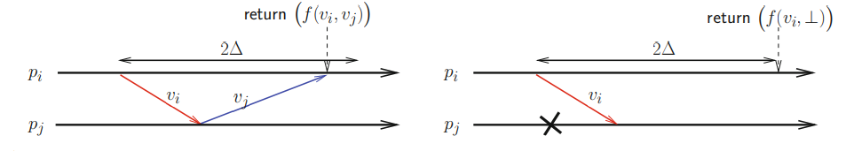
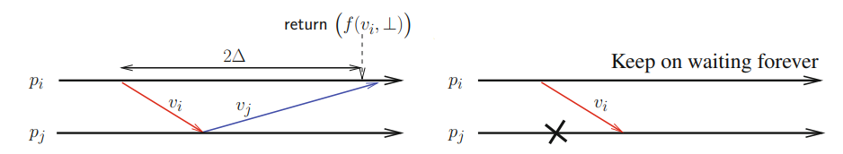
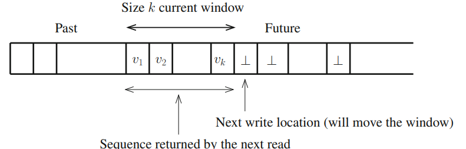
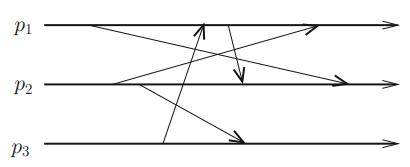
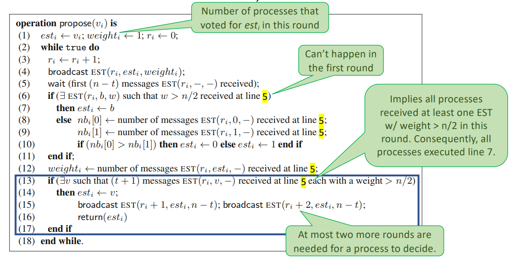

# Implementing Consensus in Enriched CrashProne Asynchronous Systems
- Consensus is ***impossible*** in purely asynchronous systems with failures.
- How do we deal with this impossibility?
	- Make the consensus problem weaker
	- Add assumptions to *CAMP(n,t)*
- We present algorithms for asynchronous randomized consensus.

### Consensus Impossibility
- Solving consensus in asynchronous systems subject to failures is ***impossible***.
- This result is a consequence of the **uncertainty** created by the net effect of **asynchrony** and **failures**, which makes it impossible to distinguish:
	- a **crashed process** from
	- a **slow process** or
	- a **process with slow communication**
- How to we enrich the asynchronous system model?
	- Assumption on **message deliveries** - Message Scheduling
	- Assumption about **failures** - Failure Detectors
	- **Randomization** - Local Coin (LC) or Common Coin (CC)

### Synchrony Rules Out Failure Uncertainty
- Consider a problem where two processes *pi* and *pj* have input values used to compute a function *f* as follows:
	- If no process crashes, the result is *f(vi, vj)*.
	- If *pj (resp, pi)* crashes, the result is *f(vi, vj)* or *f(vi, ⊥) (resp, f(⊥, vj ))*.
- **Synchronous solution:** each process sends its value and waits for the value of the other. To not wait forever by a crashed process, each process sets a timer to 2Δ when it sends its value. If the timer expires, the input of the process is set to ⊥.
	1. In failure-free executions, *pi* receives the value of *pj* and vice-versa, returning *f(vi, vj)*.
	2. If *pj* crashes before sending its value, *pi* returns *f(vi ,⊥)* when the timer expires.
- **The uncertainty on the state of *pj* is controlled by the timeout value**.



### Asynchrony Cannot Rule Out Uncertainty
- A process can use a local clock and an “estimate” of the round-trip delay, but asynchronous systems give no guarantee this estimate is an upper bound on such delay during an execution.
	1. If the estimate is incorrect, *pi* returns *f(vi ,⊥)* when the timer expires, while it should wait a bit more and return *f(vi ,vj)* - **violates safety** (incorrect result).
	2. If pi does not use a timer and pj crash before sending its value, it will wait forever, **violating liveness** (no result is ever returned)
- This shows that it is **impossible** to always guarantee both **safety** and **liveness** in fail-prone asynchronous systems.



- This is known as the **FLP impossibility**.
- It means consensus can be implemented in *CSMP(n,t)* but cannot in *CAMP(n,t)*.
- Such impossibility comes from the net effect of process crashes and asynchrony:
	- How to differentiate slow from failed processes?
	- Due to this, for any given algorithm, it is possible to find an execution that can run forever (breaking termination) or in which different correct processes decide different values (breaking agreement).

### Consensus Number (CN)
- The **consensus number** of a concurrent object (abstraction) type T, denoted CN(T), is the **positive integer x such that consensus can be implemented from any number of read/write registers**, and any number of objects of type T, in an asynchronous system of x processes, but not x+1 processes. If there is no largest x, the consensus number is said to be infinite.
	- The consensus number of **read/write registers** is 1.
	- The consensus number of a **ledger** is infinite.
	- The consensus number of objects such as a **stack** and a **queue** is 2.
		- A queue or a stack cannot be implemented in *CAMP(n,t)\[t < n/2]*.
		- If it was possible, we would be able to solve consensus for two processes from read/write registers only, which is impossible as the consensus number of read/write registers 1.
- It follows from the consensus number definition that any abstraction (object) whose **consensus number is greater than 1 cannot be implemented in *CAMP(n,t)\[t < n/2]****.

##### Example: Atomic k-sliding Window Register
- Let RWk be an object such that it can be seen as a sequence of values, accessed by two atomic operations, write and read.
- The safety and termination properties of a k-sliding window register are the same as the ones from the atomic register, except (on the safety side) for the value returned by the read operation.
	- *RWk.write(v)* adds the value *v* at the end of the sequence RWk.
	- RWk.read() returns the ordered sequence of the last *k* written values.
		- if only l ≤ k−1, values have been written, a sequence of size l is returned.



- The **consensus number** of the k-sliding window register is k.
- If an object (abstraction) can implement RWk such that k > 1, its consensus number is at least k, and due to the FLP impossibility, it cannot be implemented in *CAMP(n,t)\[t < n/2]*.

```vhdl
operation propose(vi) is
(1) RWk.write(vi)
(2) seqi ← RWk.read();
(3) let d be the last k non-⊥ values written in seqi;
(4) return(d)
end operation
```

### Summary
- This impossibility result shows that the nature of computability in distributed computing is different from that encountered in sequential computing.
- In both cases there are many problems which are not computable, but, in asynchronous crash-prone distributed computing, the limits to computability reflect the difficulty of making decisions in the face of the uncertainty created by the environment (mainly asynchrony and failures).
- The following table summarizes fundamental results of distributed computability in read/write and message-passing asynchronous crash-prone systems:

| Communication type     | Read/write register | Consensus               |
| ---------------------- | ------------------- | ----------------------- |
| Read/write system      | given for free      | impossible with crashes |
| Message-passing system | requires t < n/2    | impossible with crashes |

# Asynchronous Consensus Protocols
### Message Scheduling Assumption
- Most asynchronous protocols run in **asynchronous rounds**:
	- On each round, each process broadcasts a message
	- Waits for n – t messages
	- Executes some local computation.
- **Message Scheduling (MS) assumption**: there is a round r during which all the processes receive their first n-t round-r messages from the same set of correct processes.
- Independently of the schedule:
	- If t processes crash initially, the n-t remaining processes define a reliable system, and the previous MS assumption is satisfied in all rounds.
	- If eventually t processes crash, MS is eventually satisfied.
- The MS assumption can be weakened as follows:
	- **Fair MS assumption (FMS)**: at any round r, there is a constant probability ρ > 0 that all non-crashed processes receive their first n-t round-r messages from the same set of n-t correct processes.



##### Binary Consensus in *CAMP(n,t)\[t < n/2,MS]*


- The operation *broadcast()* used at line 4 and line 15 is a "best-effort broadcast" - it is not a reliable broadcast, but a simple "for all processes send this"
- After it has initialized the variables (line 1), a process *pi* executes an asynchronous sequence of rounds, synchronized by the reception of *n-t* messages at every round.
- During a round, *pi* first broadcasts the message *EST(ri, esti, weighti)*, which carries its current local state (line 4) and waits until it has received a message *EST(ri,-,-)* from *n-t* processes (line 5).
- Then, according to the values it has received during the current round, *pi* updates its local state (lines 6-14).
	- If there is a value *b* whose weight is a majority, *pi* adopts it as its new estimate (lines 6-7).
	- Otherwise, *pi* adopts the value it has received most often as its new estimate (lines 8-10).
- Then, *pi* computes the weight of *esti*, namely the number of processes that voted *esti* (line 12).
- Finally, if there is an estimate value *v* that has been selected by at least *x+1* processes, each with a (possible different) majority weight, *pi* adopts and decides it (line 14 and 16).
- Moreover, as it will stop executing after having decided, before deciding *pi* broadcasts the messages *EST(ri + 1, esti, n − t)* and *EST(ri + 2, esti, n − t)* in order to prevent a possible deadlock - a process waiting for a message from a correct process that has already decidied, when up to *t* processes crash.

### Enriching CAMP(n,t)\[t < n/2] with Randomization
- In a randomized computation model, in addition to deterministic statements, processes can make random choices at certain steps.
- In our context, this means that *CAMP(n,t)* is enriched with a **random oracle**:
	- **Local coin - CAMP(n,t)\[LC]:** each process has access to a local random number generator - such *local coins* (LC) provide an operation *random()* that returns either 0 or 1, each with a probability of 0.5.
	- **Common coin - CAMP(n,t)\[CC]:** processes have access to a *common coin* (CC) oracle, which can be seen as a global entity that delivers the same sequence of random bits b1, b2, ... to the processes, each bit having the value 0 or 1 with probability of 0.5.
		- *random()* returns a random bit each time it is called by a process, satisfying the following global property: the same random bit is returned to any process as the result of its r-th invocation of random() whatever the time of this invocation.
		- A common coin can be realized by starting processes with the same **pseudo-random number generator algorithm** and **initial seed**.
- The *CC-termination* property states that there is a finite time after which every non-faulty process has decided.
- In a randomized system, this property can be ensured only with some probability.
- Randomized consensus is defined by the same validity and agreement properties as consensus but replacing termination by the following weaker property:
	- **RbC-termination:** with a probability of 1, every non-faulty process decides.
	- When using round-based algorithms, this can be restated as:
		- ∀i: pi ∈ Correct(F): lim r→+∞ (Probability \[pi decides by round r]) = 1.

##### Randomized Binary Consensus in *CAMP(n,t)\[t < n/2, LC]*
```vhdl
operation propose (vi) is % vi ∈ {0, 1} %
(1) est1i ← vi; ri ← 0;
(2) while (true) do
(3)     begin asynchronous round
(4)     ri ← ri + 1;

% Phase 1 : from all to all %
(5)         broadcast PHASE1 (ri, est1i);
(6)         wait() { PHASE1 (ri, −) received from (n − t) processes };
(7)         if (the same estimate v has been received from > n/2 processes)
(8)         then est2i ← v else est2i ← ⊥ end if;
(9)         % Here, we have ((est2i ̸= ⊥) ∧ (est2j ̸= ⊥)) ⇒ (est2i = est2j = v) %

% Phase 2 : try to decide a value from the est2 values %
(10)         broadcast PHASE2 (ri, est2i);
(11)         wait() { PHASE2 (ri, −) received from (n − t) processes };
(12)         let reci = {est2 | PHASE2 (ri, est2) has been received};
(13)         case (reci = {v}) then broadcast DECIDE(v); return(v)
(14)         (reci = {v, ⊥}) then est1i ← v
(15)         (reci = {⊥}) then est1i ← random()
(16)         end case
(17)     end asynchronous round
(18) end while
(19) when DECIDE(v) is received do broadcast DECIDE(v); return(v)
```

- If all the proposed values are equal, the decision is deterministic and the protocol terminates in a single round.
- **Probabilistic Termination**
	- Let p = (1/2)^n be an upper bound on the probability of est1 be the same on all n processes at the end of the round.
		- Then, for r rounds we have P(r) ≥ p + p(1 − p) + p(1 − p)^2 + ··· + p(1 − p)^(r-1) = 1 − (1 − p)\^r.
	- Therefore, lim(r→+∞)(1−(1−p)r) = 1.

- **The advantage of a common coin:** in *CAMP(n,t)\[t < n/2, CC]*, processes can use a common coin, namely, whatever processes pi and pj , the rth invocation of *random()* by pi , and the r-th invocation of the random() by pj, returns them the same random bit.
- Number of rounds to terminate:
	- **LC protocols:** require an expected **exponential** number of rounds to terminate.
	- **CC protocols:** expected to terminate in a **constant (and small)** number of rounds.
- The common coin protocol is simpler than the local coin.
- Therefore, CC > LC.

##### Randomized Binary Consensus in *CAMP(n,t)\[t < n/2, CC]*
```vhdl
operation propose (vi) is % vi ∈ {0, 1} %
(1) esti ← vi; ri ← 0;
(2) while (true) do
(3)     begin asynchronous round
(4)     ri ← ri + 1;
(5)     si ← random(); % random bit generated in each round %
(6)     broadcast EST (ri, esti);
(7)     wait (EST (ri, −) or DECIDE (−) received from (n − t) processe);
(8)     if (∃v in the messages EST (ri, −) or DECIDE (−) such that #(v) > n/2)
(9)         then esti ← v;
				% if majority is observed for v, decide if the random bit = v %
(10)            if (si = v) then broadcast DECIDE (v); return (v) end if
(11)        else esti ← si % if no majority, use random bit %
(12)    end if
(13)    end asynchronous round
(14) end while.
```

### From Binary to Multi-Valued Consensus
- To build state machine replication, we need a Total Order Broadcast, which requires a Multi-Valued Consensus (MVC).
- It also employs a Uniform Reliable Broadcast to disseminate values
- Binary Consensus (BC) instances are used to decide if a value is the decision
- MVC in CAMP(n,t)\[BC]
```vhdl
operation propose (vi) is
(1) proposalsi ← [⊥,..., ⊥]; ki ← −1;
(2) URB broadcast PROPOSAL (vi);
(3) while (true) do
(4)     ki ← ki + 1;
(5)     let bin propi = (proposalsi[ki mod n] ̸= ⊥);
(6)     resi ← BIN CONS[ki].bin propose(bin propi);
(7)     if (resi) then wait (proposalsi[ki mod n] ̸= ⊥);
(8)         return(proposalsi[ki mod n])
(9)     end if
(10) end while.
(11) when PROPOSAL(v) is URB delivered from pj do proposalsi[j] ← v
```

##### Deciding in One Communication Step
- Since failures are expected to be rare, it is always advantageous to try to optimize the protocol for failure free executions.
- One comm. step decision are possible in CAMP(n,t) **only if t < n/3.**
- CAMP(n,t)\[t < n/3, CONS]
```vhdl
operation one step propose (vi) is
(1) broadcast PROPOSAL (vi);
(2) wait (PROPOSAL (−) received from (n − t) processes);
(3) if (all these messages carry the same value, say v)
(4)     then broadcast EARLY DEC (v);
(5)         return(v)
(6)     else if ((n − 2t) messages carry the same value v) then propi ← v else propi ← vi end if;
(7)         deci ← MV CONS.propose(propi);
(8)         return(deci)
(9) end if.
(10) when EARLY DEC(v) is received do: broadcast EARLY DEC(v); return(v)
```
