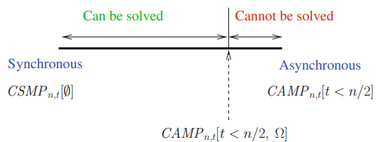

### Synchronous Consensus
- **Unfair Consensus**
	- First process always decides if it doesn't fail
	- Has t + 1 lower bound
- **Fair Consensus**
	- Uses deterministic rule (min)
- **Interactive Consistency (Vector Consensus)**
	- Processes agree on **input vector** rather than a single proposed value
	- **Stronger than consensus:** IC can implement consensus but not the contrary
- **Early Deciding IC**
	- Has min(f+2, t+1) lower bound
	- Predicate Ri^r-1 = UP^r = Ri^r, meaning **no process crashed, so decision can be made**
- NBAC (Non-Blocking Atomic Commitment)
	- Transaction/job split into multiple processes
	- All of them must agree on the same decision **(all or nothing)**: "commit" (yes) or "abort" (no)
	- Can be implemented with
		- **Trusted coordinator** that orchestrates multiple processes
		- In case coordinator fails, with a **two-phase commit**, which ensures atomicity with a prepare phase and a decision phase

### Sub-Consensus Problems
- **Consensus:** the canonical form of agreement - cannot be solved in the system model *CAMP(n,t)\[t < n/2]*
- However, many weaker agreement problems can
	- **Renaming:** allows processes to decide different values using shared memory with registers
	- **Approximate agreement:** allows processes to decide numeric values within a bounded difference ε also using shared memory with registers
	- **Safe agreement:** allows processes processes to decide only when there are no crashes during certain critical steps of the protocol (failure-dependent termination condition in the decide phase) using message passing primitives

### Consensus Equivalent Abstractions
- **Total-Order Broadcast**
	- All messages are delivered in the same order on all correct processes
	- Applies even for completely unrelated messages
	- **Equivalent to consensus**
		- **TO-Broadcast → Consensus**: using to-broadcast, a process proposes values and waits for the first TO-delivered value to achieve consensus
		- **Consensus → TO-Broadcast**: consensus instances ensure ordered agreement, enabling TO-broadcast implementation
- **State Machine**
	- Fault-tolerant approach where the service's state is replicated across machines
	- Commands are processed in the same order across replicas to maintain consistency
	- Relies on to-broadcast to synchronize state updates across replicas
- **Sequential Specification of Objects**
	- Describes an object’s behavior with its **initial state**, **operations** and **state transitions**
	- Each operation includes
		- **Pre-condition**: state before execution
		- **Post-condition**: result and state after execution
	- Operations are modeled using a **transition function**: δ(s, op(param)) → ⟨s', result⟩
- **Consensus-based Universal Construction**
	- Uses **to-broadcast** to build fault-tolerant distributed objects
	- Clients invoke operations and servers apply them sequentially and return results
	- Ensures all non-faulty processes execute the same operation sequence
- **Ledger Object**
	- **Append-only atomic data structure with immutable history** ensuring sequential consistency
	- **Comparisons**
		- vs Blockchain: blockchains are a specific type of ledger with cryptographic linking and additional features like decentralization and trust mechanisms
		- vs Read/Write Registers: ledgers prevent overwriting data and retain all values, unlike registers
		- vs State Machine: ledgers store full history, while state machines only store the latest state
- The distributed computing models *CAMP(n,t)\[CONS]*, *CAMP(n,t)\[TO-broadcast]* and *CAMP(n,t)\[LEDGER]* are equivalent → **they have the same computability power**
- These models are enough for implementing the state machine replication approach → **a universal construction**

### Asynchronous Consensus
- Solving consensus in asynchronous systems subject to failures is ***impossible***
- This result is a consequence of the **uncertainty** created by the net effect of **asynchrony** and **failures**, which makes it impossible to distinguish
	- a **crashed process** from
	- a **slow process** or
	- a **process with slow communication**
- **Do we wait or move on from a process not responding?**
	- Synchrony rules out failure uncertainty, unlike asynchrony
	- The uncertainty on the state of the slow process is controlled by a timeout value
	- With asynchrony, we either violate **safety** (incorrect result) or **liveness** (no result is ever returned) - **FLP impossibility**
	- Due to this, for any given algorithm, it is possible to find an execution that can run forever **(breaking termination)** or in which different correct processes decide different values **(breaking agreement)**
- How do we deal with this impossibility?
	- Make the consensus problem weaker
	- Add assumptions to *CAMP(n,t)*
		- Assumption on **message deliveries** - Message Scheduling
		- Assumption about **failures** - Failure Detectors
		- **Randomization** - Local Coin (LC) or Common Coin (CC)
- **Consensus Number (CN)**
	- Measure of the "power" of a type of object (like a stack, queue or read/write register) in solving the **consensus problem** in a distributed system with multiple processes
	- Indicates how many processes can reach consensus using a given type of object
	- If an object type has a consensus number of *x*, it means that:
		- You can solve consensus for *x* processes using that object and r/w registers
		- However, you cannot solve consensus for *x+1* processes
	- Examples:
		- The CN of **read/write registers** is 1
		- The CN of objects such as a **stack** and a **queue** is 2
		- The CN of the **k-sliding window register** is k (k=1 means it's just an atomic register)
		- The CN of a **ledger** is infinite
- The consensus number definition that any abstraction (object) whose **consensus number is greater than 1 cannot be implemented in *CAMP(n,t)\[t < n/2]****

| Communication type     | Read/write register | Consensus               |
| ---------------------- | ------------------- | ----------------------- |
| Read/write system      | given for free      | impossible with crashes |
| Message-passing system | requires t < n/2    | impossible with crashes |

### Asynchronous Consensus Protocols
- **Message Scheduling Assumption**
	- Assumes there is a round *r* during which **all processes** receive their first *n-t* messages from the **same set of correct processes**
		- *n−t* is the minimum number of messages required to guarantee that processes can proceed, as *t* processes may crash
	- Ensures **consistency** across processes, as they base their decisions in a round on messages received from the same set of other processes
	- In cases where *t* processes crash initially, the *n−t* remaining processes form a reliable system, satisfying the MS assumption for all subsequent rounds
	- If crashes occur gradually, the assumption may not hold immediately, but will eventually be satisfied
	- **Fair MS assumption (FMS)**
		- Weakened version of MS
		- With a constant probability *ρ>0*, all processes receive their first *n−t* messages from the same set of *n−t* correct processes, introducing a fair likelihood of the MS condition being met in any round
- **Randomization**
	- Allows processes to make random choices at certain steps
	- Introduces **random oracle**
		- **Local Coin (LC)**
			- Each process has access to its **own random number generator**
		- **Common Coin (CC)**
			- Processes have access to a global random oracle that delivers the **same random bits** to all processes
			- All processes get the same result for their *r*-th invocation, regardless of when they call *random()*
			- Can be simulated by starting processes with the same **pseudo-random number generator** and an **initial seed**
	- **Randomized consensus** ensures eventual decision with **probability of 1**
	- **LC vs CC**
		- CC ensures all process get the **same random bit**; LC does not
		- CC terminates in **constant** (and small) rounds; LC requires **exponential** rounds
		- CC is **simpler and more efficient** than LC
		- **CC > LC**
	- **Randomized Binary Consensus**
		- Uses a local coin to break symmetry and ensure consensus in *CAMP(n,t)\[t < n/2, LC]*
		- Processes adopt a **random bit** when estimates diverge (*rec = {⊥}*), resolving non-determinism and enabling progress
	- **From Binary to Multi-Valued Consensus**
		- Requires **TO-broadcast** and uses **Binary Consensus**
		- Relies on **URB** to disseminate proposals reliably
		- **Deciding in One Communication Step**
			- Optimized for failure-free scenarios
			- Only possible when *t < n/3*

### Consensus with Failure Detectors
- **P Failure Detector** (Perfect/Perpetual)
	- **Completeness:** all crashed processes are eventually suspected
	- **Strong Accuracy:** no false suspicions before crashes
	- Can easily implement consensus - makes CAMP almost as strong as a synchronous system (provides more than the minimal information required to solve consensus)
- **◇P Failure Detector** (Eventual Strong Accuracy)
	- Not a perpetual failure detector - weaker than P
	- Cannot be implemented in CAMP - requires eventual synchrony
	- Sufficient for solving consensus consensus since it allows for temporary inaccuracies (anarchy period) while still ensuring eventual completeness and accuracy
- **◇SYNC** (Eventually Synchronous System)
	- Starts asynchronous (unbounded delays) and becomes synchronous after an unknown **Global Stabilization Time (GST)**
	- Message delays are bounded by **δ** only after GST
- **Ω Failure Detector** (Eventual Leader)
	- Guarantees that after some unknown time, all processes agree on the same correct leader
	- **Weakest failure detector for solving consensus** - computability lower bound
	- Represents the minimal information about failures needed for solving consensus
	- **Perfect scenario:** if Ω works perfectly, consensus can be achieved in just 2 communication steps - satisfies zero-degradation
	- **Implementing Ω with Minimal Assumptions**
		- **Eventual timely channel:** message transit time becomes bounded by δ after some unknown time τ - values of δ and τ are unknown to processes
		- **Eventual t-source:** a non-faulty process has t output channels that are eventually timely
		- **Goal:** elect the least suspected non-faulty process as the leader in *CAMP(n,t)\[◇t-SOURCE]*

- **Indulgence:** an algorithm is indulgent if it preserves safety regardless of failure detector behavior, though termination may be compromised
- **Zero-Degradation:** a crash in one consensus round does not degrade performance of future rounds - consensus is achieved efficiently even after failures
- **Paxos**
	- Classical consensus algorithm adapted for *CAMP(n,t)\[t < n/2, Ω]*
	- **Alpha Abstraction:** provides a single operation *alpha()* to return a decision value, ensuring safety properties - validity, agreement, convergence and termination
	- **Alpha as Write-Once Register:** stores the first value written and holds it forever
	- **Paxos-Style Consensus in *CAMP(n,t)\[ALPHA, Ω]***
		- **Separation of Safety and Liveness**
			- **Alpha** ensures safety by holding the first written value - shared one-shot storage object
			- **Ω** eventually elects the leader to write the decision in Alpha
		- **Algorithm**
			- Processes iterate asynchronously until a leader (via Ω) writes a decision to Alpha
			- Leader writes decision - non-leaders adopt it
			- Consensus achieved through minimal coordination
- **Conclusion**
	- Consensus can be solved in CAMP with additional assumptions
		- **Message Scheduling (MS)**
		- **Randomization with LC and CC**
		- **Failure Detector P or ◇P** (on top of underlying synchronized system)
		- **Eventual Leader Abstraction Ω** (on top of eventually synchronized system)