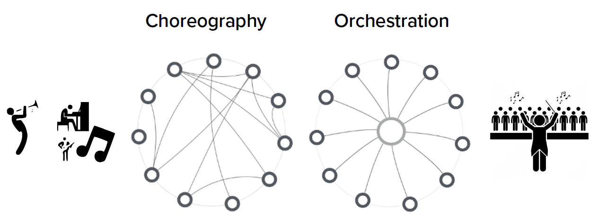

# Backend Architecture
### Architecture-Driven Development
#### Architecture-First
- Technological foundation
- Features that can be used by multiple apps
- Non-user facing
- Structure + behavior + data

#### Principal Design Decisions
- Scaffolding for multiple use cases, services and apps
- Lifecycle view (design, develop, deploy, change)
- Resilience to change

#### Desirable Properties
- Reusability, extensibility, evolvability, scalability
- Changeability, agility, flexibility, resilience
- Projectability
- Soundness, elegance

#### Major Architectural Decisions:
- Structural and functional decomposition
	- Architectural components
	- Interfaces (APIs)
- Control logic
- Data flows
- Event flows
- Application seen as an **ecosystem**, with things that function together
- Major **building blocks**: architectural components and how they behave, interact and are reused
- Define an **architectural style**: how the ecosystem works, how it is kept stable and how it changes

### Architectural Styles
#### Data Centered Architecture
- Single source of truth
- Transactional model
- CRUD operations
- Conceptually simple but limited in practice

#### Client-Server Architecture
- Resource oriented
- Request-response model
- Distributed/centralized
- Simple, loose, difficult to scale up

#### Object-Oriented Architecture
- Objects encapsulate data and functions
- Composition and reusability
- Massive choreography
- Decentralized
- Monolithic
- Complex, low-level
- Overly complex on a large scale

#### Component Architecture
- Defined at higher-leel than object-oriented
- Composition/decomposition
- Separation of concerns
- Dependency complexity
- Coupled
- Controlled
- Incremental development

#### Layered Architecture
- Well-defined responsibilities
- Traditional enterprise systems
- Performance issues
- **2-tier**
	- Client-server
- **3-tier**
	- Top: users
	- Middle: business logic
	- Bottom: data management
- **N-tier**
	- More flexible

#### Event Driven Architecture
- Publish-subscribe model
- Decouples notion of client and server to consumer and producer
- Decentralized, serverless
- No dependencies
- Choreography, loose control
- Multiple consumers can listen to the same event (broadcasting)
- Easy to scale and change

#### Process Driven Architecture
- Variation of event driven
- Serverless or not
- Business oriented
- Coordination
- Automation
- Highly managed
- Easy to change models

#### Message Driven Architecture
- Request/response model
- Common message bus
- Standardized messages
- Service-to-service
- Flexible
- Easy to scale and change

#### Service Oriented Architecture (SOA)
- Variation of message bus
- Competition: services request other services, multiple may respond
- Services portal/catalog/broker
- Orchestration
- Loosely coupled
- Scalability, flexibility, agility, resilience

#### Microservices Architecture
- Collection of small, autonomous, loosely-coupled services
- Each service is self-contained
- Cloud native, global, API driven
- Increased frequency of communication (performance overhead)
- Elastic: pay-per-use
- Dynamic, flexible
- No need to share technology

### Web Architectures
#### Static web architecture
- Client-server
- Static
- Stateless

#### Dynamic web architecture
- Client-server
- Dynamic
- Stateless or stateful with session cookies

#### Enterprise beans (3-tiered)
- Client, web server, application server
- Dynamic
- Stateful/stateless beans 

#### Web service architecture (SOA)
- Remote procedure call (RPC), SOAP, XML

#### Microservices architecture
- Stateless
- Small, single capabilities
- Light requests

# Backend Services
### Service
- Consumer-provider model
- Unit of work done by the provider
- Intended to achieve a defined result
- Self contained
- The provider is a black box to the consumer

### Service Principles
#### Contract
- Respected by provider and consumer
- Service description
	- Specifies what the service does
	- WSDL - Web Service Description Language

#### Service Directory
- Mediator between provider and consumer
- Defines how to find a service
- UDDI - Universal Discovery, Description and Integration

#### Interface Description (API)
- Request/response messages
- Input/output data

#### App Abstraction
- App as a collection of services
- App as a composition of services
- Services as standalone apps
- Services as (partial) apps

#### Enterprise Service Bus
- Rules and principles for integrating services
- Pluggable services
- Transport protocol (e.g. HTTP)

#### Loose Coupling
- Between consumers and providers
- Multiple consumers and multiple providers
- App changes should impact as few services as possible
- Service changes should impact as few apps as possible
- Technology changes should impact as few services as possible

#### Reusability
- Some services have more capability to serve multiple needs than others
- A service that suits multiple needs is more useful than a service that suits a single need
- Reusability involves analyzing from the top down

#### Composability
- Some services require other services to be implemented
- Some complex apps require the divide-and-conquer strategy to tame complexity
- Composability involves analyzing the app from the bottom up

#### Operation Structure
- Independence and autonomy (for consumers and providers)
- Flexibility (for consumers and providers)
- Extensibility (plug-in)
- Interoperability (variety of consumers and providers)
- Change management (service evolution)
- Managing complexity through information hiding
- Integration of smart items

### API Gateways
- For managing subnets
	- Services placed inside private networks for security (demilitarized zones)
	- Single entry point
	- Proxied requests
- Manage authentication, logging and caching
- Elastic management, rate-limiting

#### Types of API Gateways
- **Direct client-to-service (no gateway)**
	- Public endpoints
	- Can be complicated to scale up
- **General purpose**
	- Reduces coupling
	- Can scale up services
	- Forces generic functionality over the frontend
	- May result in monolithic architecture
- **Backend for frontend (BFF)**
	- Supports the needs of different frontends
	- Backend partially coupled to frontend
	- Tailored APIs
- **Gateway aggregation/transformation**
	- Consolidate services
	- Help manage changes
	- Compromise between loose and tight coupling

### Orchestration vs Choreography
#### Choreography
- **Events, listeners**
- No current state
- Faster
- No hard dependencies
- More flexible and scalable
#### Orchestration
- **Centralized control**
- Single point of control
- Less flexible and scalable

|                 | **Orchestration**    | **Choreography**      |
| --------------- | -------------------- | --------------------- |
| **Control**     | Easier to control    | Difficult to control  |
| **Change**      | Difficult to change  | Easier to change      |
| **Flexibility** | Less flexible        | More flexible         |
| **Complexity**  | Worst at large scale | Better at large scale |
