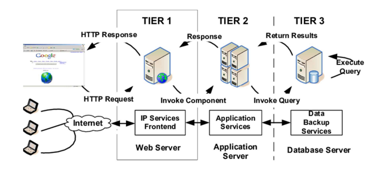

# Cloud Overview
### Cloud
- Diverse IT environment that is intended for the purpose of remotely **provisioning scalable and estimated/measured IT resources**
- Gives remote access to numerous decentralized IT resources that can be bounded
- IT resources can be **compute**, **storage**, **network**, **database** or other services
- **Delivery of on-demand** computing services/IT resources over the internet rather than on premises which are **metered or pay-per-use**
- Examples of cloud providers: Amazon, Microsoft, Google, Oracle, IBM, etc.

### Key Characteristics
- Broad network access
- Rapid elasticity
- Measuring services/pay as you go
- On-demand self-services
- Resource pooling
- Multitenancy

# Web APIs
## Web Services
- A **web service** is a standardized medium to **propagate communication between the client and server applications** on the world wide web
- Software modules which are designed to perform a certain set of tasks

### Interservice Communication
- **Request/response** - synchronous communication
	- Examples: HTTP, gRPC, GraphQL
- **WebSockets** - real-time communication
	- Examples: ws, wss, Socket.io
- **Event-driven messaging** - asynchronous communication
	- Examples: Kafka, NATS, RabbitMQ, MQTT

### Server Architecture
- A typical 3 Tier server architecture:

### Advantages of Web Services
- Exposing business functionality
- Interoperability
- Standardized protocol
- Reduction in cost of communication
- ...

## REST
- Captures characteristics of the web:
	- URI-addressable resources
	- Stateless HTTP
	- Request → Response → Display Response
- Data representation
	- JSON
	- XML
- **Advantages:**
	- Easy to scale
	- Easy to integrate
	- Performance (cached requests)
- **Disadvantages:**
	- Many constraints ignored by organizations
	- Need multiple requests to fetch data for a view
	- No uniform style for documentation
	- API versioning and field deprecation
### OpenAPI
- The OpenAPI specification, also known as Swagger, is an open-source format for describing and documenting APIs
- Can be written in JSON or YAML
- Tools can generate clients and servers (stubs) from OpenAPI specification
- **Advantages:**
	- Specification includes all operations, parameters and responses
	- Maintains the API contracts between teams
	- Specification is always in-sync with implementation
	- No temporary changes to the implementation
- **Disadvantages:**
	- Stubs may not be compatible with programming frameworks

### gRPC
- Open-source Remote Procedure Call framework from Google
- Performance benefits:
	- HTTP/2 or HTTP/3 transport protocol - allows multiple requests in parallel on a long-lived connection in a thread-safe way
	- Binary encodings via protocol buffers - extensible mechanism for serializing structured data
	- Avoids text parsing
	- Compression
	- Streaming