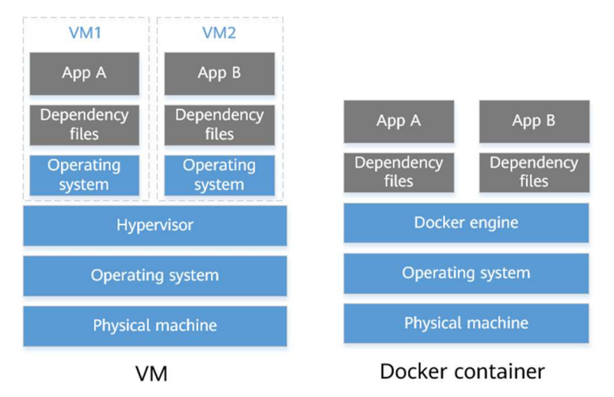
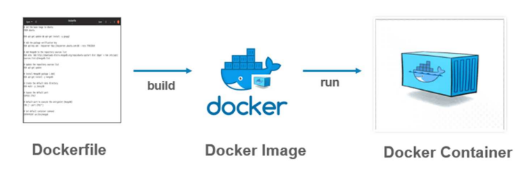
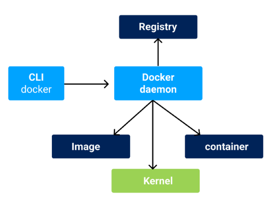
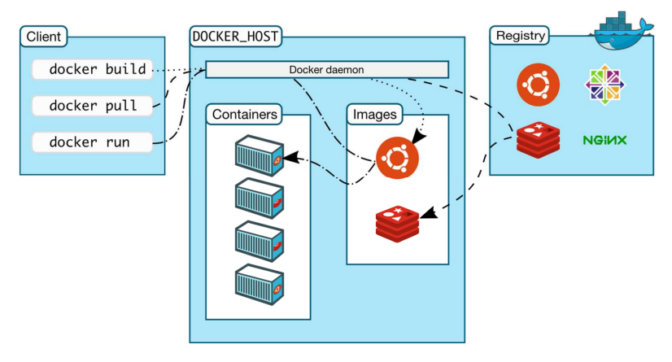
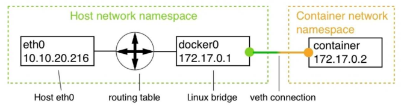
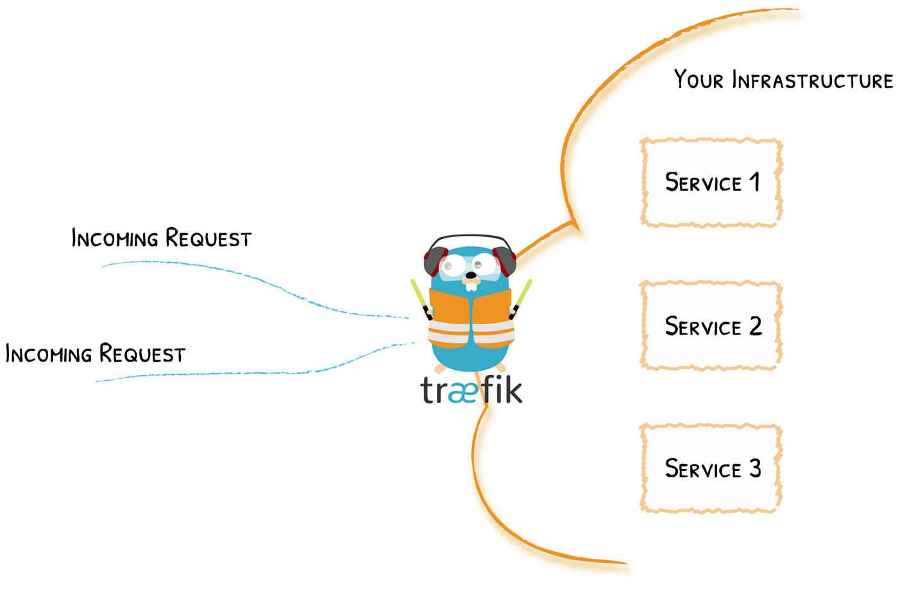

# Containers
- **Executable unit of software in which application code is packaged, along with its libraries and dependencies** so that it can be executed **anywhere**
- To do so, they take advantage of a form of **operating system virtualization** in which features of the OS are leveraged to both **isolate processes and control the amount of CPU, memory and disk** that those processes have access to
- Containers are **small**, **fast** and **portable** because unlike a virtual machine, they don't need to include a guest OS and can instead simply leverage the features and resources of the host OS
- Instead of virtualizing the underlying hardware like traditional VMs, **containers virtualize the operating system** (typically Linux) so each individual container **contains only the application and its libraries and dependencies**

### Advantages
- **Lightweight:** containers share the machine OS kernel, eliminating the need for a full OS instance per application and making container files small and easy on resources. Their smaller size allows them to **spin up quickly** and **better support cloud-native applications that scale horizontally**
- **Portable and platform independent:** containers carry all their dependencies with them, meaning that software can be written once and then run without needing to be re-configured across laptops, cloud and on-premises computing environments
- **Supports modern development and architecture:** DevOps, serverless, microservices, ...
- **Improves utilization:** CPU and memory

### Use Cases
- Cloud
- Microservices
- DevOps
- Hybrid, multi-cloud
- Application modernizing and migration

### Containerization
- Process where software needs to be designed and packaged differently in order to take advantage of containers
- When containerizing an application, the process includes packaging an application with its relevant environment variables, configuration files, libraries and software dependencies
- The result is a container image that can then be run on a container platform

### Container Image Format
- Container images are stacked ranked, leveraging the Tape Archive (TAR) file format
- The format of the way these images were glued together was called the Docker image format, also called **OCI image specification**

### Container Objects
- **Images:** read-only template with instructions for creating a Docker container
- **Containers:** runnable instance of an image
- **Services:** allow to scale containers across multiple Docker daemons, which all work together as a *swarm* with multiple *managers* and *workers*

### Docker Engine
- Client-server application with:
	- **Docker Daemon:** a constant background process that helps to manage Docker images, containers, networks and volumes
	- **Docker Engine REST API:** an API used by applications to interact with the Docker daemon though HTTP requests
	- **Docker CLI:** a docker command line client for interacting with the Docker daemon

### Podman
- Daemonless container engine for developing, managing and running OCI containers on a Linux system
- Directly interacts with image registry, containers and image storage
- Compatible with docker images

### Using Docker
- Common operations:
	- **pull** an image or a repository from a local registry, private registry or Docker Hub
	- **create** a container from an image
	- **start** one or more stopped containers
	- **stop** on or more running containers

### Network Model
- Docker has defined a very simple networking model called **container network model (CNM)**, to specify the requirements that any software that implements a container network has to fulfill
- The CNM has three elements:
	- **Sandbox:** perfectly isolates a container from the outside world
	- **Endpoint:** controlled gateway from the outside world into the network's sandbox
	- **Network:** the network is the pathway that transports the data packets of an instance of communication from endpoint to endpoint

### Bridge Network
- Responsible for routing the network traffic between the host's network and the subnet of the bridge network
- When the Docker daemon runs for the first time, it creates a Linux bridge and call it `docker0`
- All the containers that we create on a Docker host and that we do not explicitly bind to another network leaders to Docker automatically attaching to this bridge network

- It is a recommended best practice to not run all containers on the same network, but instead use additional bridge networks to further isolate containers that have no need to communicate with each other

### Managing Container Ports
- To expose an application service to the outside world, we have to open a gate in our firewall through which we can funnel external traffic to our API - for security, we want to have a single controlled gate through which traffic flows
- We can create such gate by **mapping a container to an available port on the host** - we're also calling this opening a gate to the container port to **publish a port**
- We can either:
	- Let Docker map all exposed container ports to a free port in the range 32xxx
	- Explicitly map exposed container ports to any available port

### HTTP-Level Routing Using a Reverse Proxy
- With a microservices architecture, multiple containers provide an external service through a REST API
- It is not adequate to expose the internal architecture to the clients
- A solution makes use of a reverse proxy that becomes the only frontend to the external clients and internally routes requests to the respective container
- An open source reverse proxy is **Traefik**
	- The container for each microservice is run with specific labels
	- Traefik is ran as a standalone container
	- Offers a web UI

