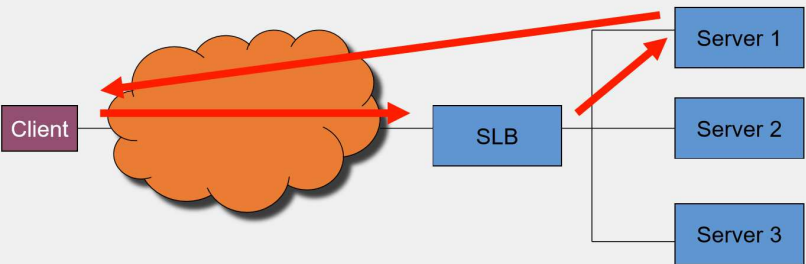

# Container Orchestration
- Scaling containers across an enterprise can be very challenging without automated methods for load balancing, resource allocation and security enforcement
- Container orchestration automates:
	- **Scheduling**
	- **Deployment**
	- **Networking**
	- **Scaling**
	- **Health monitoring**
	- **Management** of containers
- Container orchestration tools are **declarative by nature** - we simply state the desired outcome and the platform ensures that it is fulfilled - in **YAML** or **JSON** formats for the declarative definitions
### Benefits
- **Scaling** the applications and infrastructure easily
- **Service discovery** and **container networking**
- **Improved governance** and **security protocols**
- Container **health monitoring**
- **Load balancing** of containers evenly among hosts
- Optimal **resource allocation**
- Container **lifecycle management**

### Architecture of Orchestration Platforms
- **Job** - an application composed of interdependent and heterogeneous tasks defined by a user
- **Cluster Manager** - the core of the orchestration platform, responsible for resource monitoring, accounting, task scheduling, administration control and task relocator decisions
- **Compute Cluster** - all tasks are scheduled on a set of worker nodes, each running a worker node agent that signals container information back to the cluster manager
- **Infrastructure** - the networking and resources upon which the orchestration platform is deployed - because containers are so flexible and portable, this can be on-premise, private cloud or public cloud


## Load Balancer Schemes
### Web Server Load Balancing
- Request enters a router
- Load balancing server determines which web server should serve the request
- Sends the request to the appropriate web server


### Server Load Balancer (SLB)
- Gets client the needed resource
- Must know servers (IP/port, availability) and understand details of some protocols (e.g., FTP, SIP, ...)
- Network Address Translation (NAT) - packets are rewritten as they pass through the SLB service

### Reasons to Load Balance
- **Scale applications/services**
- **Ease of administration/maintenance:** easily and transparently remove physical servers from rotation in order to perform any type of maintenance on that server
- **Resource sharing:** can run multiple instances of an application/service on a server, run on a different port of each instance and load balance to different a port 

### Load Balancing Algorithms
- **Least connections:** server with fewest number of flows gets the new flow request
- **Weighted least connections:** associate a weight for each server and distribute load across server pool based on the weights of all servers in the pool
- **Round robin:** distributes incoming requests sequentially and cyclically across the server pool, ensuring an even distribution of workload
- **Weighted round robin:** assignes requests to servers based on predefined weights, distributing more requests to those with higher weights while maintaining a cyclic order
- There are other algorithms that look at or try to predict server load in determining the load of the real server

### How SLB Devices Make Decisions
- SLB devices can make their load balancing decisions based on several factors:
	- Obtained from the packet headers - IP address, port numbers, ...
	- Obtained by looking at the data beyond the network headers - HTTP cookies, HTTP URLs, SSL client certificates, ...
- The decisions can be based strictly on flow counts or based on knowledge of the application
- For some protocols, you must have knowledge of the protocol to correctly load balance

### Flow Arrival
- When a new flow arrives, we determine whether virtual server exists:
	- If so, make sure virtual server has available resources
	- If so, determine level of service needed by that client to that virtual server
	- Pick a real server for that client, based on flow counts and information about the flow
- Otherwise, the packet is bridged to the correct interface based on Layer 2

### SLB Architectures
- **Traditional:** SLB device sits between the clients and the servers being load balanced
- **Distributed:** SLB device sits off to the side and only receives the packets it needs to, based on flow setup and teardown

#### SLB Traditional View with NAT


#### SLB Traditional View without NAT


#### Load Balance: Layer 3/4


#### Load Balance: Layer 5+


#### SLB Distributed Architecture


#### SLB Distributed Architecture - Sample Flow


#### Basic Auto-Scaling Configuration


## Orchestration Tools
- **Kubernetes** (k8s)
- **Docker Swarm**
- **Apache Mesos**
- **Amazon Elastic Container Service** (ECS)

### Docker Swarm Orchestration
- Swarm is included with Docker itself
- Enabling Swarm mode is straightforward, as is adding nodes
- Enables developers to define applications in a single file
- Smaller learning curve, but less features than Kubernetes

### Kubernetes Orchestration
- Like Swarm, Kubernetes enables developers to create resources such as **groups of replicas**, **networking** and **storage**, but it’s done in a completely different way
- Kubernetes is a separate piece of software - in order to use it, you must either install a distribution locally or have access to an existing cluster

# Kubernetes
- Kubernetes is a production-grade, open-source platform that **orchestrates the placement** (scheduling) and **execution** of application containers within and across computer clusters
- Extends how we scale and manage containerized applications by automating deployment, scaling and operations across clusters, making it easier to modify and adapt the infrastructure dynamically
- The general rule of thumb for K8S is **if your app fits in a container, Kubernetes will deploy it**

### Benefits
- **Horizontal Scaling:** scale your application as needed from the command line or the UI
- **Automated rollouts and rollbacks:** roll out changes that monitor the health of your application ensuring all instances don't fail or go down simultaneously - if something goes wrong, K8S automatically rolls back the change
- **Service discovery and load balancing:** containers get their own IP so you can put a set of containers behind a single DNS name for load balancing
- **Storage orchestration:** automatically mount local or public cloud or a network storage
- **Secret and configuration management:** create and update secrets and configs without rebuilding your image
- **Self-healing:** the platform heals many problems automatically - restarting failed containers, replacing and rescheduling containers as nodes die, killing containers that don't respond to your user-defined health check and waiting to advertise containers to clients until they're ready
- **Batch execution:** manage your batch and CI workloads and replace failed containers
- **Automatic binpacking:** automatically schedules containers based on resource requirements and other constraints

### Kubernetes Architecture
- Kubernetes coordinates a highly available cluster of computers that are connected to work a single unit
- A Kubernetes cluster consists of three logical planes (network):
	- **Data Plane:** carries user traffic
	- **Control Plane:** carries signaling traffic to coordinate the cluster
	- **Management Plane:** carries administrative traffic


### Cluster Nodes
- A Node is a worker machine in Kubernetes and may be either a virtual or a physical machine, depending on the cluster - a cluster can have up to thousands of nodes
- Kubernetes schedules application workloads to nodes - it provides a **command line tool** for communicating with a cluster's control plane, using the Kubernetes API, the `kubectl`
- Every Kubernetes Node runs at least:
	- **Kubelet:** process responsible for communication between the Kubernetes Master and the Node - it manages the pods and the containers running on a machine
	- **Container Runtime** (`containerd`): responsible for pulling the container image from a registry, unpacking the container and running the application
	- **Kube-proxy**, runs a daemon and is a simple network proxy and load balancer for all application services running on the node


### Resource Specification
- When creating or modifying a resource in a Kubernetes cluster, we can be either:
	- **Imperative:** by specifying the exact procedure that should be followed by the system
	- **Declarative:** solve problems without requiring the programmer to specify an exact procedure to be followed
- In general, the **declarative approach is strongly preferred**
- Using a declarative approach means that we write a **manifest** that describes the desired state we want to achieve, in **YAML** or **JSON**

### Desired vs. Current State
- Kubernetes takes a **cloud-native** view of systems and can handle constant change
	- Your cluster could be changing at any point as work happens and control loops automatically fix failures - this means that your cluster could potentially never reach a stable state
	- As long as the controllers for your cluster are running and able to make useful changes, it doesn't matter if the overall state is stable or not
- Kubernetes uses lots of **controllers** that each manage a particular aspect of cluster state
- A particular control loop (controller) uses one kind of resource as its desired state and has a different kind of resource that it manages to make that desired state happen
	- For example, a controller for Jobs tracks Job objects (to discover new work) and Pod objects (to run the Jobs) 
- **Controllers can fail**, so Kubernetes is designed with that in mind

### kubectl Tool
- The Kubernetes control plane runs a REST API server for accessing Kubernetes resources and undertaking operation activities
- Kubernetes comes with a CLI tool named **kubectl** in order to consume the REST API
- It's installed on the local system and configured to connect remote clusters securely and reliably
- It is a powerful tool for:
	- Application management, handling CRUD operations and troubleshooting
	- Cluster operations, like checking and changing the status of servers in the cluster

### Pods
- A Pod represents a **group of one or more application containers and shared resources**
- Those resources include:
	- Shared storage, as **volumes**
	- **Networking**, as a unique cluster IP address
	- Information about how to run each container, such as the container image version or specific ports to use
- **Every Pod gets its own IP address**
	- This creates a clean, backwards-compatible model where Pods can be treated much like VMs or physical hosts from the perspectives of port allocation, naming, service, discovery, load balancing, application configuration and migration

### Pod Networking
- The containers in a pod **share an IP address and port space**, are always co-located and co-scheduled and run in a shared context on the same Node


#### Networking inside a Pod
- Kubernetes **IP addresses exist at the pod scope** - containers within a pod share their network namespaces - including their IP and MAC addresses
	- This means that containers within a pod can all reach each other's ports on localhost
	- This also means that containers within a pod must coordinate port usage, but this is no different from processes in a VM
	- This is called the **IP-per-pod model**


### Pod Lifecycle
- When a pod is created on a cluster node, it first enters the **pending** status
- Once all the containers of the pod are up and running, the pod enters the **running** status
	- The pod only enters this state if all its containers run successfully
	- If the pod is asked to terminate, it will request all its containers to terminate
- If all containers terminate with exit code zero, then the pod enters the **succeeded** status
- Failure scenarios:
	- If at least one container fails to run
	- One of the containers crashes or exists with a nonzero exit code
	- Pod is asked to terminate and one of the containers exists with a nonzero exit code


### Pod Specification
- Essential sections of a pod specification YAML - `pod.yaml`
	- API version info: `v1`
	- Type of Kubernetes object or resource: `Pod`
	- Metadata, at least includes the name of the pod: `web-pod`
	- The list of containers that are part of this pod, in this case only one:
		- Name: `web`
		- Location and name of the container image: `nginx:alpine`
		- List of ports the container is exposing: `80`
- This specification can be applied to a cluster with the command `$ kubectl create -f pod.yaml`

```yaml
apiVersion: v1
kind: Pod
metadata:
  name: web-pod
spec:
  containers:
  - name: web
    image: nginx:alpine
    ports:
    - containerPort: 80
```

### Volumes
- Kubernetes supports many volume types, including:
	- **emptyDir:** created when a pod is first assigned to a Node and remains active as long as the pod is running on that node - the volume is initially empty and the containers in the pod can read and write the files in the emptyDir volume - once the pod is removed from the node, the data is erased
	- **hostPath:** mounts a file or directory from the host node's filesystem into the pod
	- **gitRepo:** mounts an empty directory and clones a git repository into it
	- **secret:** used to pass sensitive information to pods
	- **persistentVolumeClaim:** used to mount a PersistentVolume into a pod

### StorageClass
- Defines the type of storage that will be used - this could be AWS, EBD, Portworx, etc.
- If a provisioner is defined then Kubernetes will connect to the storage provider and allocate a new persistent volume whenever a claim is made
- Otherwise, the cluster administrator needs to manually add **new persistent volumes** before each claim can be made

### Pod ReplicaSets
- A single pod in an environment with **high availability requirements** is insufficient because of crashes or update an application running inside the pod without interrupting service interruption
- In Kubernetes, the **ReplicaSet** is used to defined and manage such a collection of identical pods that are running on different cluster nodes
- It is responsible for reconciling the desired state at all times, if the actual state ever deviates from it


### StatefulSet
- Workload API object that manages stateful applications, such as databases
- Its main features include:
	- **Stable, unique network identifiers:** each pod in a StatefulSet is given a hostname that is based on the application name and increment, e.g., web1, web2, ...
	- **Stable, persistent storage:** every pod in the cluster is given its own persistent volume based on the storage class defined or the default if non are defined - deleting or scaling down pods will not automatically delete the volumes associated with them so that the data persists
	- **Ordered, graceful deployment and scaling:** pods for the StatefulSet are created and brought online in order, from 1 to *n*, and are shutdown in reverse order to ensure a reliable and repeatable deployment and runtime
	- **Ordered, automated rolling updates:** StatefulSets have the ability to handle upgrades in a rolling manner where it shuts down and rebuilds each node in the order it was created originally - persistent volumes are reused and data is automatically migrated to the upgraded version

### Stateful App Scenarios
- **NoSQL/Sharded Databases (e.g., Cassandra)**:
	- Designed for fault tolerance and easy scaling
	- Typically uses **three data copies** with no master/slave setup, ensuring availability even if a node fails
	- Best practice is to limit replicas to **three** for faster recovery
- **Relational Databases (e.g., PostgreSQL)**:
	- Usually runs as a **single instance** without clustering
	- When deploying in Kubernetes, keep the database **small** to minimize downtime
	- Smaller databases restore transactions faster if a pod fails and restarts on another node

### Other Controllers
- Controllers, or higher-level abstractions, include:
	- **DaemonSet:** ensures that all or some worker nodes run a copy of a pod
	- **Job/CronJob:** creates one or more pods, runs certain tasks to completion, then deletes the pods

### Deployment
- Deployment augments a ReplicaSet by providing **rolling updates and rollback** functionality on top of it
- Once the application instances are created, a Kubernetes Deployment Controller continuously monitors them
- This provides a self-healing mechanism to address machine failure or maintenance


### Stability of Pod Endpoints
- Due to the nature of highly distributed systems, **we cannot assume that pods have stable endpoints** - a pod can come and go on a whim
- Since we cannot rely on pod endpoints being stable, we need **Kubernetes services**, meant to provide **stable endpoints** to ReplicaSets or Deployments


### Kubernetes Service
- A service provides a **reliable** cluster-wide **IP address**, also called a **virtual IP (VIP)**, as well as a **reliable port** that's unique in the whole cluster
- The pods that the Kubernetes service is proxying are determined by the **selector** defined in the service specification
- Selectors are always based on labels
- Every Kubernetes object can have zero to many labels assigned to it
- In this case, the **selector** is **app=web** - all pods that have a label called app with a value of web are proxied


- A service is an abstraction which defines a **logical set of pods and a policy by which to access them**
- Although each pod has a unique IP address, those **IPs are not exposed outside the cluster without a service**
- Services allow your applications to receive traffic
- Services can be exposed in different ways by specifying a **type**:
	- **ClusterIP** (default) - exposes the service on an internal IP in the cluster - this type makes the service only reachable from within the cluster
	- **NodePort** - exposes the service on the same port of each selected node in the cluster using NAT - makes a service accessible from outside the cluster using `<node-ip>:<node-port>` - superset of ClusterIP
	- **LoadBalancer** - creates an external load balancer in the current cloud (if supported) and assignes a fixed, external IP to the service - superset of NodePort
	- **ExternalName** - exposes the service using an arbitrary name by returning a CNAME record with the name - no proxy used

### Services and Labels
- A service routes traffic across a set of pods - services are the abstraction that allow pods to die and replicate in Kubernetes without impacting the application
- Discovery and routing among dependent pods is handled by Kubernetes Services
- Services match a set of pods using labels and selectors, a grouping primitive that allows logical operation on objects in Kubernetes - labels are key-value pairs attached to objects and can be used in any number of ways:
	- Designate objects for deployment
	- Embed version tags
	- Classify an object using tags


### Deploying a Web Component
- A deployment in Kubernetes creates 3 objects:
	- The **Deployment**
	- The respective **ReplicaSet**
	- A single **Pod**
- A service object exposes the containerized web component to the public by specifying its type as a **NodePort**
- By using the cluster external IP address and the port attributes to the service it's possible to access it from outside the cluster
- **Streamlining a deployment:** all components that make up an application in Kubernetes can be defined in a single file - it simplifies the maintenance of the various specifications

### Context-Based Routing
- Often, we want to configure context-based (layer 7) routing for our Kubernetes cluster - the preferred and most scalable way to do this is to use an **IngressController**
- We define routing from a context-based request to a corresponding `<service-name>/<port> request` - this is done through an Ingress object:
	1. In the **Ingress** object, we define the **Host** and **Path** as the source and the service name and the port as the target
	2. Modify the configuration file of the Nginx
	3. Nginx is then asked to reload its configuration and route new requests


### Ingress
- It's used to make **internal services reachable from outside** the cluster
- It **saves precious static IPs**, as there's no need to declare multiple **LoadBalancer** and **NodePort** services exposed externally
- It allows for **much more configuration** and easier setup