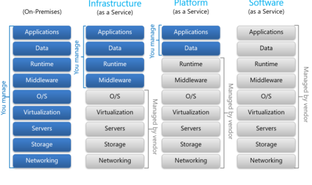
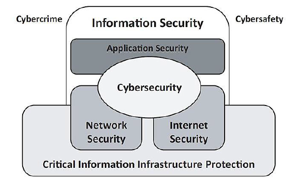
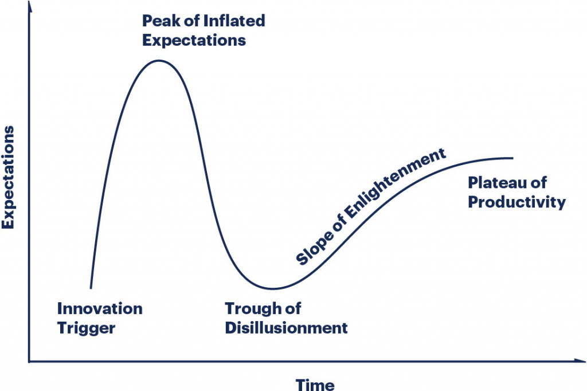

# The Computer Science Engineer in the Corporation
### Start a Company or Get a Job in a Corporation?
- There are many benefits in having a great idea and start a business
- However, most small businesses fail
- **E-myth**:
	- The entrepreneurial myth is that the mistaken belief that most businesses are started by people with tangible business skills , when in fact most are started by technicians who know nothing about running a business - hence most fail
- Whether to start a business or go to the job market, it is critical to understand how companies work and are managed and how the computer science engineer fits in the overall picture

### The Engineer in the Corporation
1. Technology Infrastructure
2. Software Development
3. Data Management and Analysis
4. Cybersecurity
5. Innovation and Digital Transformation
6. Technical Support and Troubleshooting
7. Strategic Planning and Decision-Making

### The Computational and Data Infrastructure
- CSEs are critical to any serious company
- The computation infrastructure even if not local requires competent care
	- Maintain, process and analyze data
	- Maintain the infrastructure, computers, servers and network
- Most CSEs end up building, modifying and maintaining these infrastructures

### Technology Infrastructure
- Designing, implementing and maintaining the technology infrastructure of large organizations
- Every organization has several systems designed for operations processing from accounting, to inventory, to HR up to the company's website
	- The continuous evolution of the company, the market and regulations require continuous updating
	- Development from scratch is not very common
	- Critical to understand the overall architecture

### Software Development
- CSEs develop and maintain software applications that are essential for various functions within the organization, such as:
	- **Enterprise Resource Planning (ERP)**
	- **Customer Relationship Management (CRM)**
	- **Project management and communication tools**

### Data Management and Analysis
- Management and analyzing large volume of data
- Develop data storage solutions
- Implement data analytics algorithms
- Visualization tools

### Cybersecurity
- Design and implement security measures to safeguard the organization's networks, systems and data from cyber attacks
- Data encryption
- Control of data and user access to data and infrastructures - CRUD matrices

### Innovation and Digital Transformation
- Ease digital transformation within large organizations
- Explore emerging technologies
	- e.g. AI, machine learning, cloud computing, data science, IoT
- Assess how these technologies can be leveraged to
	- Improve business processes
	- Enhance customer experiences
	- Gain competitive advantages
- Generally, companies do not like to innovate and try to resist any trend to do so
- The corporations often don't even know how to innovate, because of the lack of sources of innovation

### Technical Support and Troubleshooting
- CSEs provide technical support to employees and stakeholders, helping them troubleshoot issues with hardware, software and other technology systems
- Technology resources must be accessible
- Guarantee access to systems, tools and data, enabling smooth operations across the organization - different constraints for outside and internal support

### Strategic Planning and Decision-Making
- CSEs collaborate with senior management and other departments
- Align technology initiatives with overall business objectives
- Provide insights and recommendations on
	- Technology investments
	- Resource allocation
	- Strategic planning to drive organizational growth and success
- Mostly a senior's job, but even clever rookies can provide insight on emerging technologies

### The CSE Path to a Management Position
1. Start as a rookie - "code-monkey"
	 - Absorb corporate culture
	 - Identify the organization power distribution
2. Get promoted
	- Take responsibilities
	- Identify big problems and propose solutions
3. Participate more actively in management
	- Be eager to take more responsibilities
4. Get an MBA (Master of Business Administration)
5. Be a manager

### What Constitutes a Corporation?
- An identity
- Goals and public perception
- The people
- The infrastructure and physical/intellectual property
- The **data** - most important one

### Managing the Corporation
- Financial Accounting
- Managerial Accounting
- Microeconomics
- Macroeconomics
- Finance
- Marketing Management
- Operations Management
- Organizational Behavior
- Strategic Management
- Business Ethics and Corporate Social Responsibility

### Why Does This Matter for CSEs?
- Because they need to understand the core of the organization, making them much better professionals
- Because it will allow them to go over the ranks of the organization
- And aim for the top, by managing projects, teams, departments, etc.

### Financial Accounting
- Financial statement analysis
	- **Balance sheets** - provide a snapshot of a company's financial position at a specific point in time, usually at the end of a reporting period (e.g. quarter or year)
	- **Income statements** - provide a summary of a company'0s revenues, expenses and net income over a specific period
	- **Cash flow statements** - report the cash inflows and outflows from operating, investing and financing activities over a specific period
- In summary, balance sheets provide a snapshot of a company's financial position, income statements show its profitability and cash flow statements reveal its cash inflows and outflows

### Managerial Accounting
- Accounting information for decision-making within organizations
- Cost Analysis
	- Cost-Volume-Profit (CVP) analysis
	- Cost allocation methods
	- Activity-Based Costing (ABC)
	- Job order and process costing
	- Cost behavior analysis
- Budgeting
	- Master budget
	- Operating budgets
	- Cash budget
	- ...
- Performance Evaluation
	- Variance analysis (costs mostly)
	- Key Performance Indicators (KIPs)
	- Balanced scorecards
	- Financial metrics (ROI et al)
	- Benchmarking

> **Role of the CSE**
> Create update and maintain the existing KIPs, sometimes in real time
> Make sure that the accounting and budgeting software runs smoothly (typically an ERP)

### Macroeconomics
- Economic principles at the national and global levels
	- GDP, inflation, unemployment
	- Fiscal and monetary policy
	- Critical for strategic positioning of the company

> **Role of the CSE**
> Identify general technological trends
> Perceive global growth patterns
> Identify and ditch bad tech (especially in use within the enterprise)

#### Gartner Hype Cycle

### Microeconomics
- Economic principles at the level of individual firms and markets
- Supply and demand
- Consumer behavior
- Market structures

> **Role of the CSE**
> Identify cost factors - provide cost estimators
> Identify and explore ways for reducing software costs
> 	- Licensing vs. Open Source
> 	- Maintaining costs
> Identify needed characteristics for software products

### Finance
- Financial management principles
	- Capital budgeting
	- Risk management
	- Valuation
	- Financial markets

>**The role of the CSE**
>Work with the financial department to identify KPIs
>Realistically identify risk issues for both in-house software and systems
>Identify corporate value of the company in terms of data and information and intellectual property

### Marketing Management
- Marketing strategies
	- Market research
	- Consumer behavior
	- Product development
	- Pricing and promotions

> **Role of the CSE**
> Provide (create or maintain) data analytics tool to
> 	- Understand customers
> 	- Understand trends
> 	- Perceive weaknesses
> 	- Reveal opportunities
> The realm of Data Warehousing and Data Mining

### Operations Management
- Managing the production and delivery of goods and services including
	- Process optimization
	- Supply chain management
	- Quality control
	- Project management

>**Role of the CSE**
>Identify limiting production factors
>Propose optimization solutions for problems, not necessarily data related (e.g. logistics, scheduling, etc.)
>Provide KPIs on HR, data and technological infrastructure, company logistics and other resources

### Organizational Behavior
- Individual and group behavior within organizations
	- Leadership
	- Motivation
	- Team dynamics
	- Organizational culture

> **Role of the CSE**
> Promote company culture and values across the team, especially when leading
> Inspire the organization culture in product development for customers

### Strategic Management
- Formulation and implementation of organizational strategies
	- Strategic analysis
	- Competitive advantage
	- Industry analysis
	- Strategic planning

> **Role of the CSE**
> Collaborate with senior management and other departments to
> 	- Align technology initiatives with overall business objetives
> 	- Provide insights and recommendations on technology investments, resource allocation, strategic planning to drive organizational growth and success
> 	- Mostly a senior position, but even clever rookies can provide insight on emerging technologies

### Business Ethics and Corporate Social Responsibility
- Ethical issues in business decision-making and the responsibilities of corporations to society and stakeholders

> **Role of the CSE**
> Data management ethics - when required ensure FAIR standards (Findability, Accessibility, Interoperability and Reusability)
> Verify whether all business processes comply with international ethical standards
> 	- Identify and implement those standards (national and internationally)
> 	- Privacy is a major concern and top responsibility
> 	- Sustainability and carbon footprint