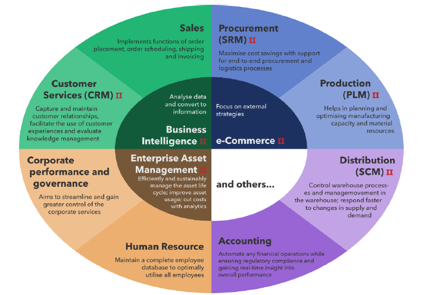
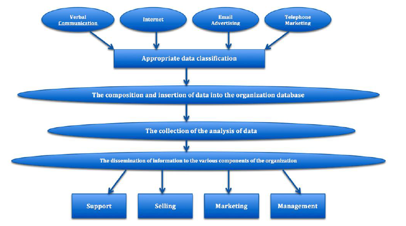

# Systems Management in the Enterprise
### Enterprise Systems
- Enterprise Systems is an interdisciplinary field that combines elements of information technology, business processes, management and organizational theory
	- **Enterprise Architecture** - designing the overall structure and framework of enterprise systems to ensure alignment with business goals and objectives
	- **Business Process Management (BPM)** - analyzing, modeling, optimizing and automating business processes to improve efficiency and effectiveness across the organization
	- **Information Systems Management** - overseeing the planning, development, implementation and maintenance of enterprise systems to support organizational operators and strategic initiatives
	- **Project Management** - coordinating and managing projects related to the implementation, customization and enhancement of enterprise systems within the organization
	- **Data Management and Analytics** - managing and analyzing large volumes of data generated by enterprise systems to derive insights, inform decision-making and support strategic initiatives

### Enterprise Resource Planning (ERP)
- Type of software platform that integrates core business processes and functions into a single unified system
- It allows organizations to streamline and automate a wide range of activities:
	- Accounting
	- Human Resources
	- Supply Chain Management
	- Procurement
	- Manufacturing
	- Project Management
	- Customer Relationship Management (CRM)

#### ERP Key Features
1. **Centralized Database** - serves as  single source of truth for all business data
	- Data consistency, accuracy, real-time visibility cross departments and functions
2. **Integration of Business Processes** - enable seamless flow of information and transactions between different departments and business units
	- For example,  sales order entered into the system can automatically trigger updates to inventory levels, production schedules and financial records
3. **Standardized Processes** - offer built-in best practices and standardized workflows that help organizations streamline operations and enforce consistency in how tasks are performed
	- Leads to increased efficiency, reduced errors and improved decision-making
4. **Data Analytics and Reporting** - reporting and analytics tools that allow users to analyze business data, generate reports and gain insights into key performance metrics
	 - Enables organizations to make data-driven decisions and monitor the health of their business in real-time
5. **Scalability and Flexibility** - to scale with the growth of an organization and adapt to changing business requirements
	- Modular architectures which allow organizations to add or customize features as needed to meet specific needs and industry requirements
6. **Improved Collaboration and Communication** - facilitate collaboration and communication among employees, departments and external stakeholders
	- Improve coordination and enhance overall productivity
7. **Compliance and Risk Management** - include features for managing regulatory compliance, risk assessment and internal controls
	- Helps organizations ensure that they adhere to legal and industry standards, mitigate risks and maintain data security and integrity

#### Popular ERP Vendors
- **SAP** - market leader
- **Oracle** - Oracle ERP Cloud
- **Microsoft (Dynamics 365)** - SaaS platform on MS Azure
- **Infor** - specific for manufacturing, distribution, healthcare and hospitality
- **IFS** - mostly for industries with complex manufacturing and service-orienting operations, such as aerospace and defense, engineering, construction and utilities

#### Managing the ERP within the Enterprise
- This is a source of continuous conflict
- Who owns the data? Who manages the data?
- Many times the ERP does not replace the internal/legacy systems
	- It's very hard to integrate
	- It's a source of continuous problems in the organization
	- Data problems and process problems
- The ERP is expensive and each upgrade or new module requires extensive process adaptation for usage

### Customer Relationship Management (CRM)
- System that refers to a strategy, process or technology used by businesses to manage interactions with current and potential customers
- It is about building and maintaining strong relationships with customers to enhance customer satisfaction, loyalty and business growth
- Typically includes software tools and applications designed to help businesses to:
	- Organize, automate and synchronize sales
	- Do marketing
	- Perform customer service and support activities

#### CRM Key Features
- **Contact Management** - store and organize customer contact information, which allows businesses to maintain a comprehensive database of customer interactions and communication channels
- **Sales Automation** - streamline the sales process by automating repetitive tasks, which helps sales teams prioritize their efforts, close deals faster and increase productivity
- **Marketing Automation** - enable targeted marketing campaigns by segmenting customers based on demographics, purchase
- **Customer Service and Support** - provide tools for managing customer inquiries, complaints and support tickets, ensuring timely resolution of issues and consistent service delivery
- **Analytics and Reporting** - offer reporting and analytics features that provide insights into sales performance, customer behavior and marketing effectiveness - businesses can analyze data trends, identify opportunities for improvement and make data-driven decisions
- **Integration Capabilities** - integrate with other business applications and systems such as ERP, marketing automation and commerce platforms

#### Popular CRM Vendors
- **Salesforce** - current market leader
- **Microsoft Dynamic 365** - cloud-based suite
- **Oracle CX Cloud** - includes modules for sales, marketing, service, commerce and social engagement
- **SAP Customer Experience** - includes modules for sales, marketing, commerce, service and customer data management
- **Zoho CRM** - cloud-based CRM platform that offers a wide range of features for sales, marketing, customer service and automation

### Other enterprise management systems
- Supply Chain Management (SCM) Systems
- Human Capital Management (HCM) Systems
- Business Intelligence (BI) and Analytics Platforms
- Enterprise Content Management (ECM) Systems
- Enterprise Asset Management (EAM) Systems
- Business Process Management (BPM) Systems
- Customer Service and Support Systems
- Enterprise Collaboration and Communication Tools
- Financial Management Systems
- Security Information and Event Management (SIEM) Systems

## Frameworks for IT Service Management
### Information Technology Infrastructure (ITIL)
- ITIL is a set of best practices and guidelines for IT service management (ITSM) that focuses on aligning IT services with the needs of the business even when they change
- Primarily adresses the management of IT services and infrastructure
- Principles and processes can be applied to various aspects of IT operations. including the management of legacy data and code
- By adhering to 7 core principles, organizations can structure their IT service management processes in a way that maximizes value, minimizes risk and supports business objectives
	- Designed to ensure that IT services are aligned with the needs of the business and delivered efficiently and effectively

## 7 Principles of ITIL
1. **Focus on Value** - the primary focus of ITIL is on delivering value to the business and its customers. This involves understanding the needs and requirements of stakeholders and ensuring that IT services support business objectives and outcomes
2. **Start Where You Are** - it emphasizes the importance of taking a practical and incremental approach to process improvements. Organizations should assess their current state, identify areas for improvements and prioritize changes based on their impact and feasibility
3. **Progress Iteratively with Feedback** - it encourages organizations to adopt and iterative approach to process improvement, where changes are implemented incrementally and feedback is used to guide further improvements. This approach helps managing risks and ensures that changes are aligned with business needs
4. **Collaborate and Promote Visibility** - effective collaboration and communication are essential for successful IT service management. ITIL promotes collaboration between different teams and departments involved in delivering and supporting IT services. It also emphasizes the importance of promoting visibility and transparency, so that stakeholders have access to relevant information and can make informed decisions
5. **Think and Work Holistically** - it encourages organizations to make a holistic view of IT service management, considering the end-to-end service lifecycle and the interdependencies between different processes and activities. This approach helps ensuring that changes are implemented in a coordinated and integrated manner, rather than in isolation
6. **Keep It Simple and Practical** - it advocates for simplicity and practicality in the design and implementation of IT service management processes. Processes should be easy to understand, use and maintain, and should be tailored to the specific needs and circumstances of the organization
7. **Optimize and Automate** - continuous improvement is a key principle of ITIL, and organizations should strive to optimize and automate their IT service management processes wherever possible. This includes identifying opportunities to streamline workflows, eliminate waste and leverage technology to improve efficiency and effectiveness

#### ITIL Services
- **Service Strategy** - emphasizes understanding the business objectives and defining the services required to support those objectives
- **Service Design** - focuses on designing efficient and effective IT services and processes
- **Service Transition** - involves transitioning new or modified services into production while minimizing disruption to the business
- **Service Operation** - focuses on delivering and supporting IT services effectively and efficiently
- **Continual Service Improvement (CSI)** - emphasizes the need for ongoing evaluation and improvement of IT services and processes

#### ITIL Management
- **Change Management** - helps organizations manage changes to IT services and infrastructure in a controlled and transparent manner
- **Configuration Management** - involves managing configuration items (CIs) and their relationships to support effective change management and service delivery

> By applying ITIL principles and practices to the management of legacy data and code, organizations can **improve the efficiency, reliability and agility of their IT operations while minimizing risks and ensuring alignment with business objectives**

### An ITIL Best Practice Example for Service Transition
- **Implement a comprehensive change management process**
- **Change management** ensures that changes to the IT environment are planned, assessed, authorized and implemented with minimal disruption
- **Key Steps:**
	1. **Establish a Change Advisory Board (CAB)**
	    - Include stakeholders from IT, operations, security, and business units
	    - CAB reviews and approves all proposed changes based on impact, risk and business alignemnt
	2. **Define Change Categories**
	    - **Standard changes** – low risk, pre-approved
	    - **Normal changes** – require CAB approval
	    - **Emergency changes** – implemented urgently to resolve critical issues
	3. **Create a Change Management Policy**
	    - Define procedures for:
	        - Requesting changes
	        - Assessing and prioritizing
	        - Roles and responsibilities
	        - Communication and escalation
	4. **Implement a Change Request Process**
	    - Use standardized forms including:
	        - Change description
	        - Risk assessment
	        - Rollback plan
	        - Implementation schedule
	    - Ensure all changes are logged and tracked
	5. **Perform Impact and Risk Assessment**
	    - Analyze effects on:
	        - Services
	        - Infrastructure
	        - Stakeholders 
	    - Consider:
	        - Potential disruptions
	        - Dependencies
	        - Compliance needs   
	6. **Review and Approval**
	    - CAB evaluates based on:
	        - Impact
	        - Urgency
	        - Cost
	        - Strategic alignment
	    - Document and communicate approvals
	7. **Coordinate Implementation**
	    - Allocate appropriate resources
	    - Schedule during:
	        - Maintenance windows
	        - Low-impact periods
	    - Take precautions to minimize disruption
	8. **Monitor and Review**
	    - Monitor during and after implementation
	    - Conduct post-implementation reviews:
	        - Evaluate success
	        - Identify improvements

### ISO/IEC 20000
- **International standard for IT Service Management (ITSM)**
- Provides a framework to meet organization and customer needs

#### Key Features:
- **Establishes best practices** - defines processes and requirements for effective service management
- **Promotes service quality** - enhances consistency, reliability, and customer satisfaction
- **Aligns IT with business objectives** - ensures IT investments support strategic priorities
- **Supports continual improvement** - encourages monitoring, measuring, and refining ITSM processes

### ITIL vs ISO/IEC 20000
- **Scope**
	- **ISO 20000**: standard with specific requirements for certification
	- **ITIL**: flexible framework of best practices
- **Structure**
	- **ISO 20000**: series of controls and compliance points
	- **ITIL**: five core books - service strategy, service design, service transition, service operation, continual service improvement
- **Flexibility vs Prescriptiveness**
	- **ITIL**: Emphasizes adaptability
	- **ISO 20000**: Requires strict adherence to documented procedures
- **Continual Improvement**
	- **ITIL**: Iterative and feedback-driven
	- **ISO 20000**: Structured and measured approach
- **Documentation Requirements**
	- **ISO 20000**: Strong emphasis on documented evidence
	- **ITIL**: Encourages documentation but is not prescriptive