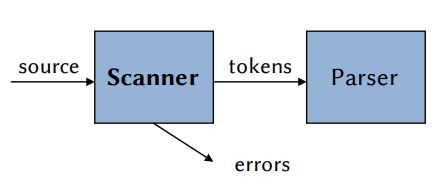
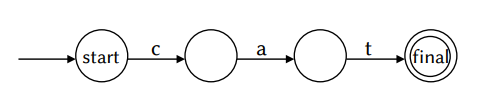
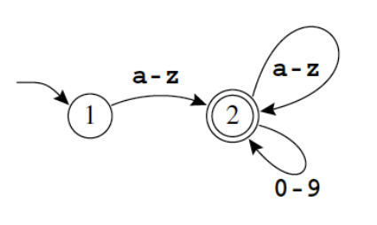
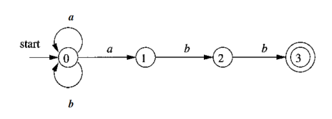
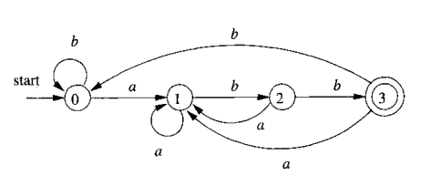
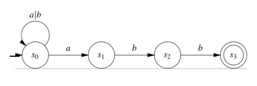
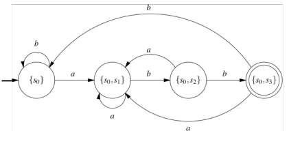
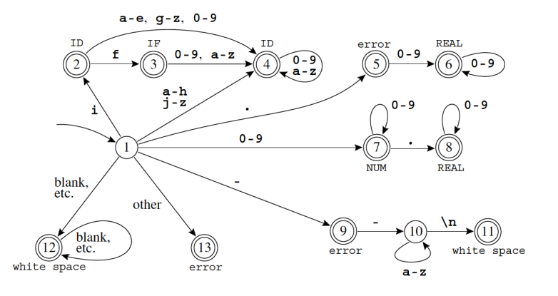

# Lexical Analysis
### Compilation Process
- To translate a program from one language into another, a compiler must first pull it apart and understand its structure and meaning to then put it all together in a different way
- The front end of the compiler performs analysis while the back end does synthesis
- The analysis is usually broken up into:
	- **Lexical Analysis:** breaking the input into individual tokens
	- **Syntax Analysis:** parsing the phrase structure of the program
	- **Semantic Analysis:** calculating the program's meaning

### Lexical Analysis
- The initial step of the compilation process performed by the **lexer/scanner:**
	- Maps sequences of characters to **tokens**
	- Eliminates white space, tabs, blanks, comments, etc.

### Lexical Tokens:
- Sequence of characters that can be treated as a **unit** in the grammar of a programming language
- A programming language classifies lexical tokens into a finite set of token types
- **Examples of tokens:** `ID`, `NUM`, `IF`, `COMMA`, `EQ`, `NOTEQ`, `LPAREN`, `RPAREN`, ...
- **Examples of nontokens:** comments, preprocessor directives, macros, blanks, tabs, newlines, ... 

    <pre>x = x + y  →  &lt;ID, x&gt; &lt;EQ&gt; &lt;ID, x&gt; &lt;PLUS&gt; &lt;ID, y&gt;</pre>

## Regular Expressions
- Regular expressions can be used to specify the grammar of a language, in order to decide whether a string is in the language or not

### Notations
- If `M` and `N` are the languages, then:

| Symbol     | Meaning                                                   |
| ---------- | --------------------------------------------------------- |
| `a`        | An ordinary character stands for itself                   |
| `ε`        | The empty string                                          |
|            | Another way to write the empty string                     |
| `M\|N`     | Alternation, choosing from `M` or `N`                     |
| `M·N`      | Concatenation, an `M` followed by an `N`                  |
| `MN`       | Another way to write concatenation                        |
| `M*`       | Repetition (0 or more times)                              |
| `M+`       | Repetition (1 or more times)                              |
| `M?`       | Optional (0 or 1 times)                                   |
| `[a-zA-Z]` | Character set alternation                                 |
| `.`        | A period stands for any single character except newline   |
| `"a.+*"`   | Quotation, a string in quotes stands for itself literally |

- Useful extensions:
	- `[abc]` means `(a|b|c)`
	- `[d-g]` means `[defg]`
- Examples of lexical tokens using regular expressions:
	- `IF` → `if`
	- `ID` → `[a-z] [a-z0-9]*`
	- `NUM` → `[0-9]+`
	- `REAL` → `([0-9]+ "." [0-9]*) | ([0-9]* "." [0-9]+)`
	- *nontoken* → `("--" [a-z]* "\n") | (" " | "\n" | "\t")+`
	- *error* → .

### Rules
- **Longest Match:**
	- The longest initial substring of the input that can match any regular expression is taken as the next token
	- For example, for the string `if8`, the scanner generates an `ID` token instead of an `IF` token
- **Rule Priority:**
	- For a *particular* longest initial substring, the first regular expression that can match determines its token type, meaning that the order of writing down the regular expression rules matters
- Therefore, `if8` matches as an identifier by the longest match rule, and if matches as a reserved word by rule priority

## Finite Automata
- A **finite automaton** has a finite set of *states*; *edges* lead from one state to another, and each edge is labeled with a *symbol*. One state is the *start* state and certain of the states are distinguished as *final* states
- Finite automata are recognizers: they simply say "yes" or "no" about each possible input string
- Syntax:
	- The states are indicated by circles
	- Final states are indicated by double circles
	- The start state has an arrow coming in from nowhere
	- An edge labeled with several characters is shorthand for many parallel edges

- There are two types:
	- **Nondeterministic Finite Automata (NFA)**
	- **Deterministic Finite Automata (DFA)**
- Example representation as a finite automata of the regular expression `[a-z][a-z0-9]*` which represents the token type `ID`:

### Nondeterministic Finite Automata (NFA)
- Automaton that has a choice of edges labeled with the same symbol to follow out of a state or with special edges labeled with ε that can be followed without eating any symbol from the input
- When more than one path is possible, the machine must always "guess" correctly
- Example: `(a|b)*abb`

### Deterministic Finite Automata (DFA)
- Automaton where no two edges leaving from the same state are labeled with the same symbol
- Example: `b∗a+(ba∗)∗b`

### Converting an NFA to a DFA
- We want to convert an NFA to a DFA to:
	- Avoid guessing which path to take by specifying every possibility
	- Remove transitions by ε

#### NFA

| states | a      | b   |
| ------ | ------ | --- |
| s₀     | s₀, s₁ | s₀  |
| s₁     | 0      | s₂  |
| s₂     | 0      | s₃  |
| s₃     | 0      | 0   |
#### DFA

| states   | a        | b        |
| -------- | -------- | -------- |
| s₀       | {s₀, s₁} | s₀       |
| {s₀, s₁} | {s₀, s₁} | {s₀, s₂} |
| {s₀, s₂} | {s₀, s₁} | {s₀, s₃} |
| {s₀, s₃} | {s₀, s₁} | s₀       |

### Simple Lexical Analyzer DFA
- Each automaton accepts a certain token and the combination of several automata can serve as a lexical analyzers
- The lexer must keep track of the longest match seen so far and the input position of that match

## Lexical Analyzer Generators
- DFA construction is a mechanical task easily performed by computer, so it makes sense to have an **automatic lexical analyzer generator** to translate regular expressions into a DFA
- **Examples:** Lex, Flex, JavaCC, SableCC, ANTLR, Ply 