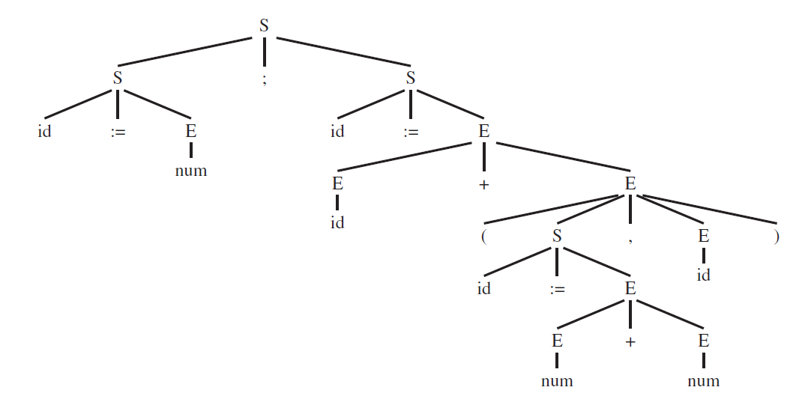
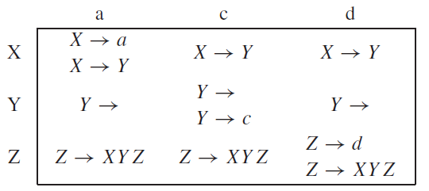

# Parsing
- Critical phase in the compilation process where the compiler takes a sequence of tokens from the lexical analyzer and determines the **syntactic structure of the program according to the language's grammar**, producing a **parse tree**
- It bridges lexical analysis (token generation) and semantic analysis (meaning extraction) by **ensuring the program's syntax is valid**
- While regular expressions are enough for lexical analysis (e.g., defining tokens like `digis = [0-9]+`), parsing requires more expressive power to handle nested structures (e.g., balanced parentheses), which finite automata cannot recognize

## Parser
- Performs context-free syntax analysis
- Guides context-sensitive analysis
- Constructs an intermediate representation
- Produces meaningful error messages


## Context-Free Grammars (CFGs)
- Formal way to describe the syntax of a programming language, which consists of:
	- **Productions:** rules of the form `symbol → symbol ... symbol` where the left-hand side is a single nonterminal and the right-hand side is a sequence of terminals and/or nonterminals
	- **Terminals:** tokens from the lexical analyzer (e.g., `ID`, `NUM`, `PLUS`, `LPAREN`, ...)
	- **Nonterminals:** symbols that can be expanded into other symbols (e.g., `S`, `E`, ...)
	- **Start symbol:** a designated nonterminal from which derivation begins (e.g., `S`)
- This grammar defines straight-line programs, where `S` represents statements, `E` expressions, and `L` lists of expressions:

```
S → S ; S
S → id := E
S → print(L)
E → id
E → num
E → E + E
E → (S, E)
L → E
L → L , E
```

### Derivations
- Process to generate a string of terminals from the start symbol by repeatedly replacing nonterminals with their productions
	- **Leftmost derivation:** always expand the leftmost nonterminal
	- **Rightmost derivation:** always expand the rightmost nonterminal

- With the source code (before lexical analysis) like:
```
a := 7;
b := c + (d := 5 + 6, d)
```

- The derivation tree would be:
```
S
S ; S
S ; id := E
id := E ; id := E
id := num ; id := E
id := num ; id := E + E
id := num ; id := E + (S , E)
id := num ; id := id + (S , E)
id := num ; id := id + (id := E , E)
id := num ; id := id + (id := E + E , E)
id := num ; id := id + (id := E + E , id)
id := num ; id := id + (id := num + E , id)
id := num ; id := id + (id := num + num , id)
```

### Parse Trees
- Graphical representation of a **derivation**, with the start symbol as the root, non terminals as nodes and terminals as leaves
- A parse tree is made by connecting each symbol in a derivation to the one from which it was derived
- Two different derivations can have the same parse tree



### Ambiguity in Grammars
- A grammar is ambiguous if **a single string can have multiple parse trees**, implying different syntactic structures and potentially different meanings
- This is highly undesirable in compilers since it can lead to inconsistent interpretations of the code
- To solve this, we must **rewrite the grammar and introduce new nonterminals to enforce precedence and associativity**

## Predictive Parsing
- A top-down approach that builds the parse tree from the root (start symbol) to the leaves (terminals) using **recursive-descent** parsing without backtracking
- Relies on a lookahead token to decide which production rule to apply for a given nonterminal

### Recursive-Descent Parsing (Top-Down)
- Each nonterminal gets a function that:
	- Checks the lookahead token
	- Uses FIRST and FOLLOW sets (or the parsing table) to pick a production
	- Calls other nonterminal functions or matches terminals

```java
void E() {
    if (lookahead in {id, '('}) {  // FIRST(T)
        T(); E_prime();
    } else {
        error("Expected id or (");
    }
}
void E_prime() {
    if (lookahead == '+') {
        eat('+'); T(); E_prime();
    } else if (lookahead in {')', '$'}) {  // FOLLOW(E)
        // epsilon production
    } else {
        error("Unexpected token");
    }
}
```

- **FIRST and FOLLOW sets:**
	- **FIRST(γ)**: 
		- Set of terminals that can begin strings derived from γ
		- Help the parser predict which production to apply - when a nonterminal has multiple productions, the parser uses the lookahead token to check which production's FIRST set contains it (if the sets overlap the parser can't decide - ambiguous grammar)
		- **Example:** for `T → T * F`, `FIRST(T * F) = {id, num, (}`
	- **FOLLOW(X):**
		- Set of terminals that can follow X in some derivation, often including the end-of-file marker $
		- Important when a production can generate the empty string ε, as they guide the parser in deciding whether to apply the nullable production or move forward with other rules
	- **Nullable(X):** true if X can derive the empty string ε
- **Computation:** iterative algorithm

```
Initialize FIRST, FOLLOW as empty, nullable as false.
For each terminal Z, FIRST[Z] = {Z}.
Repeat until no change:
    For each production X → Y1 Y2 ... Yk:
        If all Yi are nullable, nullable[X] = true.
        For each i, if Y1...Yi-1 nullable, FIRST[X] ∪= FIRST[Yi].
        For each i, if Yi+1...Yk nullable, FOLLOW[Yi] ∪= FOLLOW[X].
        For each i,j, if Yi+1...Yj-1 nullable, FOLLOW[Yi] ∪= FIRST[Yj].
```

#### Predictive Parsing Table
- Two dimensional table with **rows as non terminals** and **columns as terminals**
- **How to build it:**
	- For each production X→γ:
		- Add it to the table at \[X,t] for every terminal t in FIRST(γ)
		- If γ can derive ϵ (is nullable), also add it to \[X,t] for every t in FOLLOW(X)
- **How to use it:**
	- The parser looks at the current nonterminal and lookahead token, checks the table and applies the listed production. If the cell is empty, it signals an error



- The presence of duplicates indicates that the grammar is ambiguous, which predictive parsing cannot work with
- Grammars whose predictive parsing tables contain no duplicate entries are called **LL(1)**, which stands for *left-to-right parse, leftmost-derivation, 1-symbol lookahead*
- Every LL(k) grammar is an LL(k+1) grammar

#### Eliminating Left Recursion
- **Problem:** left recursion occurs when a nonterminal directly or indirectly derives itself as the first symbol, which causes infinite recursion in a predictive parser

```
E → E + T
  → E + T + T
  → E + T + T + T
  → ... (infinite recursion)
```

- **Solution:** transform the grammar to remove left recursion, introducing a nonterminal `E'`

```
E → T E'
E' → + T E'
E' →
```

- This works because by moving the recursion to the right hand side, the parser processes the non-recursive part first

#### Left Factoring
- **Problem:** when productions for a nonterminal share a common prefix, the parser can't decide which to apply based on the lookahead token

```
S → if E then S else S
S → if E then S
```

- **Solution:** factor out the common prefix

```
S → if E then S X
X →
X → else S
```

#### Error Recovery
- When the parser encounters an error (e.g., lookahead doesn’t match expectations), the parser should present the error as a message instead of terminating immediately and recover to try to find more syntax errors