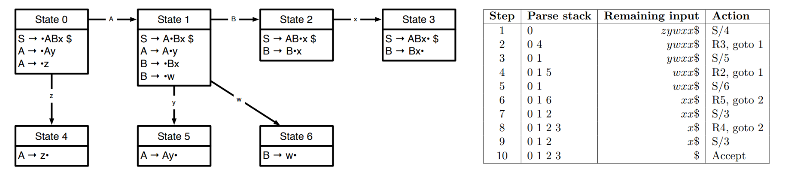
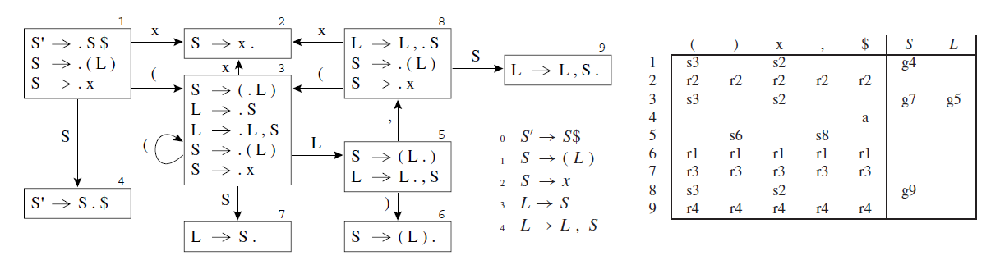

# LR Parsing
- Stronger than **LL(k)**, which must *predict* which production to use having seen only the first *k* tokens on the right-hand side
- **LR(k) parsing**, which stands for *left-to-right, rightmost-derivation, k-token lookahead*, postpones the decision until it has seen input tokens corresponding to the entire right-hand side of the production
- This is a type of bottom-up parsing, which builds the parse tree from the leaves to the root, reversing a rightmost derivation

### LL vs. LR

| **Feature**              | **LL Parser (Top-Down)**                           | **LR Parser (Bottom-Up)**                               |
| ------------------------ | -------------------------------------------------- | ------------------------------------------------------- |
| **Direction**            | Left-to-right                                      | Left-to-right                                           |
| **Derivation**           | Leftmost                                           | Rightmost in reverse                                    |
| **Parsing Type**         | Predictive, recursive descent                      | Shift-reduce, automaton-based                           |
| **Backtracking**         | May require (unless LL(1))                         | Usually no backtracking                                 |
| **Grammar Restrictions** | Must be **left-factored** & **not left-recursive** | Can handle **left recursion** and more complex grammars |
| **Efficiency**           | Easier to implement, but may require lookahead     | More powerful but harder to implement                   |
| **Example Parsers**      | Recursive descent parsers, ANTLR                   | LALR(1), yacc/bison, lalrpop                            |

### LR(k) Parsing
- **Definition**: left-to-right parsing, rightmost derivation, with *k* tokens of lookahead
- **Components**:
    - **Stack**: holds the parsed symbols
    - **Input Buffer**: contains remaining tokens
    - **Actions**:
        - **Shift**: move the next token to the stack
        - **Reduce**: replace a sequence on the stack with a nonterminal by a production rule
        - **Accept**: stop successfully when the end-of-file marker ($) is shifted
        - **Error**: stop and report failure

#### Example
- For input the `a := 7` with grammar `S' → S $, S → id := E, E → num`:
	1. Shift `a`, stack: `a`
	2. Shift `:=`, stack: `a :=`
	3. Shift `7`, stack: `a := 7`
	4. Reduce `E → num`, stack: `a := E`
	5. Reduce `S → id := E`, stack: `S`
	6. Shift `$`, stack: `S $`
	7. Accept

#### Another Example

### Variants
- **LR(0)**: no lookahead; uses only the stack - simple but weak
- **SLR(1)**: uses FOLLOW sets with one lookahead token to decide reductions
- **LR(1)**: full power with one lookahead token, tracking more context
- **LALR(1)**: merges LR(1) states for efficiency, balancing power and memory use

### Parsing Tables
- **Structure**:
	- **Rows** - states
	- **Columns** - terminals and nonterminals
	- **Entries** - sn (shift), gn (goto), rk (reduce), a (accept) or blank (error)
- **Construction**:
    - **LR(0)**: uses items (productions with a dot, e.g., `S → .x`) and closure/goto operations - no duplicated entries 
    - **SLR(1)**: adds FOLLOW set checks to LR(0) tables
    - **LR(1)**: items include lookahead (e.g., `S → .x, $`), increasing precision
    - **LALR(1)**: merges LR(1) states with identical cores

#### LR(0) Parsing Table Example

### Handling Ambiguity
- **Shift-Reduce Conflicts**: e.g., in `if E then S else S`, shift favors the “dangling else” binding to the nearest `then` - this can be resolved by rewriting the grammar or adjusting the table
- **Reduce-Reduce Conflicts**: indicate grammar issues - should be resolved by disambiguation

### Further Notes
- **Tools and Generators:** Yacc, Bison, and similar tools often generate LALR(1) or LR(1) parsers
- **Grammar Design:** LR parsers do not require left-factoring or removing left recursion (unlike LL parsers)
- **Memory Use:** LR(1) can produce large tables; LALR(1) merges states to reduce size but can occasionally introduce conflicts
- **Performance:** LR parsing is deterministic once the table is built, so it typically runs in linear time relative to the length of the input (O(n))