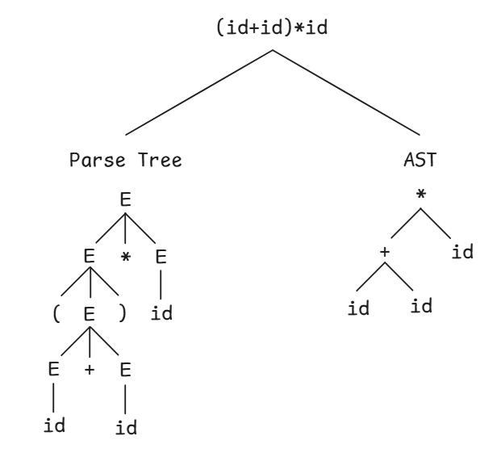

# Abstract Syntax
- Simplified, structured representation of source code that captures its logical structure without including syntax details.
- Used to analyze and transform code more easily.



### OOP - Visitor Pattern
```java
interface ASTNode {
	void accept(ASTVisitor visitor);
}
interface ASTVisitor {
	void visit(NumberNode number);
	void visit(PlusNode plus);
}
class NumberNode implements ASTNode {
	int value;
	// constructor
	public void accept(ASTVisitor visitor) {
		visitor.visit(this);
	}
}
class PlusNode implements ASTNode {
	ASTNode left;
	ASTNode right;
	// constructor
	public void accept(ASTVisitor visitor) {
		visitor.visit(this);	
	}
}
class EvalVisitor implements ASTVisitor {
	int result;
	// constructor
	public void visit(NumberNode number) {
		result = number.value;
	}
	public void visit(PlusNode plus) {
		plus.left.accept(this);
		int left = result;
		plus.right.accept(this);
		int right = result;
		result = left + right;
	}
}
```

### FP - Pattern Matching
```rust
enum Expr {
    Number(i32),
    Plus(Box<Expr>, Box<Expr>),
}
fn eval(expr: Expr) -> i32 {
    match expr {
        Expr::Number(i) => i,
        Expr::Plus(l, r) => eval(*l) + eval(*r),
    }
}
```