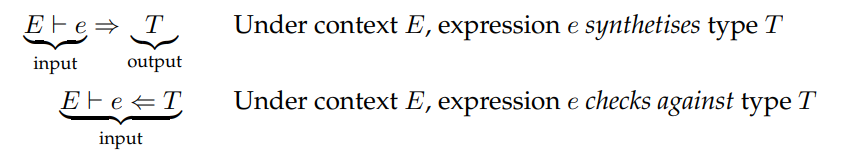
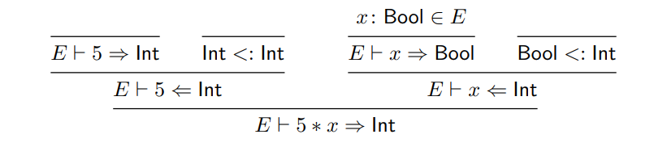

# Semantic Analysis
### Symbol Tables
- Data structure used hold the information about the program's identifiers (variables, functions, etc.) throughout the declaration checking of the program
- Used to check for undeclared identifiers

```rust
struct Scope {
	symbols: HashMap<String, Type>,
	parent: Option<Scope>
}
pub struct SymbolTable {
    curr_scope: Scope,
}
impl SymbolTable {
	fn enter_scope(&mut self) {
		self.curr_scope = Scope {
			symbols: HashMap::new(),
			parent: Some(self.curr_scope.clone())
		}
	}
	fn exit_scope(&mut self) {
		if let Some(p) = curr_scope.parent {
			self.curr_scope = p
		} else {
			panic!("cannot exit root scope")
		}
	}
	fn declare(&mut self, id: &str, ty: Type) {
		curr_scope.symbols.insert(id, ty)
	}
	fn lookup(&mut self, id: &str) -> Option<Type> {
		let scope = self.curr_scope;
		while let Some(s) = scope.parent {
			if let Some(ty) = scope.symbols.get(id) {
				return ty
			}
			scope = scope.parent.clone();
		}
		None
	}
}
```

### Type Checking
- Process of checking whether all AST nodes have the type they are expected to have
- This formalization has the advantage of being useful for writing mathematical proofs - the most common are:
	- **Soundness:** any program that type checks, executes
	- **Completeness:** any program that executes, also type checks
	- If we manually annotate a program with the inferred type, it also type checks

#### Judgements
- Typing rules have the following format, which reds that if the judgements *J₁, J₂, ... Jn* are true, then we can conclude *J*:


- So, if *e* is an expression and *T* a type, then a judgement of the form *⊢ e: T* reads “the expression *e* is well-formed and has type *T* under the empty context”
- Additionally, *T <: U* means that *T* is a subtype of *U*

#### Typing Context
- Variables can have different types depending on their use. This is tracked in a
**typing context**, represented by the Greek letter Γ, which maps variables to types, in the form of *Γ = x₁: T₁, ..., xₙ: Tₙ*
- *Γ ⊢ e : T* means the expression *e* has type *T* under the context Γ

#### Bidirectional Type Checking
- Bidirectional type checking is a type-checking technique that distinguishes between two kinds of judgments:
	- **Synthesis (⇒):** infers the type of an expression
	- **Checking (⇐):** verifies that an expression conforms to a given type



- The check against rule is as follows:


- For example, the derivation tree of the type checking of the expression `5*x` would look like this:



#### Check Against Error Precision
- In order to get more precise type checking errors, we add more rules to the check against relation
- This way, the check against rules yield better error messages - the effort to implement more check against rules is rewarded by a more friendly compiler

```rust
fn check_against(&mut self, expr: &Expr, expected: &Type) {
	match &expr.value {
		Expr::IfElse { cond, then, els } => {
			self.check_against(cond, &Type::Bool);
			self.check_against(then, &expected);
			self.check_against(els, &expected);
		}
		Expr::Eq { lhs, rhs } | Expr:Neq { lhs, rhs } => {
			let lhs_ty = self.type_of(lhs);
			self.check_against(rhs, &lhs_ty);
		}
		Expr::ArrayIndex { lhs, index } => {
			let lhs_type = self.type_of_lhs(lhs);
			match lhs_type {
				Type::Array(elem_type) => {
					self.check_against(index, &Type::Int);
					if *elem_type != *expected {
						// type mistmatch
					}
				}
				_ => // not indexable
			}
        }
		_ => {
			let found = self.type_of(expr);
			if &found != expected {
				// type mismatch!
			}
		}
	}
}
```