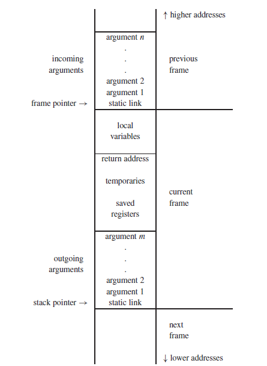

# Activation Records
- An activation record, or a **stack frame**, is a contiguous block of memory that manages the information required by a single execution of a procedure
- When we enter a procedure, we need to allocate an activation record, and when we exit that procedure, we need to deallocate it - it stores the status of the current activation function
- Whenever a function call occurs, a new activation record is created and pushed onto the top of the stack, which remains there until the execution of that function terminates, where the activation record is popped out of the stack (LIFO)



- **Temporaries:** temporary values, such as those that arise from the evaluation of expressions
- **Local variables:** holds local variables used in the execution of a procedure
- **Saved registers:** registers that need to be preserved across function calls
	- **Callee-saved:** preserves registers when entering the function and restores their values when exiting
	- **Caller-saved:** stores registers before making a function call and restores them when it ends
- **Static link:** refers to the information stored in other activation records (non-local) - it is used to access information that is not accessible in the current scope of the activation record
- **Return address:** address to be returned to after ending the procedure
- **Arguments:** the arguments are provided in the registers, but if there are too many, the rest can be passed in the stack

### Accessing Variables in Nested Functions
- How do we access variables from a function closure?
	- **Static Link:** a pointer in the activation record that connects a function to its enclosing parent
	- **Display:** an array of pointers, one per nesting level, to activation records
	- **Lambda Lifting:** transformation that makes nested functions top-level by adding free variables as parameters

```ocaml
type tree = {key: string, left: tree, right: tree}

function prettyprint(tree: tree) : string =
let
  var output := ""

  function write(s: string) =
    output := concat(output, s)

  function show(n: int, t: tree) =
    let
      function indent(s: string) =
        (for i := 1 to n
         do write(" ");
         output := concat(output, s); write("\n"))
    in
      if t = nil then indent(".")
      else (
        indent(t.key);
        show(n+1, t.left);
        show(n+1, t.right)
      )
    end

in
  show(0, tree); output
end

```