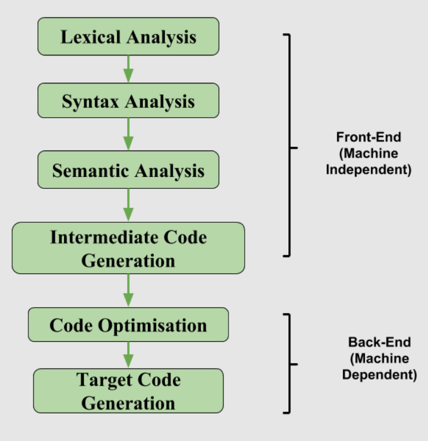

# Intermediate Code Generation
- Stage in the process of compiling a program where the compiler translates the AST generated from the source code into an intermediate representation
- This representation is not machine code but is simpler than the original high-level code
	- **Translation:** the compiler takes the AST and converts it to an intermediate representation, like LLVM or JVM
	- **Portability:** the intermediate code can often run on any type of machine
	- **Optimization:** before turning it into machine code, the compiler can optimize this intermediate code to make the final program more efficient
- Enables modular and portable compiler design by allowing N front ends and M back ends to interact through a common language, decoupling source language specifics from machine details and significantly simplifying development
- **Basic Blocks:** straight line code sequence that has no branches except to the entry and exit, where each statement executes one after another
- Code can be compiled into LLVM with the `llc` compiler or interpreted with the `lli` interpreter



### LLVM IR
- Low-level programming language used as the core representation in the LLVM compiler framework
- It is typed, in SSA form, and is either written in textual form (`.ll`) or binary form (`.bc`)
- **Static Single Assignment (SSA):** registers can be assigned only once, but can be used as many times as needed
#### Syntax
- **Labels:** define *basic blocks*, which are units of code with one entry and one exit point, used as jump targets in branches
- **Globals:** declared at the module scope prefixed by "@"
- **Locals**: SSA registers prefixed by "%"
- **Instructions:** 
	- `alloca` - store memory
	- `load` - load memory
	- `call` - call a function
	- `br` - conditional/unconditional branch
	- `ret` - return
	- `add`, `sub`, `mul`, ... - arithmetic operations
	- ...

##### Example:
```
define i32 @main() {
entry:
  %a = alloca i32
  store i32 42, i32* %a
  %val = load i32, i32* %a
  %cmp = icmp eq i32 %val, 42
  br i1 %cmp, label %if_true, label %if_false

if_true:
  ret i32 1

if_false:
  ret i32 0
}
```