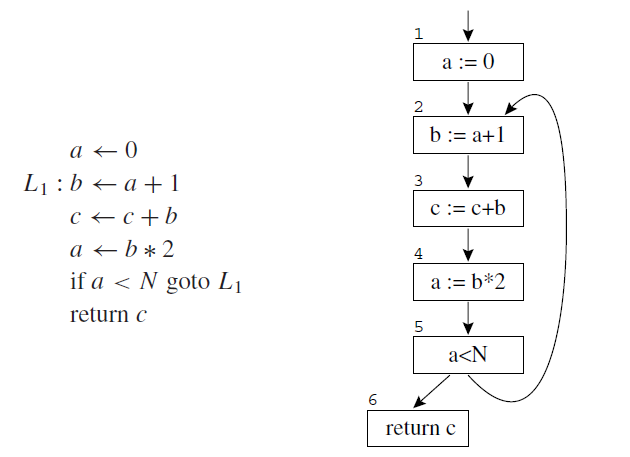
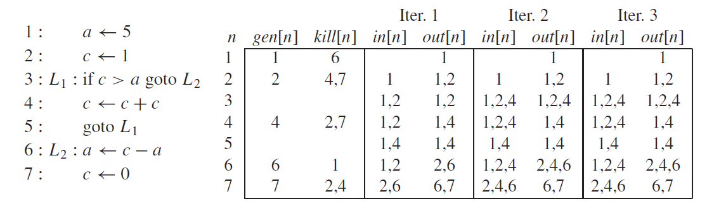
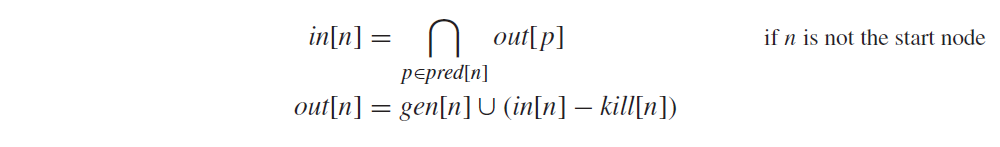
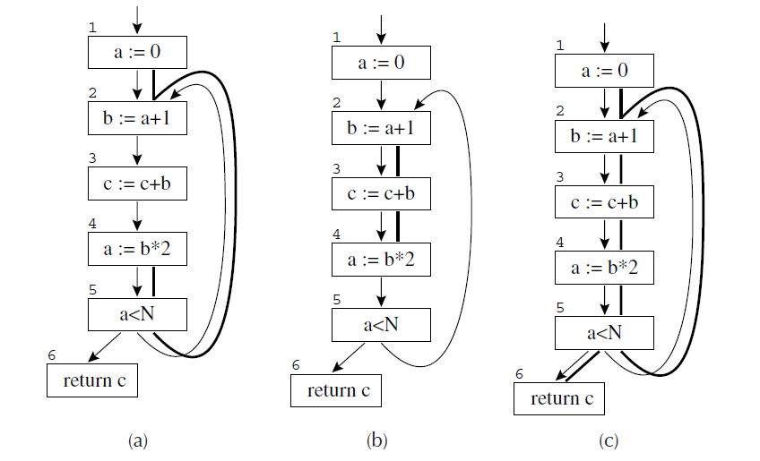
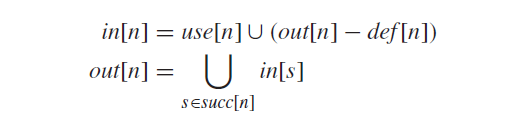

# Optimization & Dataflow Analysis
### Optimization
- Phase in the compiler aimed at enhancing the performance and efficiency of the executable code

#### Types of Optimizations
- **Compile Time Evaluation:** evaluates expressions at compile time instead of at runtime
- **Variable Propagation:** replaces variables with their known values
- **Constant Propagation:** replaces variables with constant values with those constants directly
- **Constant Folding:** calculates constant expressions at compile time to instead of at runtime
- **Dead Code Elimination:** removes code that doesn't affect the program (e.g. unused variables)
- **Unreachable Code:** removes parts of the code that can never be executed (e.g. code after a return statement)

### Dataflow Analysis
- Technique in compiler design to analyze how data flows through a program, involving tracking the values of variables and expressions as they are computed and used throughout the program with the goal of identifying opportunities for optimization and identifying potential errors
- The basic idea behind it is to model the program as a graph, where the nodes represent program statements and the edges represent dataflow dependencies between the statements - the dataflow information is then propagated through the graph using a set of rules and equations to compute the values of variables and expressions at each point in the program

### Types of Dataflow Analysis
- **Reaching Definition Analysis:** tracks the definition of a variable and determines the points in the program where the definition "reaches" a particular use of the variable
	- Used to identify variables that can be safely removed or optimized
- **Liveness Analysis:** determines the points in the program where a variable is "live", meaning that its value is still needed for some future computation
	- Used to identify variables that can be safely removed or optimized
- **Available Expressions Analysis:** determines the points in the program where a particular expression is "available", meaning that its value has already been computed and can be reused
	- Used to identify opportunities for common subexpression elimination
- **Constant Propagation Analysis:** tracks the values of constants and determines the points in the program where a particular constant value is used
	- Used to identify opportunities for constant folding

- These optimizations can be calculated through dataflow equations

#### Reaching Definitions
- We say that *d* reaches a statement *u* in the program if there is some path of control-flow edges from *d* to *u* that does not contain any unambiguous definition of t
##### Equations

##### Example

- Here, for example, we can do **constant propagation**: only one definition of *a* reaches statement 3, so we can replace the test *c > a* with *c > 5*

#### Available Expressions
- An expression *x ⊕ y* is *available* at a node *n* in the flow graph if, on every path from the entry node of the graph to node *n*, *x ⊕ y* is computed at least once and there are no definitions of *x* or *y* since the most recent occurrence of *x ⊕ y* on that path

##### Equations

#### Reaching Expressions
- An expression *t ← x ⊕ y* (in node *s* of the flow graph) reaches node *n* if there is a path from *s* to *n* that does not go through any assignment to *x* or *y* or through any computation of *x ⊕ y*
#### Liveness Analysis
- Liveness of variables “flows” around the edges of the control-flow graph
- A variable is *live* on an edge if there is a directed path from that edge to a *use* of the variable that does not go through any *def*

##### Equations

