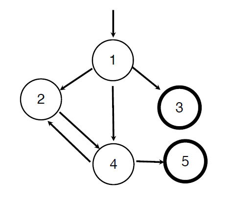
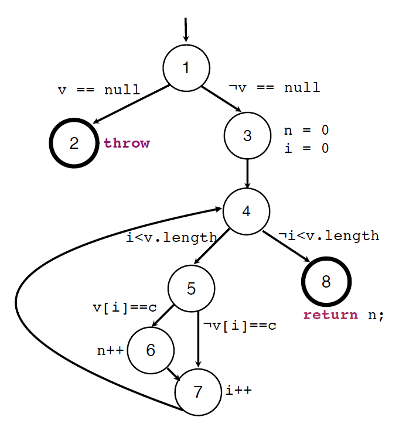
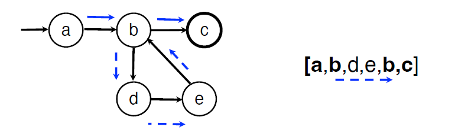

# Graph-Based Test Coverage (Part 1)
### Graph Coverage 
- A graph representation models the SUT
- The execution of a test case corresponds to a path in the graph
- Coverage criteria specify requirements as sets of paths that must be covered by test paths

### Test Coverage
- A test graph is a tuple **G = (N, N0, Nf, E)** where:
	- **N** is a non-empty set of **nodes**
	- **N0 ⊆ N** is a non-empty set of **initial** nodes
	- **Nf ⊆ N** is a non-empty set of **final** nodes
	- **E ⊆ N x N** is a set of **edges**
	- For **(a,b)∈E** we say **a** is a **predecessor** of **b** and **b** is a **successor** of **a**

### Definitions
- A **path** is a sequence p=\[n0, n1, ..., nk] such that ni+1 is a successor of ni for i=\[0..k-1]
	- The length of the path is **k**
	- Paths with just one node have length 0
	- A subsequence of p is called a **subpath** of p
	- A path is called a **cycle** if n0=nk
	- A path **contains a cycle** if one of its subpaths is a cycle
- A **test path** is a path p=\[n0, n1, ..., nk] such that n0∈N0 and nk∈NF - a test path starts with an entry node and ends with an exit node

### Coverage Criteria for Graphs
- A **test criterion C** is a set of rules that impose requirements for test paths
- **Test requirements TR(C)** are expressed as paths or subpaths of the graph at stake
- The execution of a test case **t** results in a test path **path(t)**
- A set of test cases **T satisfies C** if and only if for every requirement **r∈TR(C)** there is a test **t∈T** that covers **r** - **r** is a subpath of **path(t)**

### Node and Edge Coverage
- **Node coverage (NC)**
	- Test requirements: cover every node (all graph paths of length 0)
	- **TR(NC)** = set of nodes in the graph
- **Edge coverage (EC)**
	- Test requirements: cover every edge (all paths up to length 1)
	- **TR(EC)** = set of edges in the graph
- **EC ⊆ NC**

### Control Flow Graph (CFG)
- Used to represent the control flow of a piece of imperative source code
- **Nodes** represent **basic blocks** (sequences of instructions that always execute together in sequence)
- **Edges** represent **control flow** between basic blocks
- The **entry node** corresponds to a method's entry point
- **Final nodes** correspond to method's exit points - returns or throws
- **Decisions nodes** represent choices in control flow - ifs, switch cases or loop conditions

### Edge-Pair Coverage (EPC)
- Cover all paths up to length 2
- EPC ⊆ EC and NC 

### Beyond Node/Edge Coverage
- NC, EC, EPC are instances of the general criterion: cover all paths up to length **k**
	- NC for k=0; EC for k=1; EPC for k=2;
- As **k** increases we approximate **Complete-Path-Coverage (CPC)** - all possible paths
	- The number of paths may be infinite
	- In practice, instead of increasing k, we should try to pick a subset of relevant paths in the graph

### Prime Path Coverage (PPC)
- A path p is a **simple path** if no node appears more than once, other than possible the first and last ones and has no internal loops (but may represent a loop if the first and last nodes are equal)
- A **prime path** is a maximal length simple path - a simple path that is not a proper subpath of any other simple path
- **PPC requires every prime path to be covered by the test set** 

### Best-Effort Touring using Side-Trips
- **Best-effort touring** - a test set **T** achieves best effort touring of **TR** if for every path in **TR** there is a test in **T** that tours the path either directly or using side-trips
- Way to deal with infeasible test requirements

### Call Graphs
- Expresses calls between units
- The call graph of a set of units (methods) is defined as follows:
	- A node is defined per each method **mi**
	- An edge **mi → mj** is defined if there is a call from **mi** to **mj**
- The usual structural coverage criteria can be applied to call graphs:
	- Node coverage means that every method should be executed at least once and is known as **method coverage** in the context of call graphs
	- Edge coverage means that every call should be executed at least once, and is known as **call coverage** in the context of call graphs

### Testing Object States
- Besides methods, it is important to be able to test overall behavior - interactions (message passing) between objects
- State machines can model such behavior
- If our test model is a state machine, we can generate test cases for the modeled behavior

### FSM Abstractions for SUT
- **Nodes** represent **states of the SUT**
- **Edges** represent **transitions between states** with associated pre-state (guards) and post-state (actions)

### State Model Validation
- A state model must be **complete, consistent and correct** before generating test cases
- **General requirements:**
	- There is an **initial state** with only outbound transitions
	- There is a **final state** with only inbound transitions (if not, an explicit reason is required)
	- No **equivalent states** exist
	- Every state is **reachable** from the initial state
	- The **final state** is reachable from all states
	- Every defined **event** and **action** appears in at least one transition
- **Structural requirements:**
	- Except for the **initial** and **final** states, every state has at least **one incoming** and **one outgoing** transition
	- The events accepted in a particular state are **unique** or differentiated by **mutually exclusive guards**
	- The evaluation of a guard **does not cause side effects**
	- **Complete specification**: for every state, every event is either **accepted** or **rejected** (explicitly or implicitly)

### FSM Coverage Criteria
- **State Coverage** ~ Node Coverage
- **Transition Coverage** ~ Edge Coverage
- **Transition-Pair Coverage** ~ Edge-Pair Coverage