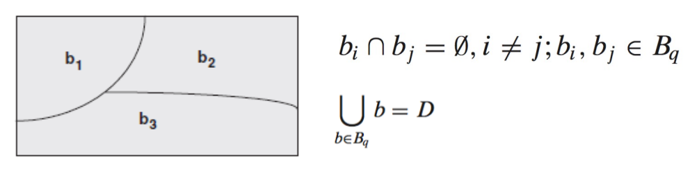
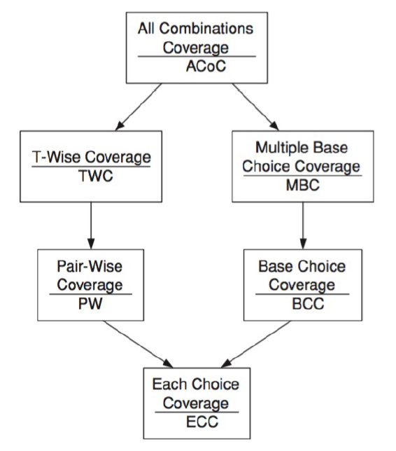

# Input Space Partitioning
## Input State Partitioning
- Testing is about choosing elements from the input space of the software being tested
- The input domain is defined by the possible values that the input parameters can have
- The input parameters can be method parameters and global variables, objects representing current state, or user-level inputs to a program
- The input domain is partitioned into regions assumed to contain equally useful values from a testing perspective and values are selected from each region

### Advantages
- Easy to use because it can be applied with no automation and very little training
- The tester doesn't need to understand the implementation as everything is based on a description of the inputs
- It's simple to "tune" to get more or fewer tests

### Partitioning a Domain
- A partition *q* defines a set of equivalence classes which can be simply called **blocks**
- The blocks are pairwise distinct, and together cover the domain *D*



## Input Space Partitioning (ISP)
- Four step process:
	1. **Identify** the input parameters for the SUT
	2. **Model** the input domain by identifying one or more characteristics for the input domain - each characteristic defines blocks that *must* partition the input space
	3. **Apply** some criterion over the characteristics, defining a set of test requirements
	4. **Derive** test inputs/cases
- **Examples:**
	- **Bad:** string of numbers - is it sorted, inverse sorted or arbitrary? - not a valid partition since an empty string would belong to all partitions
	- **Good:** define a characteristic pair (sorted ascending, sorted descending) - now an empty string only belongs to partition (true, true)

### Identifying Input Parameters
- Mechanic analysis and automation can help
- To test a method, input parameters may include method parameters, instance fields, global class variables, user-level or system-level I/O

#### Example:
```java
public final class Time {
	private int hours;
	private int minutes;
	/**
	* Constructor.
	* @param h hours (from 0 to 23)
	* @param m minutes (from 0 to 59)
	* @throws IllegalArgumentException if arguments are invalid
	*/
	public Time(int h, int m) throws IllegalArgumentException { ... }
	public int getHours() { ... }
	public int getMinutes() { ... }
	/**
	* Advance one minute to the current time.
	*/
	public void tick() { ... }
	public boolean equals(Object obj) { ... }
	public String toString() { ... }
}
```
- Input domain modeling:
	- `Time()` - `h, m` (method parameters)
	- `toString, tick()` - `hours, minutes` (instance fields)
	- `equals()` - `hours, minutes, obj` (instance fields + method parameters)

### Identifying Characteristics and Blocks
- Each characteristic should represent a meaningful feature of the input domain
- Blocks of a characteristic should have distinctive values
- Look for:
	- "Common use" values
	- Boundary values
	- "Invalid use values"
	- Relations between input parameters
- And always ensure that blocks:
	- Do not overlap
	- Effectively define a partition

#### Example in class Time
- Suppose that `toString()` must return a string in a 12-hour AM/PM format: `"hh:mm [AM|PM]"`, e.g., "01:05 PM", "12:10 AM"
- Possible characteristics:
	- **AM/PM** - earlier or later than midday. Blocks:
		- AM = 0 ≤ h < 12
		- PM = 12 ≤ h < 24
	- **hz** - requires '0' prefix for hour representation. Blocks:
		- yes = h ∈ {1,2, ..., 9, 13,14, ..., 21}
		- no = h ∈ {0, 10, 11, 12, 22, 23}
	- **mz** - requires a '0' prefix for minute representation. Blocks:
		- yes = 0 ≤ m < 10
		- no = 10 ≤ m < 60

### Input Domain Modeling (IDM)
1. Identification of testable functions
2. Identification of all the parameters that can affect the behavior of a given testable function
3. Modelling the input domain (the key creative engineering step): characteristics → blocks → values
4. Built test input: a tuple of values, one for each parameter

#### Interface-based vs Functionality-based IDM
- **Interface-based** (input domain knowledge)
	- Develops characteristics directly from input parameters to the SUT
	- Considers each particular parameter in isolation
	- Focuses on the implementation 
	- **Pros:**
		- Easy to identify characteristics
		- Easy to translate the abstract tests into executable test cases
	- **Cons:**
		- Not all the information available to the test engineer is reflected in the interface domain model
		- Some parts of the functionality may depend on combinations of specific values of several interface parameters
- **Functionality-based** (domain knowledge)
	- Develops characteristics from a functional or behavioral view of the SUT
	- Identify characteristics that correspond to the intended functionality of the SUT
	- Allows the tester to incorporate some semantics or domain knowledge into the modelling
	- Preconditions and postconditions are excellent sources
	- Requires more thinking on the part of the test engineer, but can result in better tests

### Combination Strategies Criteria
- Given the block partitions \[A, B], \[1, 2, 3] and \[x, y]
#### All Combinations Coverage (ACoC)
- All combinations of blocks from all characteristics must be used
- Yields a unique test for each combination of blocks for each partition
- The number of tests is the product of the number of blocks for each partition
- The number of combinations would be very large and impractical to implement
- (A, 1, x) (A, 1, y) (A, 2, x) (A, 2, y) (A, 3, x) (A, 3, y) (B, 1, x) (B, 1, y) (B, 2, x) (B, 2, y) (B, 3, x) (B, 3, y) ...
#### Each Choice Coverage (ECC)
- One value from each block for each characteristic must be used in at least one test case
- Not very effective tests
- (A, 1, x) (B, 2, y) (A, 3, x)
#### Pair-Wise Coverage (PWC)
- A value from each block for each characteristic must be combined with a value from every block for each other characteristic
- All pairs of blocks must be tested
- (A, 1, x) (A, 2, x) (A, 3, x) (A, -, y) (B, 1, y) (B, 2, y) (B, 3, y) (B, -, x)
#### T-Wise Coverage (TWC)
- A value from each block for each group of *t* characteristics must be combined
- *t* = 1 → equivalent to ECC
- *t* = 2 → equivalent to PWC
- *t* = number of characteristics → equivalent to ACoC

### ISP - "Base Choices"
- PWC and TWC combine blocks "blindly"
- Some combinations may be more relevant than others
- A base choice reflects the most "important" block for each characteristic
- The base choice can be the simples, the smallest, the first in some ordering, or the most likely from an end-user point of view
#### Base Choice Coverage (BCC)
- Determine the most important block for each partition
- Define a base choice by selecting a single block for each characteristic
- Define remaining test requirements by varying one block for each characteristic at a time
- Example:
	- Base choice: (A, 1, x)
	- (A, 1, x) (**B**, 1, x) (A, **2**, x) (A, **3**, x) (A, 1, **y**)

#### Multiple Base Choice Coverage (MBCC)
- Use *n* > 1 base choices
- Base choices should be selected such that there is the least overlapping between requirements
- Test requirements are defined for each base choice as in BCC

### Subsumption Relations Among Criteria
- **ACoC** may not be practical, because it leads to many test requirements; possibility of also many infeasible requirements
- **ECC** may be too simplistic
- **PWC** and **TWC** combine characteristics blindly
- **BCC** and **MBCC** try to pick more meaningful blocks



